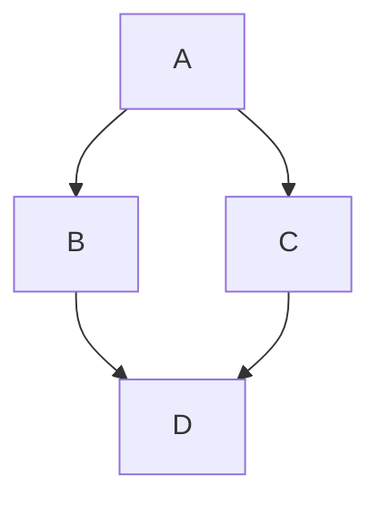

# GameMaker Studio 2 Top Down Shooter

## Introduction
This tutorial is a a simplified version of the arcade game **1942**.  It is NOT a complete game but a scaffolding that allows you to complete the game on your own.  It uses GML programming language.  It would be useful if you have completed a previous tutorial such as [YoYo Games Space Rocks GML](https://marketplace.yoyogames.com/assets/7423/space-rocks-gml) prior to workign in this tutorial.

All artwork needed for the game is supplied in this tutorial.  There is a folder called datafiles/TutorialResources/Sprites and a folder called datafiles/TutorialResources/Sounds that include all the assets that you need (except for one song that the tutorial asks you to find for yourself).

  
In this walk through:

* Importing ship animation
* Moving ship with keyboard
* Moving ship with gamepad
* Scrolling water background
* Scrolling islands background
* Setting up enemy parent
* Regular, shooting and targeting enemy planes
* Player health
* Player damage
* Ghost mode
* Audio
* Front End

## Keyboard Controls
* Left, Right, Up and Down Arrow moves player in 4 directions
* Space bar shoots and starts game

## Gamepad Controls
* Left analog stick moves player
* Right trigger shoots
* Start button begins the game

progra,ming concepts
dynamic arrays

gms2 functions
audio_sound_pitch
audio_sound_gain
event_inherited instance_exists?
instance_Create_layer returns instance
point_direction()?
game_restart()?
layer_vspeed()
draw_healthbar()
draw_sprite_ext
distance_to_point()
place_meeting
gamepad_axis_value
gamepad_button_value
instance_change

gms2 internal variables
timeline_index
timeline_runnung
timeline_position
delta_time

vectors players velocity
stopping repetitive audio
parent child relationship
rate of fire/timer not using alarms
finite state machine
explain place_meeting and two other collision detection functions
clamping for bounds simplest for, of collision detection
benefits of using actual seconds over steps
controller bias in this scheme
sinewave trig

gamemaker assets
timeline

provided objects
obj_gamepad() adds 4 controllers to game

replace diagonals with clamping speed

