### Audio

[previous](../ghost-mode/README.md#user-content-ghost-mode) • [home](../README.md#user-content-gms2-top-down-shooter) • [next](../front-end/README.md#user-content-front-end)

Lets add some music and sound effects to the game.

 

---

##### `Step 1.`\|`TDS`|:small_blue_diamond:

Open up **P4v**.  Select the top folder of the **GameMaker** project. Press the <kbd>Checkout</kbd> button.  Checkout out all files in P4V so that they are all writable (otherwise they will be read only and none of the changes will be saved). Select a **New** changelist and add a message describing the unit of work you will be performing. Press the <kbd>OK</kbd> button.

Open up the project you are working on in **GameMaker**. 

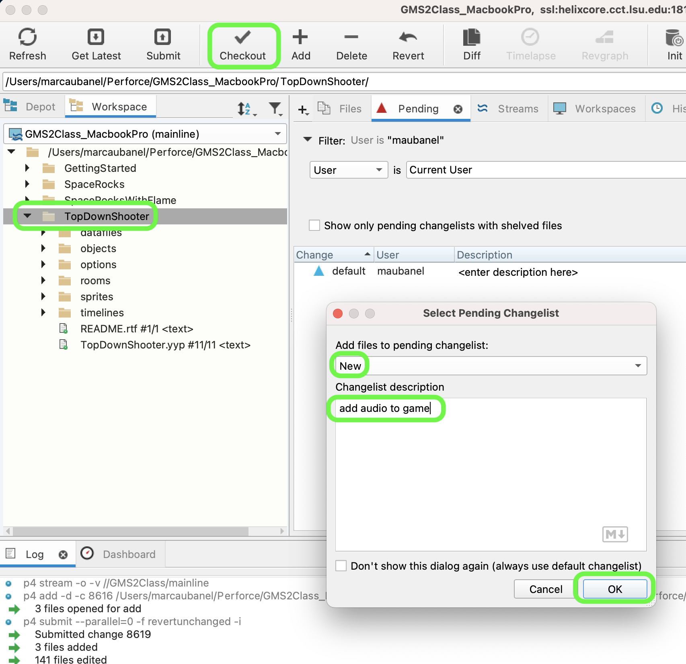

##### `Step 2.`\|`TDS`|:small_blue_diamond: :small_blue_diamond: 

Pick some free music that you think might be appropriate for the game. I used The *Spririt of Russian Love* by **Zinaida Troikai** for mine from the free music archive. Look for an MP4 or OGG format.  *Download* a song that you have permission to use and right click on **Sounds** and select **Create | Sound**.  Call it *snd_theme_music* and press the three periods (dots) next to the name to bring up an explorer menu to pick the music.

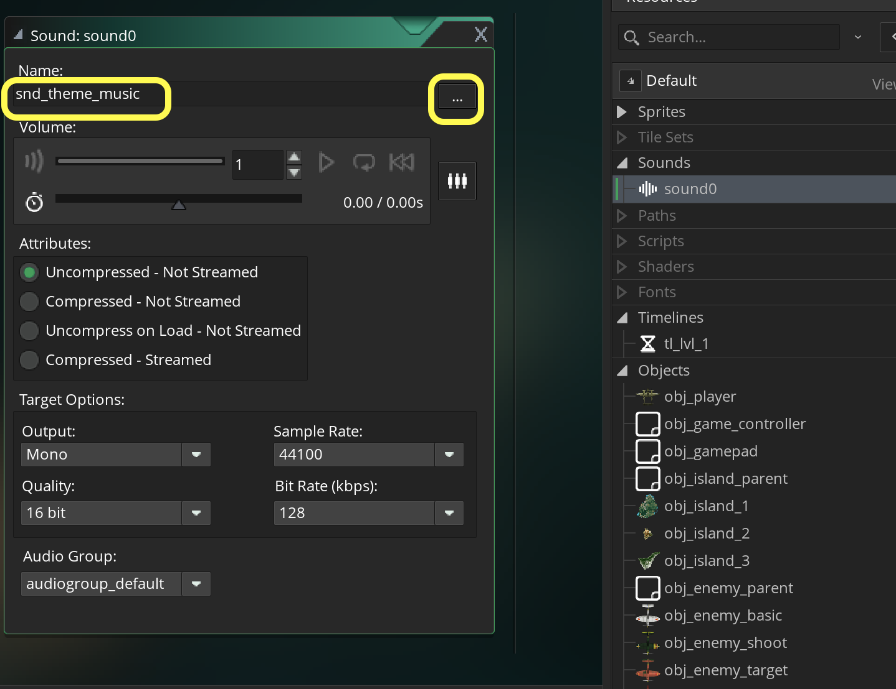

##### `Step 3.`\|`TDS`|:small_blue_diamond: :small_blue_diamond: :small_blue_diamond:

Pick the music you have downloaded.

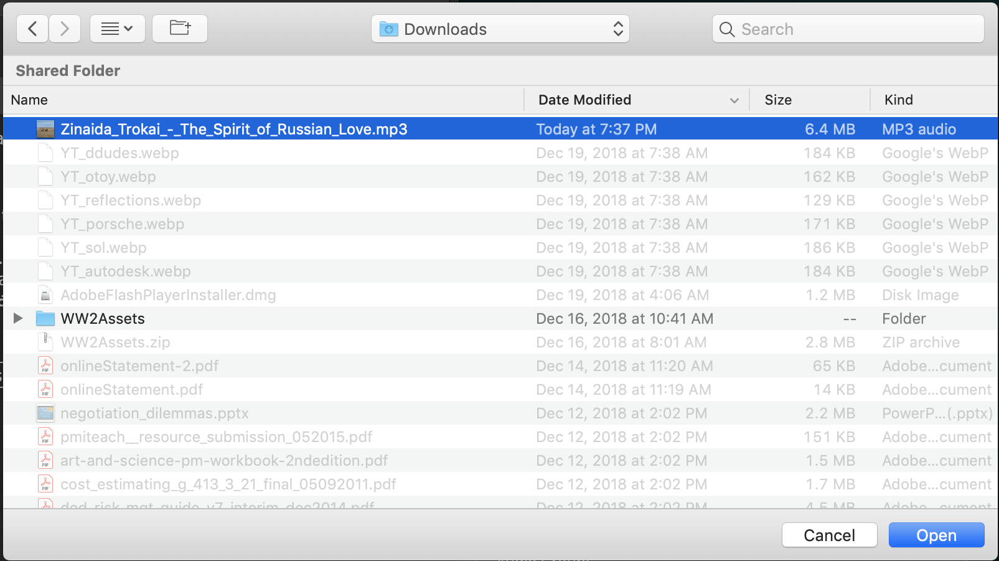

##### `Step 4.`\|`TDS`|:small_blue_diamond: :small_blue_diamond: :small_blue_diamond: :small_blue_diamond:

Open **obj_game: Create** event script and at the bottom check to make sure the song is not already playing, then play the song in an endless loop.

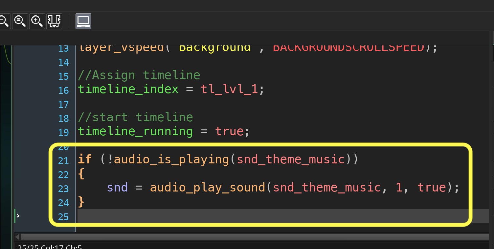

##### `Step 5.`\|`TDS`| :small_orange_diamond:

Now *press* the <kbd>Play</kbd> button in the top menu bar to launch the game. Play it and notice that the music should play and go on forever.

https://user-images.githubusercontent.com/5504953/139530532-cb5d8513-7082-4fd4-a452-d79599d7ed0d.mp4

##### `Step 6.`\|`TDS`| :small_orange_diamond: :small_blue_diamond:

Download [snd_enemy_explode.wav](../Assets/Sounds/snd_enemy_explode.wav) to your computer. Call this **Sound** file `snd_enemy_explode`.

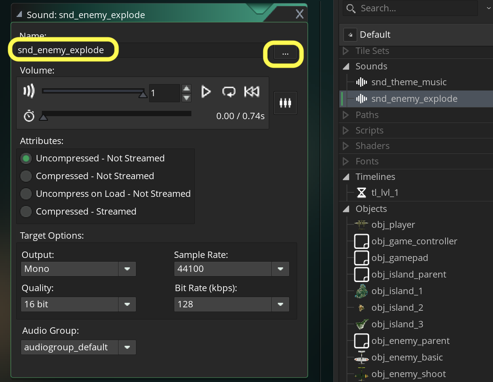

##### `Step 7.`\|`TDS`| :small_orange_diamond: :small_blue_diamond: :small_blue_diamond:

Add the enemy explosion to **obj_player_bullet: Collision | obj_enemy_parent** event and add the audio playback at the bottom of the script.

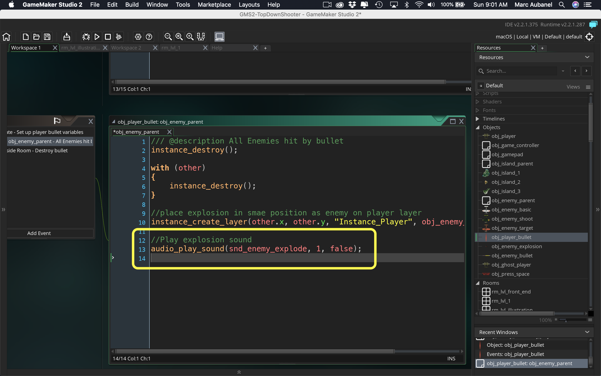

##### `Step 8.`\|`TDS`| :small_orange_diamond: :small_blue_diamond: :small_blue_diamond: :small_blue_diamond:
Now *press* the <kbd>Play</kbd> button in the top menu bar to launch the game. Play it and shoot enemies ot hear the sounds played!

https://user-images.githubusercontent.com/5504953/139530785-5453222b-188a-47bc-9d84-62f6948e6dc4.mp4

##### `Step 9.`\|`TDS`| :small_orange_diamond: :small_blue_diamond: :small_blue_diamond: :small_blue_diamond: :small_blue_diamond:

Repeat the process for [snd_player_explode.wav](../Assets/Sounds/snd_player_explode.wav), [snd_player_shoot.wav](../Assets/Sounds/snd_player_shoot.wav) and [snd_enemy_shoot.wav](../Assets/Sounds/snd_enemy_shoot.wav). Name the files the same as the downloads and link audio files with the appropriate name. 

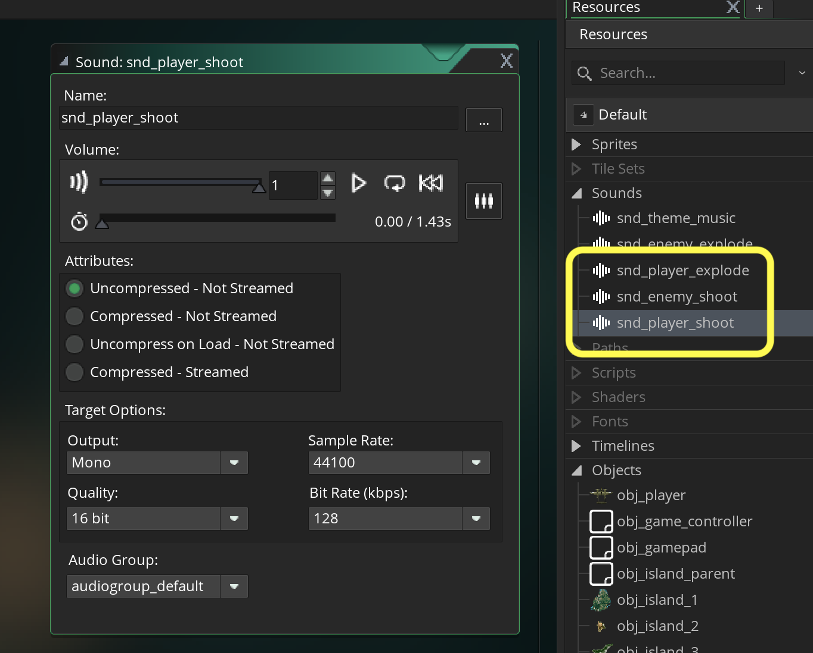

##### `Step 10.`\|`TDS`| :large_blue_diamond:

Lets play all of these sounds in their appropriate places.  Open up **obj_enemy_bullet | Collision | obj_player**.

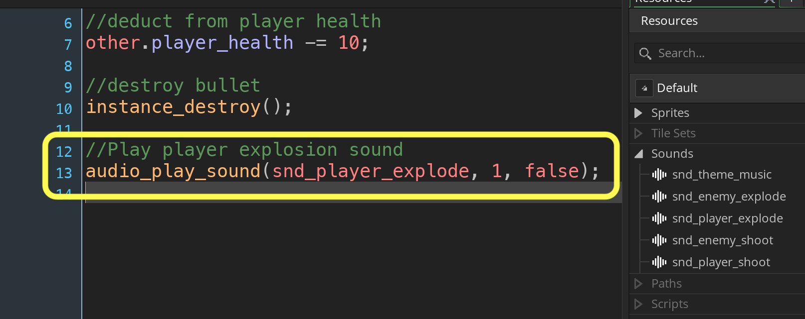

##### `Step 11.`\|`TDS`| :large_blue_diamond: :small_blue_diamond: 

*Open* up **obj_player: Step** and inside the shooting braces (`if ( (keyboard_check_pressed(vk_space)...`)

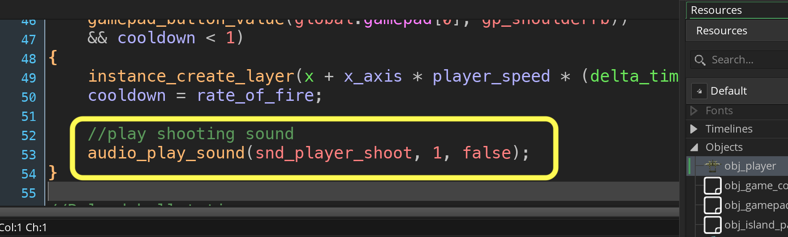

##### `Step 12.`\|`TDS`| :large_blue_diamond: :small_blue_diamond: :small_blue_diamond: 

*Open* up **obj_enemy_target: Step**.

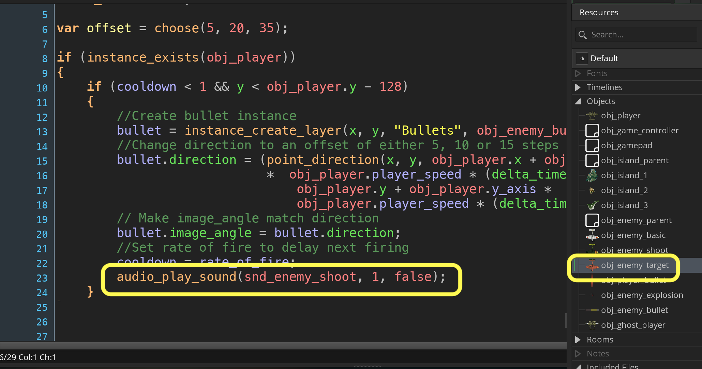

##### `Step 13.`\|`TDS`| :large_blue_diamond: :small_blue_diamond: :small_blue_diamond:  :small_blue_diamond: 

Finally *open* up **obj_enemy_shoot: Step**.

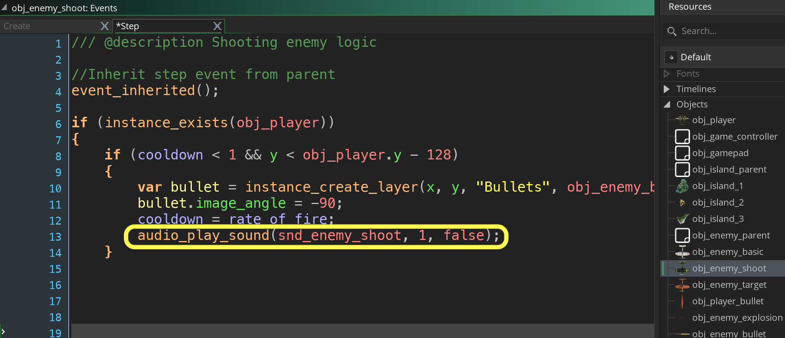

##### `Step 14.`\|`TDS`| :large_blue_diamond: :small_blue_diamond: :small_blue_diamond: :small_blue_diamond:  :small_blue_diamond: 

Now *press* the <kbd>Play</kbd> button in the top menu bar to launch the game. Play it and listen to all the sounds.  

https://user-images.githubusercontent.com/5504953/214035969-09e67698-38a0-4a8e-9ba9-e7cf402fa89d.mp4

##### `Step 15.`\|`TDS`| :large_blue_diamond: :small_orange_diamond: 

The audio gets repetitive really quickly.  Lets look at a way of tricking the ear to get more out of a single sound.  Lets alter the pitch with **[audio_sound_pitch(index, pitch)](https://manual.yoyogames.com/GameMaker_Language/GML_Reference/Asset_Management/Audio/audio_sound_pitch.htm)**. The pitch is a value less than 1 is lower in pitch (0 would be none) and 2 would be an ocatve higher.

Lets alter the volume (gain) with **[audio_sound_gain(index, volume, time)](https://manual.yoyogames.com/GameMaker_Language/GML_Reference/Asset_Management/Audio/audio_sound_gain.htm)**. The volume argument is between `0` (quiet) to `1` (full volume).  We will set the time argument to `0` as we don't want it to fade in or out we want it to apply right away.

Here is an example of what it looks like in **obj_player: Step**.  Repeat this for all other sounds played (except for the music looping).

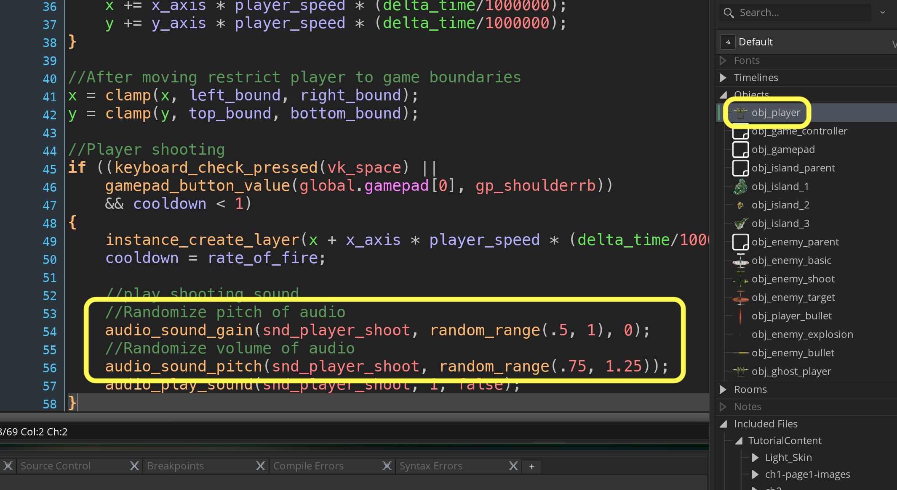

##### `Step 16.`\|`TDS`| :large_blue_diamond: :small_orange_diamond: :small_blue_diamond:

Now *press* the <kbd>Play</kbd> button in the top menu bar to launch the game. Play it and the sounds should alter a bit during playback. The only sound we forgot to put in was the sound playing when the player is hit directly by a plane.  I will let you figure this out on your own.

https://user-images.githubusercontent.com/5504953/139531886-3c7525a8-9d0c-4a45-b42a-2e778ebd36e7.mp4

##### `Step 17.`\|`TDS`| :large_blue_diamond: :small_orange_diamond: :small_blue_diamond: :small_blue_diamond:

Select the **File | Save Project**, then press **File | Quit** (PC) **Game Maker | Quit** on Mac to make sure everything in the game is saved.

##### `Step 18.`\|`TDS`| :large_blue_diamond: :small_orange_diamond: :small_blue_diamond: :small_blue_diamond: :small_blue_diamond:

Open up **P4V**.  Select the top folder and press the **Add** button.  We want to add all the new files we created during this last session.  Add these files to the last change list you used at the begining of the session (in my case it was `Spaceship I portion of walkthrough`). Press the <kbd>OK</kbd> button.

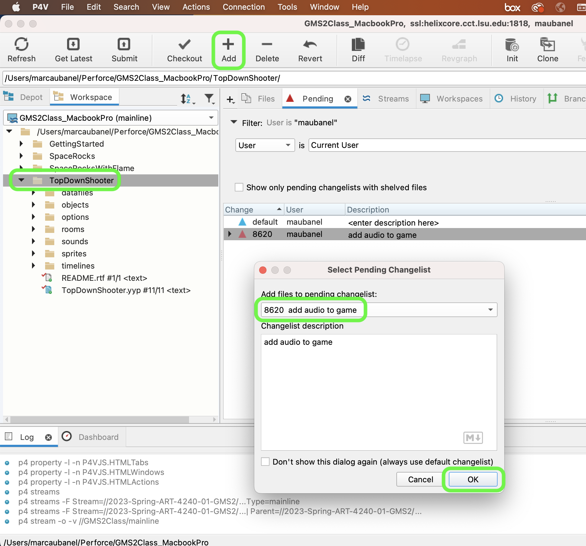

##### `Step 19.`\|`TDS`| :large_blue_diamond: :small_orange_diamond: :small_blue_diamond: :small_blue_diamond: :small_blue_diamond: :small_blue_diamond:

Now you can submit the changelist by pressing both <kbd>Submit</kbd> buttons.

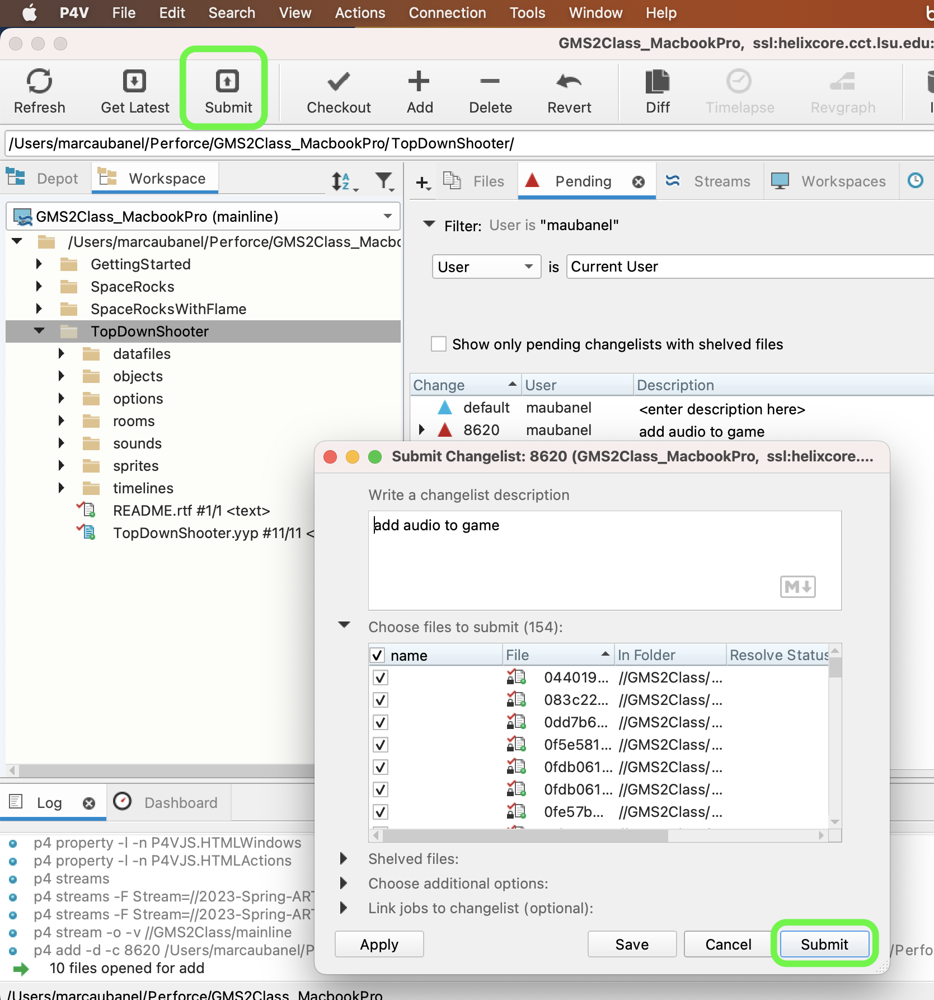

<!--  -->

| [previous](../ghost-mode/README.md#user-content-ghost-mode)| [home](../README.md#user-content-gms2-top-down-shooter) | [next](../front-end/README.md#user-content-front-end)|
|---|---|---|
