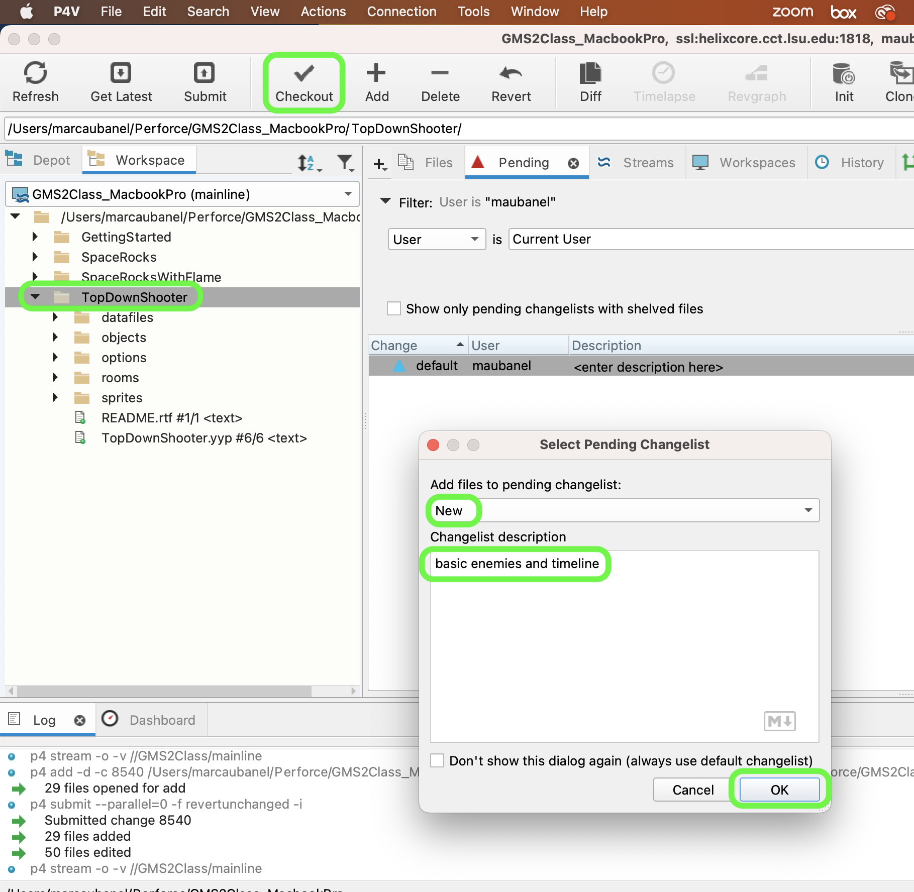
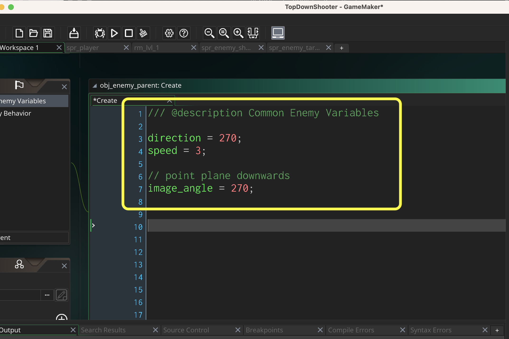
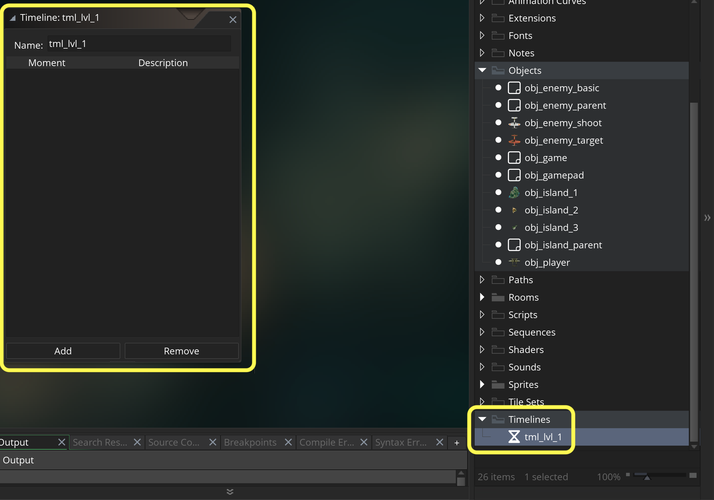
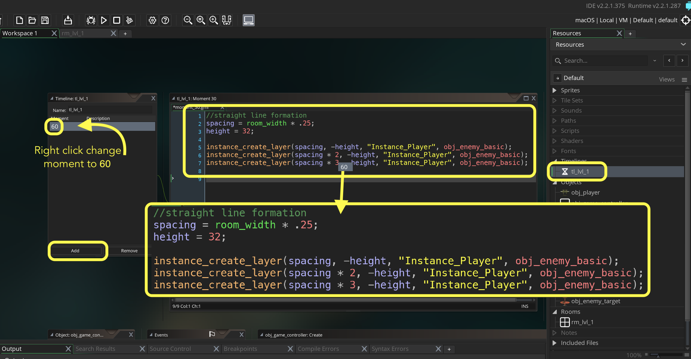
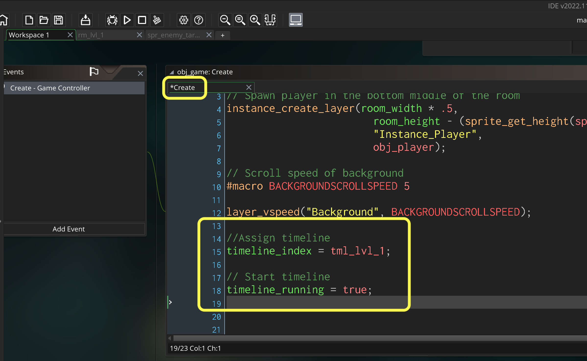
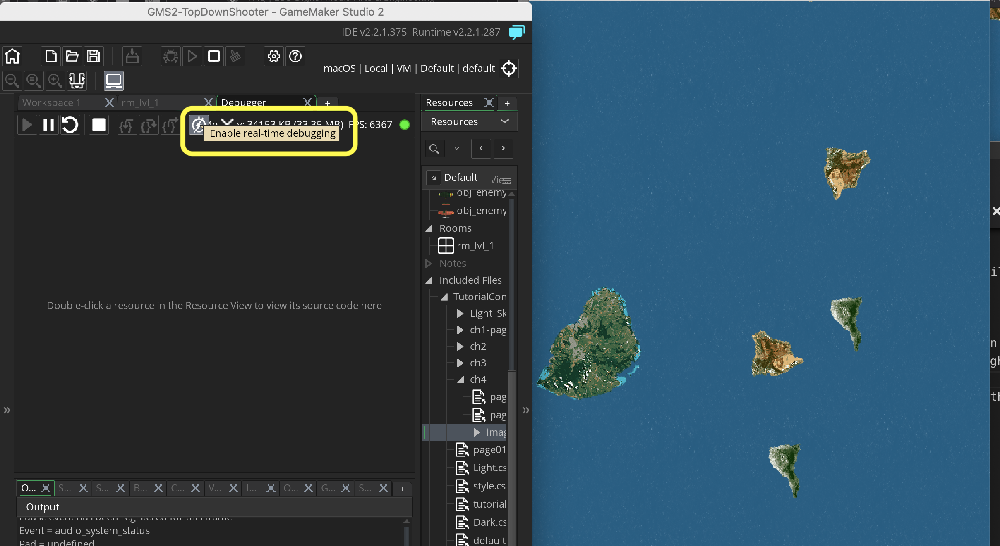
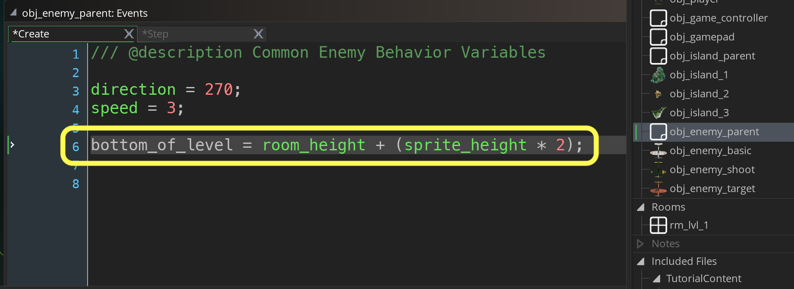
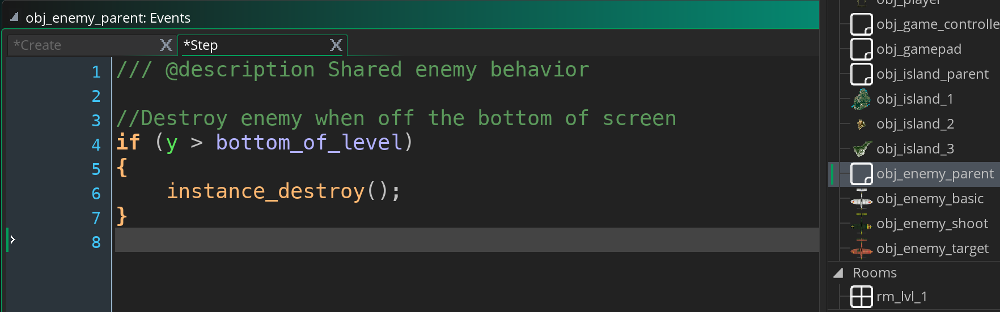
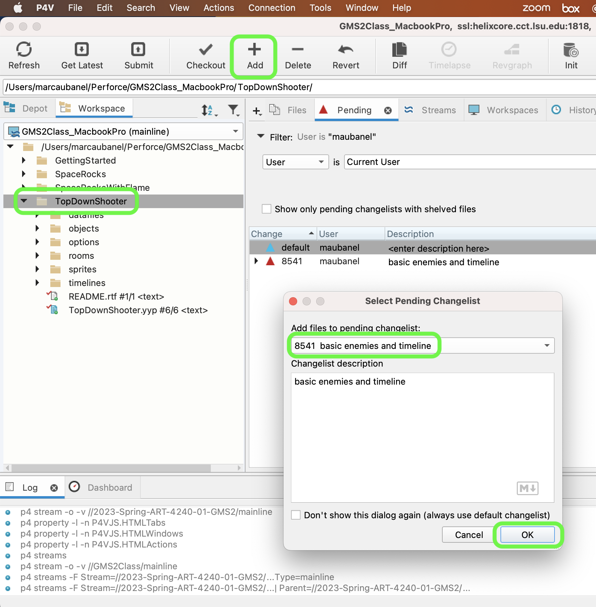

### Basic Enemy and Timelines

[previous](../preparing-enemies/README.md#user-content-setting-up-three-enemy-types) • [home](../README.md#user-content-gms2-top-down-shooter) • [next](../shooting/README.md#user-content-shooting)

All three planes fly downwards at the same speed. One shoots straight down and the other shoots with targeting. We are looking for common behavior in the obj_enemy_parent.  Lets start by setting the common behavior for **all** planes which is flying down screen. The will also get removed when they leave the play area.

 

---

##### `Step 1.`\|`TDS`|:small_blue_diamond:

Open up **P4v**.  Select the top folder of the **GameMaker** project. Press the <kbd>Checkout</kbd> button.  Checkout out all files in P4V so that they are all writable (otherwise they will be read only and none of the changes will be saved). Select a **New** changelist and add a message describing the unit of work you will be performing. Press the <kbd>OK</kbd> button.

Open up the project you are working on in **GameMaker**. 

##### `Step 2.`\|`TDS`|:small_blue_diamond: :small_blue_diamond: 

All three planes fly down at a constant speed. Make sure this speed isn't the same as the water or it will look like the planes are floating on the water like a boat. *Double click* on **obj_enemy_parent** and press <kbd>Add Event</kbd> button and add a new **Create** event script then add a downward motion.

##### `Step 3.`\|`TDS`|:small_blue_diamond: :small_blue_diamond: :small_blue_diamond:

Now we need to create a **[Timeline](https://manual.yoyogames.com/The_Asset_Editors/Timelines.htm)** to launch our enemy waves. Right click on **Timelines** and select **Create | Timeline** and call it `tl_lvl_1`.

##### `Step 4.`\|`TDS`|:small_blue_diamond: :small_blue_diamond: :small_blue_diamond: :small_blue_diamond:

Add a new **Moment** to the timeline.  *Right click* on **moment 0** and select **Change Moment**.  We will change it to 1 second in, at the `60`th frame.  We will then add three basic enemies evenly spaced horizontally. 

##### `Step 5.`\|`TDS`| :small_orange_diamond:

Each object has a timeline that is accessed through **timeline_index** but it defaults to `-1`.  We need to *assign* the newly created timeline and also start it.  Since it is unassigned it needs to be started.  Open **obj_game | Create event** and assign the timeline at the bottom of the script.

##### `Step 6.`\|`TDS`| :small_orange_diamond: :small_blue_diamond:

Now *press* the <kbd>Play</kbd> button in the top menu bar to launch the game.  Now after one second you should see three enemy ships move down screen:

##### `Step 7.`\|`TDS`| :small_orange_diamond: :small_blue_diamond: :small_blue_diamond:

We have a small problem with the enemies. It is small now, but if we spawn many more it will become an even bigger issue later. Can you figure it out? 

Answer

So what is the problem with the enemies as we have them currently? Try running the game in debug mode (right to the left of the regular run game button), let the enemies go off the screen, pause the game and look at your instances. Make sure you press the Update real time instances button and have the Instances window open.  Notice that the planes never disappear even when they go off the bottom of the screen.  If we spawn too many enemies the game will run out of memory and crash.

##### `Step 8.`\|`TDS`| :small_orange_diamond: :small_blue_diamond: :small_blue_diamond: :small_blue_diamond:

The enemy planes have not been dealt with and we need to do some housecleaning. Open up the **obj_enemy_parent: Create** event script and add a variable to the bottom to represent the bottom of the screen.

##### `Step 9.`\|`TDS`| :small_orange_diamond: :small_blue_diamond: :small_blue_diamond: :small_blue_diamond: :small_blue_diamond:

Go back to **obj_enemy_parent** and press the <kbd>Add Event</kbd> button for a **Step | Step** event script and delete the planes when they go off the bottom of the screen.

##### `Step 10.`\|`TDS`| :large_blue_diamond:

Now *press* the <kbd>Debug</kbd> button in the top menu bar to launch the game in debug mode (right to the left of the regular run game button). Check the **Instance** tab below.  Now the three planes should get removed once they are off the screen. Up next we will get back to the player for a bit and handle player shooting.

##### `Step 11.`\|`TDS`| :large_blue_diamond: :small_blue_diamond: 

Select the **File | Save Project**, then press **File | Quit** (PC) **Game Maker | Quit** on Mac to make sure everything in the game is saved.

##### `Step 12.`\|`TDS`| :large_blue_diamond: :small_blue_diamond: :small_blue_diamond: 

Open up **P4V**.  Select the top folder and press the **Add** button.  We want to add all the new files we created during this last session.  Add these files to the last change list you used at the begining of the session (in my case it was `Spaceship I portion of walkthrough`). Press the <kbd>OK</kbd> button.

##### `Step 13.`\|`TDS`| :large_blue_diamond: :small_blue_diamond: :small_blue_diamond:  :small_blue_diamond: 

Now you can submit the changelist by pressing both <kbd>Submit</kbd> buttons.

<!--  -->

| [previous](../preparing-enemies/README.md#user-content-setting-up-three-enemy-types)| [home](../README.md#user-content-gms2-top-down-shooter) | [next](../shooting/README.md#user-content-shooting)|
|---|---|---|
