### Front End

[previous](../audio/README.md#user-content-audio) • [home](../README.md#user-content-gms2-top-down-shooter) • [next](../lives/README.md#user-content-lives)

Lets add a title screen that invites the player to start the game.

 

---

##### `Step 1.`\|`TDS`|:small_blue_diamond:

Lets add the front end screen that comes up before the game starts. Download [spr_title_page.png](../Assets/Sprites/spr_title_page.png).

*Create* a new **Sprite** and press the <kbd>Import</kbd> button. Call this sprite `spr_title_page` and leave the origin in the top left corner (do not alter it).

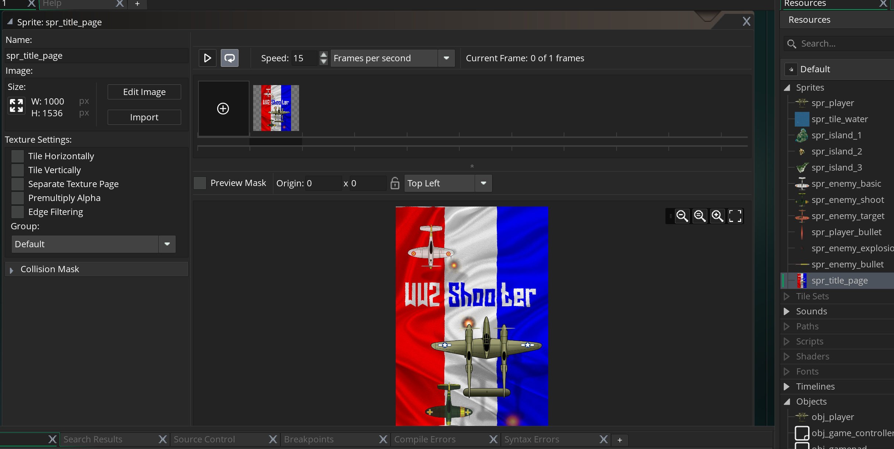

##### `Step 2.`\|`TDS`|:small_blue_diamond: :small_blue_diamond: 

*Create* a new **Room** and call it *rm_front_end*. Change the **Width** and **Height** to `1000` by `1536`. *Drag* this new room to the top of the list so it is the first room loaded.

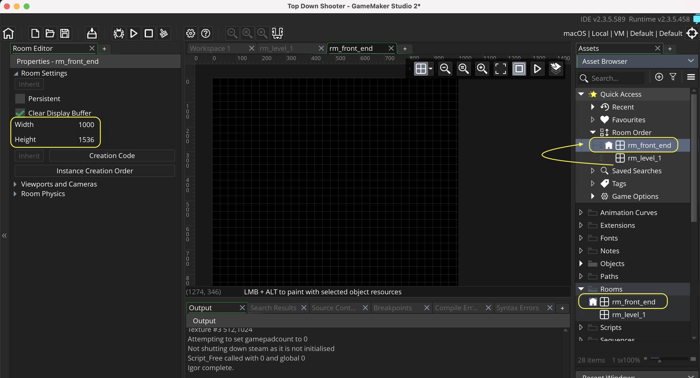

##### `Step 3.`\|`TDS`|:small_blue_diamond: :small_blue_diamond: :small_blue_diamond:

Now we are going to use the sprite as a background. Select the **Background Layer** and *click* on **no sprite**. Load the newly imported background. You should now have a screen that has our title page.

##### `Step 4.`\|`TDS`|:small_blue_diamond: :small_blue_diamond: :small_blue_diamond: :small_blue_diamond:

Now *press* the <kbd>Play</kbd> button in the top menu bar to launch the game.	The room should now have a title screen!

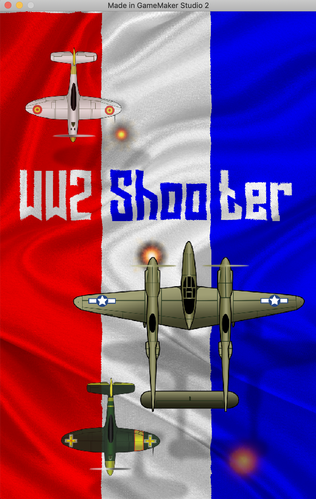

##### `Step 5.`\|`TDS`| :small_orange_diamond:

*Download* [spr_press_space.png](../Assets/Sprites/spr_press_space.png).

*Create* a new **Sprite** and <kbd>Import</kbd> spr_press_space.png and call it `spr_press_space`. 

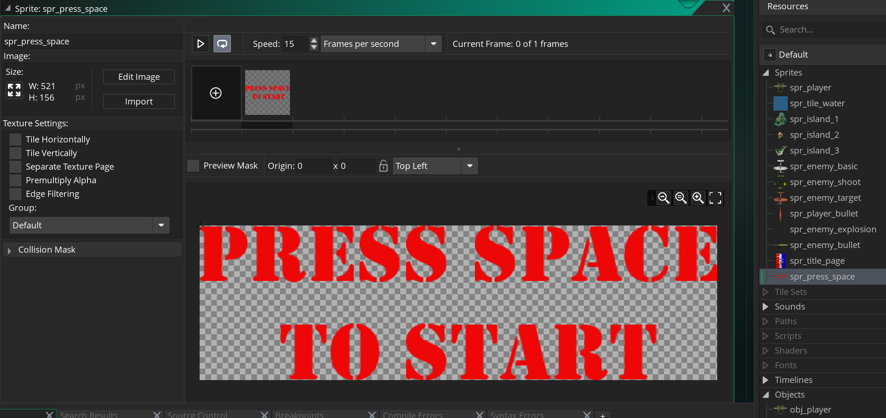

##### `Step 6.`\|`TDS`| :small_orange_diamond: :small_blue_diamond:

*Create* a new **Game Object** and bind the above sprite to it calling it `obj_press_space`. 

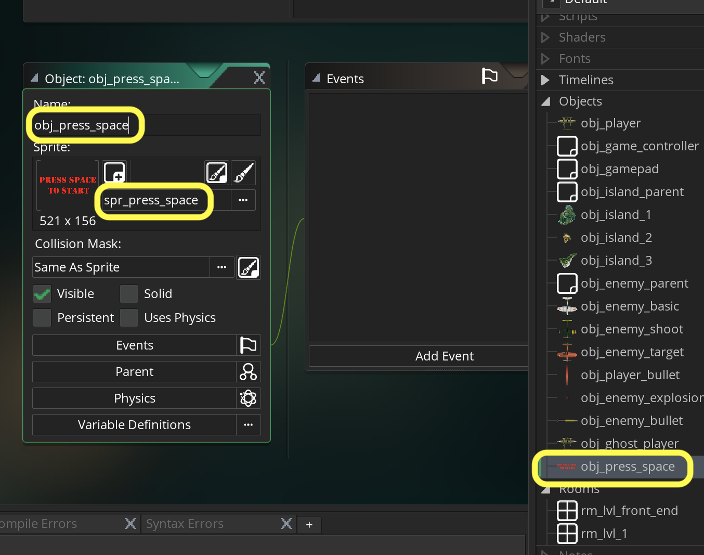

##### `Step 7.`\|`TDS`| :small_orange_diamond: :small_blue_diamond: :small_blue_diamond:

*Place* the newly created object in **rm_front_end** on the **Instances** layer.

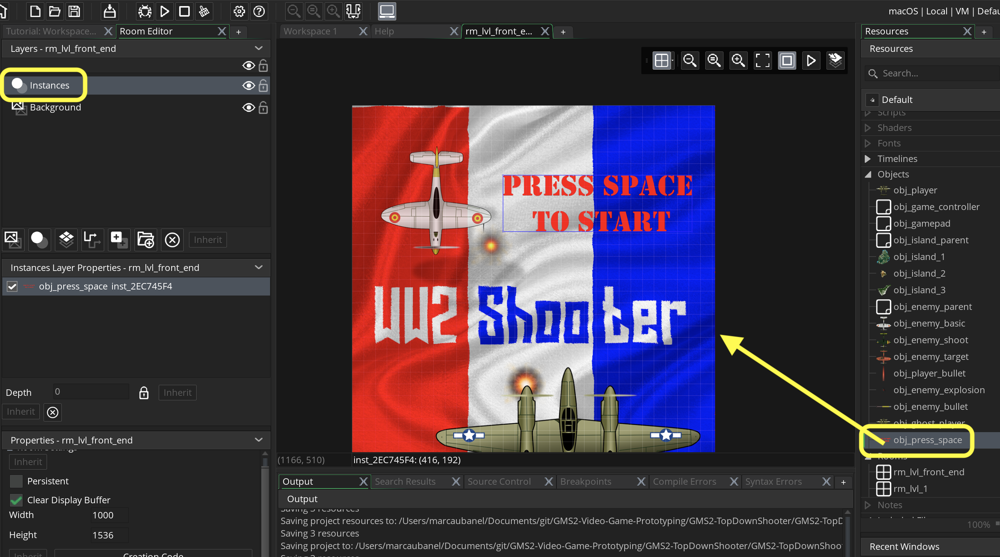

##### `Step 8.`\|`TDS`| :small_orange_diamond: :small_blue_diamond: :small_blue_diamond: :small_blue_diamond:

Run the game and now you should see the front end that still does nothing but has a call to action to start the game!

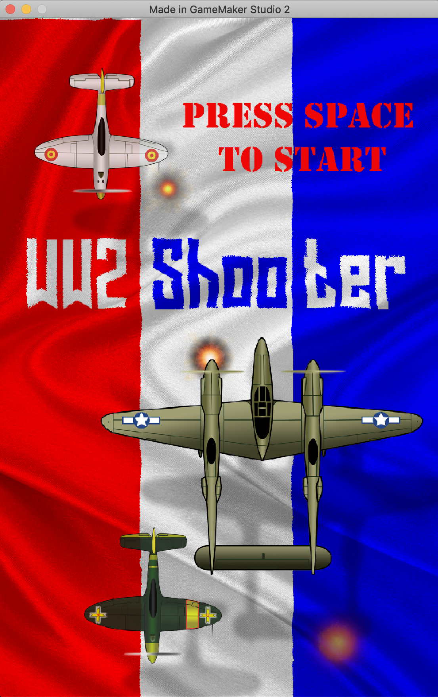

##### `Step 9.`\|`TDS`| :small_orange_diamond: :small_blue_diamond: :small_blue_diamond: :small_blue_diamond: :small_blue_diamond:

Lets make the press space call to action *flash* to attract the users attention. Open up **obj_press_space**. Press the <kbd>Add Event</kbd> and select a **Step | Step** event.

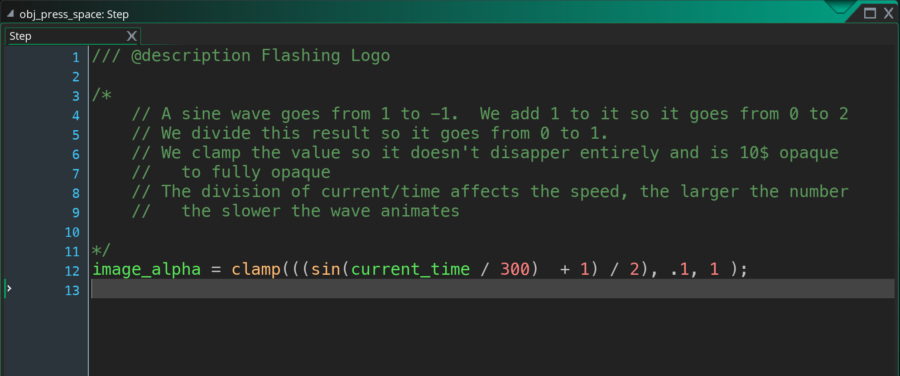

##### `Step 10.`\|`TDS`| :large_blue_diamond:

Now *press* the <kbd>Play</kbd> button in the top menu bar to launch the game.	The call to action should be flashing:

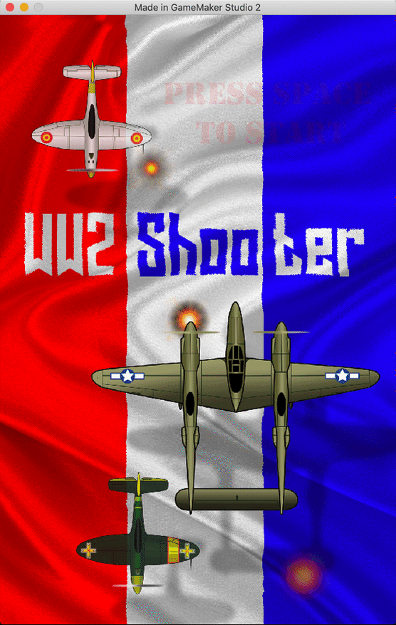

##### `Step 11.`\|`TDS`| :large_blue_diamond: :small_blue_diamond: 

Now lets add the ability to change rooms through the scripts which uses another GameMaker function **[room_goto(index)](https://manual.yoyogames.com/GameMaker_Language/GML_Reference/Asset_Management/Rooms/room_goto.htm)**.  The argument index is the name of the room we assigned.  In our case it is the rm_lvl_1 that we want to go to.
			
We will be checking for both a space bar and a start button.  Ideally we would change this title text to have start instead of space, but maybe this is something you could do on your own!  

Now add the room change to the bottom of the **obj_press_space: Step event**.

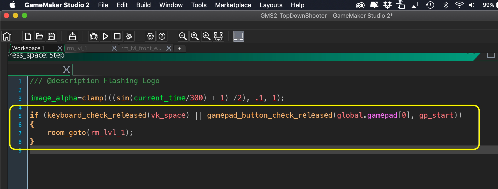

##### `Step 12.`\|`TDS`| :large_blue_diamond: :small_blue_diamond: :small_blue_diamond: 

Now *press* the <kbd>Play</kbd> button in the top menu bar to launch the game. Woops we get an error.  It looks like it can't find the global variable.  

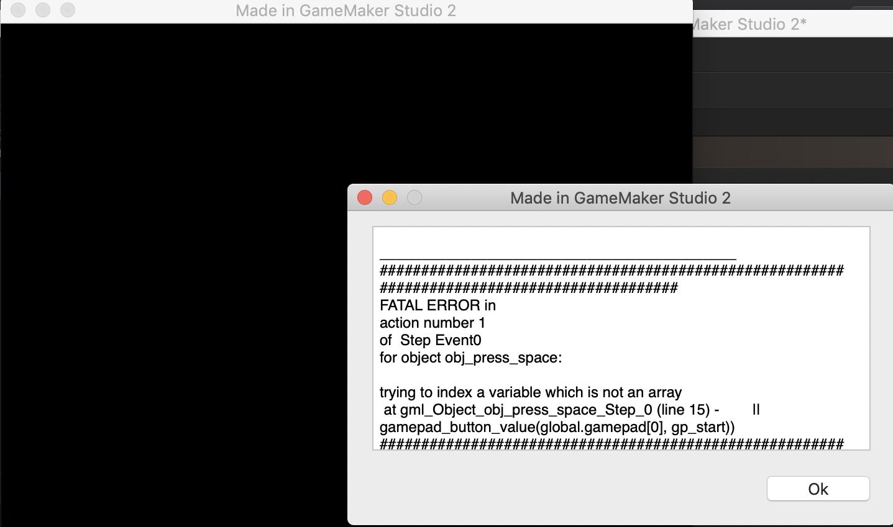

##### `Step 13.`\|`TDS`| :large_blue_diamond: :small_blue_diamond: :small_blue_diamond:  :small_blue_diamond: 

This happens because it is looking for a variable in the room that is stored in **obj_gamepad**.  We need to add the **obj_gamepad** to **rm_front_end** and remove it from **rm_level_1**. We want the controller to work for the whole game so we mark the **obj_gamepad** as **Persistent**, so it goes from level to level. We need the **obj_gamepad** in every level that uses a gamepad!

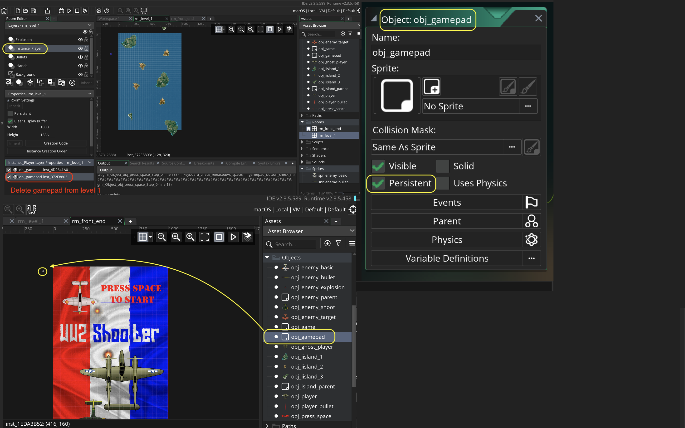

##### `Step 14.`\|`TDS`| :large_blue_diamond: :small_blue_diamond: :small_blue_diamond: :small_blue_diamond:  :small_blue_diamond: 

Test the game and you should now be able to press space and you can go to the game screen.

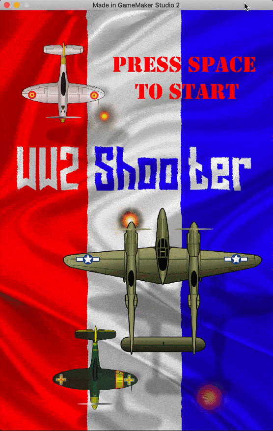

##### `Step 15.`\|`TDS`| :large_blue_diamond: :small_orange_diamond: 

Select the **File | Save Project** then press **File | Quit** to make sure everything in the game is saved. If you are using **GitHub** open up **GitHub Desktop** and add a title and longer description (if necessary) and press the <kbd>Commit to main</kbd> button. Finish by pressing **Push origin** to update the server with the latest changes.

___

<!--  -->

| [previous](../audio/README.md#user-content-audio)| [home](../README.md#user-content-gms2-top-down-shooter) | [next](../lives/README.md#user-content-lives)|
|---|---|---|
