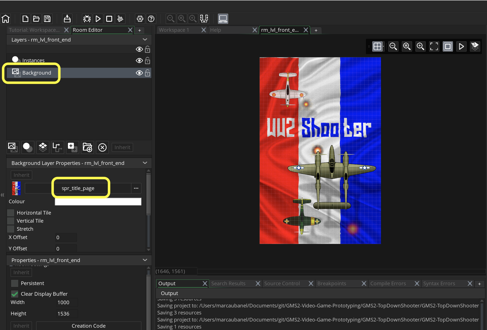

### Front End

[previous](../audio/README.md#user-content-audio) • [home](../README.md#user-content-gms2-top-down-shooter) • [next](../lives/README.md#user-content-lives)

Lets add a title screen that invites the player to start the game.

 

---

##### `Step 1.`\|`SPCRK`|:small_blue_diamond:

Lets add the front end screen that comes up before the game starts. Download [spr_title_page.png](../Assets/Sprites/spr_title_page.png).

*Create* a new **Sprite** and press the <kbd>Import</kbd> button. Call this sprite `spr_title_page` and leave the origin in the top left corner (do not alter it).

##### `Step 2.`\|`FHIU`|:small_blue_diamond: :small_blue_diamond: 

*Create* a new **Room** and call it *rm_front_end*. Change the **Width** and **Height** to `1000` by `1536`. *Drag* this new room to the top of the list so it is the first room loaded.

##### `Step 3.`\|`SPCRK`|:small_blue_diamond: :small_blue_diamond: :small_blue_diamond:

Now we are going to use the sprite as a background. Select the **Background Layer** and *click* on **no sprite**. Load the newly imported background. You should now have a screen that has our title page.

##### `Step 4.`\|`SPCRK`|:small_blue_diamond: :small_blue_diamond: :small_blue_diamond: :small_blue_diamond:

Now *press* the <kbd>Play</kbd> button in the top menu bar to launch the game.	The room should now have a title screen!

##### `Step 5.`\|`SPCRK`| :small_orange_diamond:

*Download* [spr_press_space.png](../Assets/Sprites/spr_press_space.png).

*Create* a new **Sprite** and <kbd>Import</kbd> spr_press_space.png and call it `spr_press_space`. 

##### `Step 6.`\|`SPCRK`| :small_orange_diamond: :small_blue_diamond:

*Create* a new **Game Object** and bind the above sprite to it calling it `obj_press_space`. 

##### `Step 7.`\|`SPCRK`| :small_orange_diamond: :small_blue_diamond: :small_blue_diamond:

*Place* the newly created object in **rm_front_end** on the **Instances** layer.

##### `Step 8.`\|`SPCRK`| :small_orange_diamond: :small_blue_diamond: :small_blue_diamond: :small_blue_diamond:

Run the game and now you should see the front end that still does nothing but has a call to action to start the game!

##### `Step 9.`\|`SPCRK`| :small_orange_diamond: :small_blue_diamond: :small_blue_diamond: :small_blue_diamond: :small_blue_diamond:

Lets make the press space call to action *flash* to attract the users attention. Open up **obj_press_space**. Press the <kbd>Add Event</kbd> and select a **Step | Step** event.

##### `Step 10.`\|`SPCRK`| :large_blue_diamond:

##### `Step 11.`\|`SPCRK`| :large_blue_diamond: :small_blue_diamond: 

##### `Step 12.`\|`SPCRK`| :large_blue_diamond: :small_blue_diamond: :small_blue_diamond: 

##### `Step 13.`\|`SPCRK`| :large_blue_diamond: :small_blue_diamond: :small_blue_diamond:  :small_blue_diamond: 

##### `Step 14.`\|`SPCRK`| :large_blue_diamond: :small_blue_diamond: :small_blue_diamond: :small_blue_diamond:  :small_blue_diamond: 

##### `Step 15.`\|`SPCRK`| :large_blue_diamond: :small_orange_diamond: 

##### `Step 16.`\|`SPCRK`| :large_blue_diamond: :small_orange_diamond:   :small_blue_diamond: 

##### `Step 17.`\|`SPCRK`| :large_blue_diamond: :small_orange_diamond: :small_blue_diamond: :small_blue_diamond:

##### `Step 18.`\|`SPCRK`| :large_blue_diamond: :small_orange_diamond: :small_blue_diamond: :small_blue_diamond: :small_blue_diamond:

##### `Step 19.`\|`SPCRK`| :large_blue_diamond: :small_orange_diamond: :small_blue_diamond: :small_blue_diamond: :small_blue_diamond: :small_blue_diamond:

##### `Step 20.`\|`SPCRK`| :large_blue_diamond: :large_blue_diamond:

##### `Step 21.`\|`SPCRK`| :large_blue_diamond: :large_blue_diamond: :small_blue_diamond:

___

| [previous](../audio/README.md#user-content-audio)| [home](../README.md#user-content-gms2-top-down-shooter) | [next](../lives/README.md#user-content-lives)|
|---|---|---|
