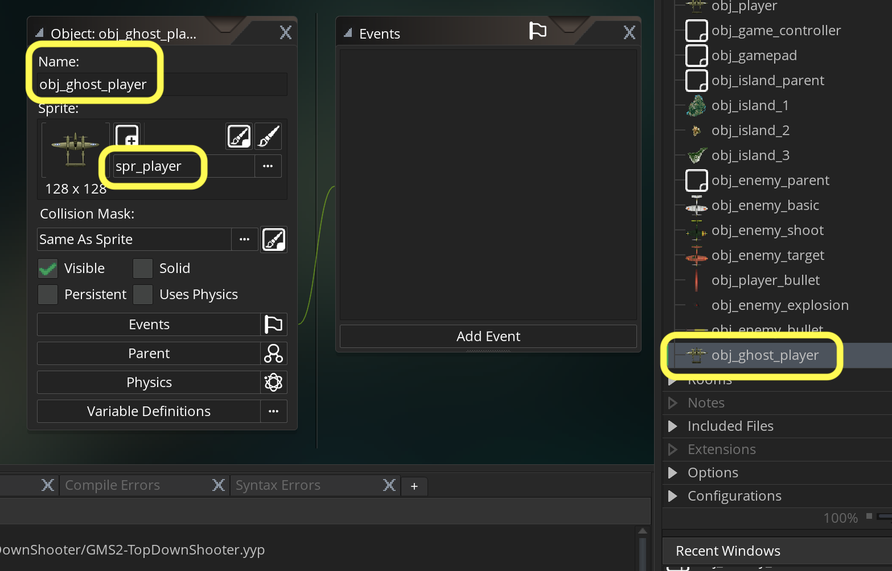

### Ghost Mode

[previous](../player-damage/README.md#user-content-player-taking-damage) • [home](../README.md#user-content-gms2-top-down-shooter) • [next](../audio/README.md#user-content-audio)

Now we want the plane when it runs out of health to go into ghost mode which is:

* Destroy player plane
* Animate new transluscent ghost plane offscreen bottom center
* Move ghost plane upwards
* Do not take damage, do not take player control
* After returning to starting point make player solid and give control back to gameplayer and give the plane 100% health again.

 

---

##### `Step 1.`\|`SPCRK`|:small_blue_diamond:

Now to do this we will need to create a finite state machine. What is a finite state machine? It is the logical state of any object. So a door can have 4 states. It can be closed, open (to more or less of a degree) or is in the act of opening or closing. Our **obj_player** will have two states: *Active In Game*vand *Out of Life Ghost Mode*.

	
For a very simple state machine, Create a new **object** for each state. We already have a **obj_player** for the *Active In Game* state. *Create* a new **Game Object**, then bind `spr_player` sprite to it and call it `obj_ghost_player`.

##### `Step 2.`\|`FHIU`|:small_blue_diamond: :small_blue_diamond: 

We need to switch the **obj_player** game object to **obj_ghost_player** when player health is less or equal to zero. GameMaker provides a function to do this for us called **[instance_change(obj, perf)](https://manual.yoyogames.com/GameMaker_Language/GML_Reference/Asset_Management/Instances/instance_change.htm)**.
	 
The **obj** argument is the object you want to turn into and the **perf** parameter is whether to perform that new object's create and destroy events (true) or not (false).
	
We need to add to the **obj_player: Step** event script to switch the game object to **ObjGhostPlayer**. Add at the bottom logic to check for zero health.

##### `Step 3.`\|`SPCRK`|:small_blue_diamond: :small_blue_diamond: :small_blue_diamond:

Now *press* the <kbd>Play</kbd> button in the top menu bar to launch the game. Get shot on purpose and get your health to 0.  Woops, another run time error.  In this case it is the health bar that can't find the player object.

##### `Step 4.`\|`SPCRK`|:small_blue_diamond: :small_blue_diamond: :small_blue_diamond: :small_blue_diamond:

Open **obj_game_controller: Draw | Draw GUI** event and we need to remove the reference to **obj_player.player_health** from the draw_healthbar() function.  Lets instead create a local variable hud_health and then reference the player only if it exists in the room (otherwise there is no plane so the health is 0):

##### `Step 5.`\|`SPCRK`| :small_orange_diamond:

Now *press* the <kbd>Play</kbd> button in the top menu bar to launch the game. Get shot on purpose and get your health to 0.  Woops, yet another run time error.  It is in both the shooting and targeting player when it is checking to see if it is above it.

##### `Step 6.`\|`SPCRK`| :small_orange_diamond: :small_blue_diamond:

Open **obj_enemy_target: Step** event and we need to check if the player exists before firing a bullet.

##### `Step 7.`\|`SPCRK`| :small_orange_diamond: :small_blue_diamond: :small_blue_diamond:

Repeat for **obj_enemy_shoot: Step**  vent and we need to check if the player exists before firing a bullet.

##### `Step 8.`\|`SPCRK`| :small_orange_diamond: :small_blue_diamond: :small_blue_diamond: :small_blue_diamond:

Now *press* the <kbd>Play</kbd> button in the top menu bar to launch the game. The player switches from **obj_player** to **obj_ghost_player**. This new ghost player cannot be controlled which is what we want!

##### `Step 9.`\|`SPCRK`| :small_orange_diamond: :small_blue_diamond: :small_blue_diamond: :small_blue_diamond: :small_blue_diamond:

Open up **obj_ghost_player**. Press the <kbd>Add Event</kbd> and select a **Create** event. Put the player in the center horizontally off screen vertically.

##### `Step 10.`\|`SPCRK`| :large_blue_diamond:

Look at **obj_game_controller: Create** event and look at where the game spawns the player at the beginning.  We want to move it to this same spot before switching from ghost back to game mode.

##### `Step 11.`\|`SPCRK`| :large_blue_diamond: :small_blue_diamond: 

##### `Step 12.`\|`SPCRK`| :large_blue_diamond: :small_blue_diamond: :small_blue_diamond: 

##### `Step 13.`\|`SPCRK`| :large_blue_diamond: :small_blue_diamond: :small_blue_diamond:  :small_blue_diamond: 

##### `Step 14.`\|`SPCRK`| :large_blue_diamond: :small_blue_diamond: :small_blue_diamond: :small_blue_diamond:  :small_blue_diamond: 

##### `Step 15.`\|`SPCRK`| :large_blue_diamond: :small_orange_diamond: 

##### `Step 16.`\|`SPCRK`| :large_blue_diamond: :small_orange_diamond:   :small_blue_diamond: 

##### `Step 17.`\|`SPCRK`| :large_blue_diamond: :small_orange_diamond: :small_blue_diamond: :small_blue_diamond:

##### `Step 18.`\|`SPCRK`| :large_blue_diamond: :small_orange_diamond: :small_blue_diamond: :small_blue_diamond: :small_blue_diamond:

##### `Step 19.`\|`SPCRK`| :large_blue_diamond: :small_orange_diamond: :small_blue_diamond: :small_blue_diamond: :small_blue_diamond: :small_blue_diamond:

##### `Step 20.`\|`SPCRK`| :large_blue_diamond: :large_blue_diamond:

##### `Step 21.`\|`SPCRK`| :large_blue_diamond: :large_blue_diamond: :small_blue_diamond:

___

| [previous](../player-damage/README.md#user-content-player-taking-damage)| [home](../README.md#user-content-gms2-top-down-shooter) | [next](../audio/README.md#user-content-audio)|
|---|---|---|
