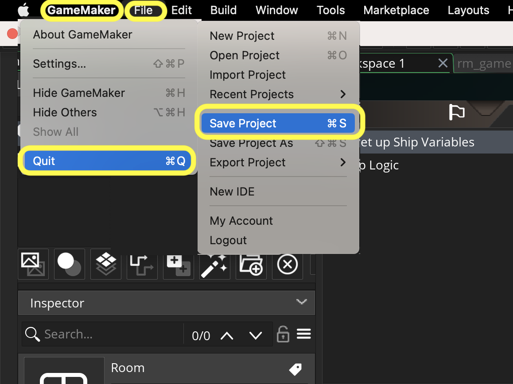

### Moving Ship with Joystick

[previous](../keyboard/README.md#user-content-moving-ship-with-keyboard) • [home](../README.md#user-content-gms2-top-down-shooter) • [next](../scrolling-water/README.md#user-content-scrolling-water)

If you do not have a controller to test with then skip to the next chapter [Scrolling Water](scrolling-water/README.md#user-content-scrolling-water).  Otherwise lets continue and add a controller.  First make sure that you controller is compatible with your PC or Mac.  The XBox controller is a good option for a PC and the Sony controller is natively supported on most macs.

The original game and most shooters use a controller instead of the keyboard.  Game mechanics have developed with the user interface in mind.  Often game systems that work well on controllers don't translate so well on keyboards and mice.  I find shooters just shine using a game controller.

 

---

##### `Step 1.`\|`TDS`|:small_blue_diamond:

Open up **P4v**.  Select the top folder of the **GameMaker** project. Press the <kbd>Checkout</kbd> button.  Checkout out all files in P4V so that they are all writable (otherwise they will be read only and none of the changes will be saved). Select a **New** changelist and add a message describing the unit of work you will be performing. Press the <kbd>OK</kbd> button.

Open up the project you are working on in **GameMaker**. 

First lets import the game object that holds the code for the joystick [joystick.mauby.games.yymps](../Assets/Objects/joystick.mauby.games.yymps).

##### `Step 2.`\|`TDS`|:small_blue_diamond: :small_blue_diamond: 

Select **Tools | Import Local Package** and selet the file you just downloaded `download joystick.mauby.games.yymps` and press the <kbd>Open</kbd> button.

##### `Step 3.`\|`TDS`|:small_blue_diamond: :small_blue_diamond: :small_blue_diamond:

Select the **obj_gamepad** and press the <kbd>Add</kbd> button.  It should move the item into **Resources to Import**.  Press the <kbd>Import</kbd> button.

##### `Step 4.`\|`TDS`|:small_blue_diamond: :small_blue_diamond: :small_blue_diamond: :small_blue_diamond:

Now in the **Objects** folder you should have an **obj_gamepad**.  Double click to open it up. If you want to find out more about how this works, check out **GameMakers** excellent tutorial [Adding Gamepad Support GML](https://marketplace.yoyogames.com/assets/5785/adding-gamepad-support-gml).

##### `Step 5.`\|`TDS`| :small_orange_diamond:

Lets quickly look at two items in the obj_gamepad object.  Open it and look at the **obj_gamepad | Create** event.  Notice that we initialize the four gamepads to **[noone](https://manual.yoyogames.com/GameMaker_Language/GML_Overview/Instance_Keywords.htm)**.  This is a keyword that means that something is empty or not there.  We are basically saying in Gamemaker parlance that there is no controller plugged into any of the 4 gamepad slots.

##### `Step 6.`\|`TDS`| :small_orange_diamond: :small_blue_diamond:

The event where the magic happens is in the **Asynchronous | Async System** event.  Here we print debug messages if a controller is plugged in or unplugged as well as save a reference to the index number that we can use in the global.gamepad array. 

The `global.` keyword allows us to create a variable that is not only seen inside the instance of an object.  It is a global variable where there is only one global copy and it is accessible everywhere. 

The square brackets `[i]` after `global.gamepad` indicates that it is a list.  A reference to the 4 **gamepads** are stored in **array**[0], [1], [2], [3], [4]. So `i` contains an integer of 0 through 4.

##### `Step 7.`\|`TDS`| :small_orange_diamond: :small_blue_diamond: :small_blue_diamond:

Open **obj_player: Step** event and add controls after we check for keyboard. To stop cheating where players press both keyboard and joystick, we can add an if statement to ensure we are getting 0's for keyboard input (player is not pressing both at the same time).  Also, we don't have to compensate for diagonals because the controller returns a horizontal and vertical value with a **normalized** magnitude of 1.

We are using [gamepad_axis_value](https://manual.yoyogames.com/GameMaker_Language/GML_Reference/Game_Input/GamePad_Input/gamepad_axis_value.htm) where we can get 2D axis values for the left and right gamepad stick (we are looking for the left here). This will return a value of -1 to 1 just like when we check for the keyboard axis. Add the code after the keyboard controls but before you move the player. 

##### `Step 8.`\|`TDS`| :small_orange_diamond: :small_blue_diamond: :small_blue_diamond: :small_blue_diamond:

Open up **rm_lvl_1** and add **obj_gamepad** to the **Instance_Player** level.

##### `Step 9.`\|`TDS`| :small_orange_diamond: :small_blue_diamond: :small_blue_diamond: :small_blue_diamond: :small_blue_diamond:

Now *press* the <kbd>Play</kbd> button in the top menu bar to launch the game and try your controller out.  You should be able to move the player around at any angle.  Look I can turn the player in circles.  You also don't go faster if you press both arrow keys and the gamepad.  Test it out!

##### `Step 10.`\|`TDS`| :large_blue_diamond:

Select the **File | Save Project**, then press **File | Quit** (PC) **Game Maker | Quit** on Mac to make sure everything in the game is saved.

Open up **P4V**.  Select the top folder and press the **Add** button.  We want to add all the new files we created during this last session.  Add these files to the last change list you used at the begining of the session (in my case it was `Spaceship I portion of walkthrough`). Press the <kbd>OK</kbd> button.

Now you can submit the changelist by pressing both <kbd>Submit</kbd> buttons.

<!--  -->

| [previous](../keyboard/README.md#user-content-moving-ship-with-keyboard)| [home](../README.md#user-content-gms2-top-down-shooter) | [next](../scrolling-water/README.md#user-content-scrolling-water)|
|---|---|---|
