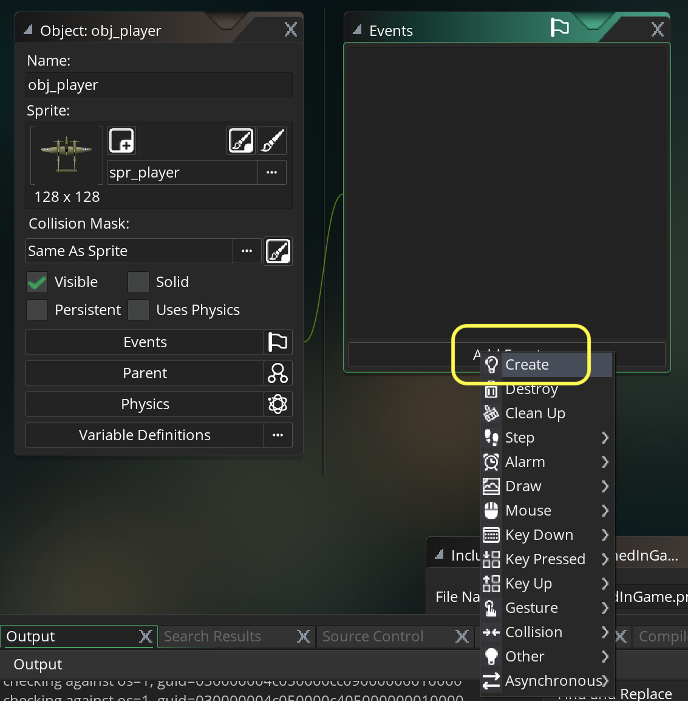
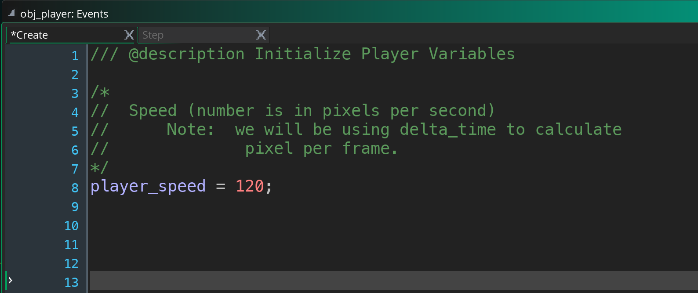
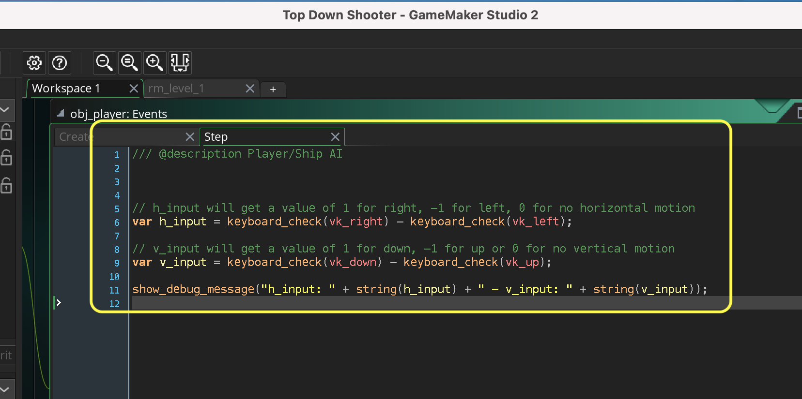
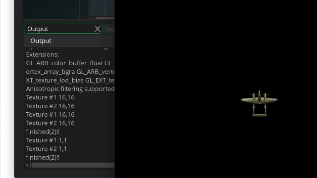
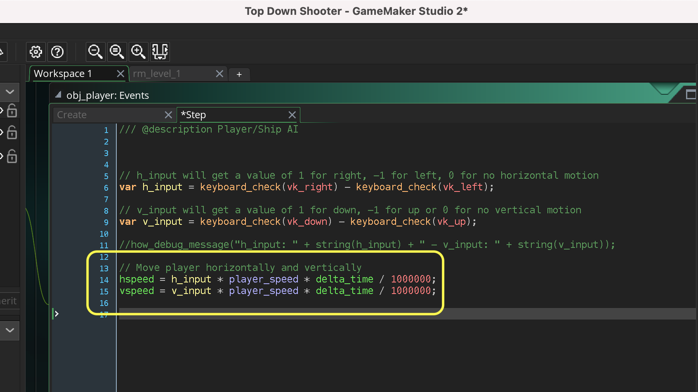
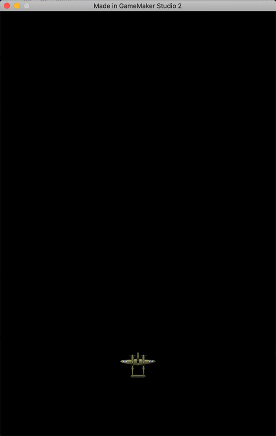

### Moving Ship with Keyboard

[previous](../ship-room/README.md#user-content-getting-ship-in-room) • [home](../README.md#user-content-gms2-top-down-shooter) • [next](../)

We will be using different physics from the space rocks (Asteroids) game. Up, down, left and right will move the plane around the screen in 8 directions.  

 

---

##### `Step 1.`\|`SPCRK`|:small_blue_diamond:

*Open* **obj_player** and press the **Add Event** button and select a **Create** event.

##### `Step 2.`\|`FHIU`|:small_blue_diamond: :small_blue_diamond: 

Previously we have set the timing based on pixels per frame.  One of the problems with this is that we can change the framerate in the room which then changes the physics.  
		
	
The game can also slow down and speed up, what if our game gets so slow that it no longer runs at the 60 fps or 30 fps we have set in the room?  The game will stutter.  We will be using pixels per second and then using **[delta_time](https://manual.yoyogames.com/GameMaker_Language/GML_Reference/Maths_And_Numbers/Date_And_Time/delta_time.htm)** to figure out how many microseconds have passed since last frame. This way the game won't pause it will continue to simulate even during a slow down. Also we can adjust the room framerate and the speed won't change.

This will make it similar to how you would handle inputs in a **Unity** or **Unreal** game as well, where the both use an equivalent method (using milliseconds). This is an extra step that puts us in line with how other engines handle this issue.

120 pixels per second would be the same as setting the value at 4 pixels per frame at 30 frames per second or 2 pixels per frame at 60 frames per second. By using delta_time the simulation will run at the same speed in all situations.

Open up **obj_player: Create** event.

##### `Step 3.`\|`SPCRK`|:small_blue_diamond: :small_blue_diamond: :small_blue_diamond:

Press the **Add Event** button on **obj_player** and add a **Step | Step** event. Now we will look at **keyboard_check(key)** and will subtract the left key from the right key. Now if you remember **[keyboard_check(key)](https://manual.yoyogames.com/GameMaker_Language/GML_Reference/Game_Input/Keyboard_Input/Keyboard_Input.htm)** returns a boolean which will be `1` if `true` and `0` if `false`. This means if right is pressed it will be 1-0. If left is pressed it will be 0-1. If both right and left are pressed it will be 1-1. So this gives us a range of -1 to 1 and a value of 0 if nothing or both are pressed (cancelling each other out).

Lets prove it. We will do that with another new function `show_debug_message(string)`. It will print this message in the **Debugger Output** window.

Open up **obj_player: Step** event.

##### `Step 4.`\|`SPCRK`|:small_blue_diamond: :small_blue_diamond: :small_blue_diamond: :small_blue_diamond:

Now *press* the <kbd>Play</kbd> button in the top menu bar to launch the game. Press a combination of arrow buttons.  Look at the output window and see if it makes sense?

##### `Step 5.`\|`SPCRK`| :small_orange_diamond:

If you get the correct debug message you can comment out this line or delete it as we will be adding movement instead below.

Now that we have a normalized value between -1 and 1, let's translate this into motion.  We need to figure out how to translate the player_speed variable from frames per second to frames since last tick.  We will use `delta_time` to figure out how many microseconds have passed since last frame. 1 microsecond is 1,000,000th of a second.  So to turn this into a fractional number in seconds we need to divide delta/time / 1,000,000 (commas for clarity you can't enter commas into the script).

So if we multiply (`delta/time / 1,000,000`) by `player_speed` we will get frames since last tick in milliseconds.

Let me give an example.  Lets say we have a framerate of 2 frames per second.  
`delta_time` would be `500,000`.  So if we divide 500,000 / 1,000,000 we get a value of .5.  This means that it will have the value of speed which get us to our delta per frame.  Type into the bottom of the **obj_player: Step** event and comment out the `show_debug_message(string)` from earlier:

##### `Step 6.`\|`SPCRK`| :small_orange_diamond: :small_blue_diamond:

Now *press* the <kbd>Play</kbd> button in the top menu bar to launch the game. Press up down left and right.  Try diagonals.  Play careful attention to the speed and see if moving in diagonals is moving faster than moving laterally?

##### `Step 7.`\|`SPCRK`| :small_orange_diamond: :small_blue_diamond: :small_blue_diamond:

We need to separate the direction we are pointing in from the speed we are moving at.  

`direction = point_direction(0, 0, h_)

##### `Step 8.`\|`SPCRK`| :small_orange_diamond: :small_blue_diamond: :small_blue_diamond: :small_blue_diamond:

##### `Step 9.`\|`SPCRK`| :small_orange_diamond: :small_blue_diamond: :small_blue_diamond: :small_blue_diamond: :small_blue_diamond:

##### `Step 10.`\|`SPCRK`| :large_blue_diamond:

##### `Step 11.`\|`SPCRK`| :large_blue_diamond: :small_blue_diamond: 

##### `Step 12.`\|`SPCRK`| :large_blue_diamond: :small_blue_diamond: :small_blue_diamond: 

##### `Step 13.`\|`SPCRK`| :large_blue_diamond: :small_blue_diamond: :small_blue_diamond:  :small_blue_diamond: 

##### `Step 14.`\|`SPCRK`| :large_blue_diamond: :small_blue_diamond: :small_blue_diamond: :small_blue_diamond:  :small_blue_diamond: 

##### `Step 15.`\|`SPCRK`| :large_blue_diamond: :small_orange_diamond: 

##### `Step 16.`\|`SPCRK`| :large_blue_diamond: :small_orange_diamond:   :small_blue_diamond: 

##### `Step 17.`\|`SPCRK`| :large_blue_diamond: :small_orange_diamond: :small_blue_diamond: :small_blue_diamond:

##### `Step 18.`\|`SPCRK`| :large_blue_diamond: :small_orange_diamond: :small_blue_diamond: :small_blue_diamond: :small_blue_diamond:

##### `Step 19.`\|`SPCRK`| :large_blue_diamond: :small_orange_diamond: :small_blue_diamond: :small_blue_diamond: :small_blue_diamond: :small_blue_diamond:

##### `Step 20.`\|`SPCRK`| :large_blue_diamond: :large_blue_diamond:

##### `Step 21.`\|`SPCRK`| :large_blue_diamond: :large_blue_diamond: :small_blue_diamond:

___

| [previous](../ship-room/README.md#user-content-getting-ship-in-room)| [home](../README.md#user-content-gms2-top-down-shooter) | [next](../)|
|---|---|---|
