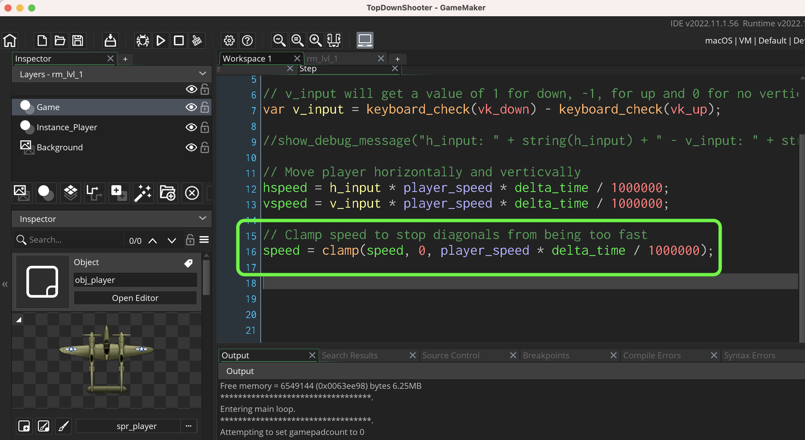
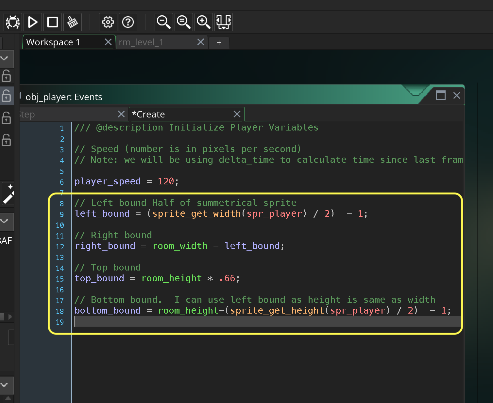

### Moving Ship with Keyboard

<sub>[previous](../ship-room/README.md#user-content-getting-ship-in-room) • [home](../README.md#user-content-gms2-top-down-shooter) • [next](../joystick/README.md#user-content-moving-ship-with-joystick)</sub>


We will be using different physics from the space rocks (Asteroids) game. Up, down, left and right will move the plane around the screen in 8 directions.  

<br>

---


##### `Step 1.`\|`TDS`|:small_blue_diamond:

Open up **P4v**.  Select the top folder of the **GameMaker** project. Press the <kbd>Checkout</kbd> button.  Checkout out all files in P4V so that they are all writable (otherwise they will be read only and none of the changes will be saved). Select a **New** changelist and add a message describing the unit of work you will be performing. Press the <kbd>OK</kbd> button.

Open up the project you are working on in **GameMaker**. 


##### `Step 2.`\|`TDS`|:small_blue_diamond: :small_blue_diamond: 

*Open* **obj_player** and press the **Add Event** button and select a **Create** event.


##### `Step 3.`\|`TDS`|:small_blue_diamond: :small_blue_diamond: :small_blue_diamond:

Previously we have set the timing based on pixels per frame.  One of the problems with this is that we can change the framerate in the room which then changes the physics.  
		
The game can also slow down and speed up, what if our game gets so slow that it no longer runs at the 60 fps or 30 fps we have set in the room?  The game will stutter.  We will be using pixels per second and then using **[delta_time](https://manual.yoyogames.com/GameMaker_Language/GML_Reference/Maths_And_Numbers/Date_And_Time/delta_time.htm)** to figure out how many microseconds have passed since last frame. This way the game won't pause it will continue to simulate even during a slow down. Also we can adjust the room framerate and the speed won't change.

This will make it similar to how you would handle inputs in a **Unity** or **Unreal** game as well, where the both use an equivalent method (using milliseconds). This is an extra step that puts us in line with how other engines handle this issue.

120 pixels per second would be the same as setting the value at 4 pixels per frame at 30 frames per second or 2 pixels per frame at 60 frames per second. By using delta_time the simulation will run at the same speed in all situations.

Open up **obj_player: Create** event.


##### `Step 4.`\|`TDS`|:small_blue_diamond: :small_blue_diamond: :small_blue_diamond: :small_blue_diamond:

Press the **Add Event** button on **obj_player** and add a **Step | Step** event. Now we will look at **keyboard_check(key)** and will subtract the left key from the right key. Now if you remember **[keyboard_check(key)](https://manual.yoyogames.com/GameMaker_Language/GML_Reference/Game_Input/Keyboard_Input/Keyboard_Input.htm)** returns a boolean which will be `1` if `true` and `0` if `false`. This means if right is pressed it will be 1-0. If left is pressed it will be 0-1. If both right and left are pressed it will be 1-1. So this gives us a range of -1 to 1 and a value of 0 if nothing or both are pressed (cancelling each other out).

Lets prove it. We will do that with another new function `show_debug_message(string)`. It will print this message in the **Debugger Output** window.

Open up **obj_player: Step** event.


##### `Step 5.`\|`TDS`| :small_orange_diamond:

Now *press* the <kbd>Play</kbd> button in the top menu bar to launch the game. Press a combination of arrow buttons.  Look at the output window and see if it makes sense?


##### `Step 6.`\|`TDS`| :small_orange_diamond: :small_blue_diamond:

If you get the correct debug message you can comment out this line or delete it as we will be adding movement instead below.

Now that we have a normalized value between -1 and 1, let's translate this into motion.  We need to figure out how to translate the player_speed variable from frames per second to frames since last tick.  We will use `delta_time` to figure out how many microseconds have passed since last frame. 1 microsecond is 1,000,000th of a second.  So to turn this into a fractional number in seconds we need to divide delta/time / 1,000,000 (commas for clarity you can't enter commas into the script).

So if we multiply (`delta/time / 1,000,000`) by `player_speed` we will get frames since last tick in milliseconds.

Let me give an example.  Lets say we have a framerate of 2 frames per second.  
`delta_time` would be `500,000`.  So if we divide 500,000 / 1,000,000 we get a value of .5.  This means that it will have the value of speed which get us to our delta per frame.  Type into the bottom of the **obj_player: Step** event and comment out the `show_debug_message(string)` from earlier:


##### `Step 7.`\|`TDS`| :small_orange_diamond: :small_blue_diamond: :small_blue_diamond:

Now *press* the <kbd>Play</kbd> button in the top menu bar to launch the game. Press up down left and right.  Try diagonals.  Play careful attention to the speed and see if moving in diagonals is moving faster than moving laterally?


##### `Step 8.`\|`TDS`| :small_orange_diamond: :small_blue_diamond: :small_blue_diamond: :small_blue_diamond:

Now the problem is that they are travelling 1 unit to on the horizontal axis and 1 unit on the vertical axis. So if we move 1 unit to the right and 1 unit to the left.  We can calculate the velocity with Pythagorean theorem.  If we take

```
h = √a^2* a^2 *  + b^2 * b^2
h = √1^2 * 1^2< + 1^2 * 1^2
h = √1 + 1
h = √2
h = 1.4142
```

So when you move left and right you would move 1 unit (* player_speed) but if you move diagonally, you would move by `1.4142 * player_speed and move faster. So lets clamp the value at the max speed so it goes the same speed as pure horizontal and vertical.




##### `Step 9.`\|`TDS`| :small_orange_diamond: :small_blue_diamond: :small_blue_diamond: :small_blue_diamond: :small_blue_diamond:

Now *press* the <kbd>Play</kbd> button in the top menu bar to launch the game. Now the flight works perfectly except the player can leave the level.


##### `Step 10.`\|`TDS`| :large_blue_diamond:

Now since our **Origin** is at `64` by `64` in the middle of the sprite we don't want any of the ship to leave the play area so we need to go from `64` to `room_width - 65` or `sprite_width / 2` to `room_width - sprite_wdith /2 -1`.

We want to restrict player to the bottom third of the screen and to not go off the bottom of the play area which would be `room_height - sprite_height / 2 - 1`.


##### `Step 11.`\|`TDS`| :large_blue_diamond: :small_blue_diamond: 

Open obj_player: Create event script and create 4 variables representing the top, Open the **obj_player: Create** event script and create 4 new variables representing the top, bottom, left and right boundary of the game. We need to subtract by one to get the disance from 0 to room_width -1 (instead of 1 to room_width).

Don't mind the yellow exclamation marks (∆).  That means these variables are **set** but never used.  We will do that in the next step and these marks will go away.  They are just there to remind you that it is unique, not used and could be a spelling error if we were using a variable that was already defined.




##### `Step 12.`\|`TDS`| :large_blue_diamond: :small_blue_diamond: :small_blue_diamond: 

We need to clamp the location.  Now since we are moving with speed the ship is in its new position between the ***Step** and **End Step** event. Press the <kbd>Add Event</kbd> and select a **Step | End Step** event. We can **[clamp(val, min, max)](https://manual.yoyogames.com/GameMaker_Language/GML_Reference/Maths_And_Numbers/Number_Functions/clamp.htm)** our **x** and **y** position of the ship to the bounds we just created.  Place this after we move the player (so the player will move out of bounds then the **clamp()** function will force it back on screen). 


##### `Step 13.`\|`TDS`| :large_blue_diamond: :small_blue_diamond: :small_blue_diamond:  :small_blue_diamond: 

Now *press* the <kbd>Play</kbd> button in the top menu bar to launch the game. Press a combination of buttons and try to leave the play area?  Now you should never leave the game screen no matter what you do with the arrow keys (or any other keys for that matter). 


##### `Step 14.`\|`TDS`| :large_blue_diamond: :small_blue_diamond: :small_blue_diamond: :small_blue_diamond:  :small_blue_diamond: 

Select the **File | Save Project**, then press **File | Quit** (PC) **Game Maker | Quit** on Mac to make sure everything in the game is saved.


##### `Step 15.`\|`TDS`| :large_blue_diamond: :small_orange_diamond: 

Open up **P4V**.  Select the top folder and press the **Add** button.  We want to add all the new files we created during this last session.  Add these files to the last change list you used at the begining of the session (in my case it was `Spaceship I portion of walkthrough`). Press the <kbd>OK</kbd> button.


##### `Step 16.`\|`TDS`| :large_blue_diamond: :small_orange_diamond:   :small_blue_diamond: 

Now you can submit the changelist by pressing both <kbd>Submit</kbd> buttons.


<!--  -->


| [previous](../ship-room/README.md#user-content-getting-ship-in-room)| [home](../README.md#user-content-gms2-top-down-shooter) | [next](../joystick/README.md#user-content-moving-ship-with-joystick)|
|---|---|---|
