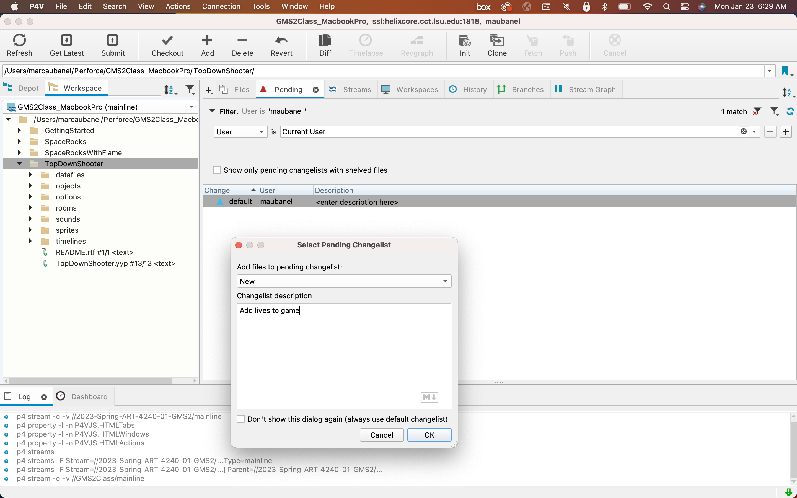
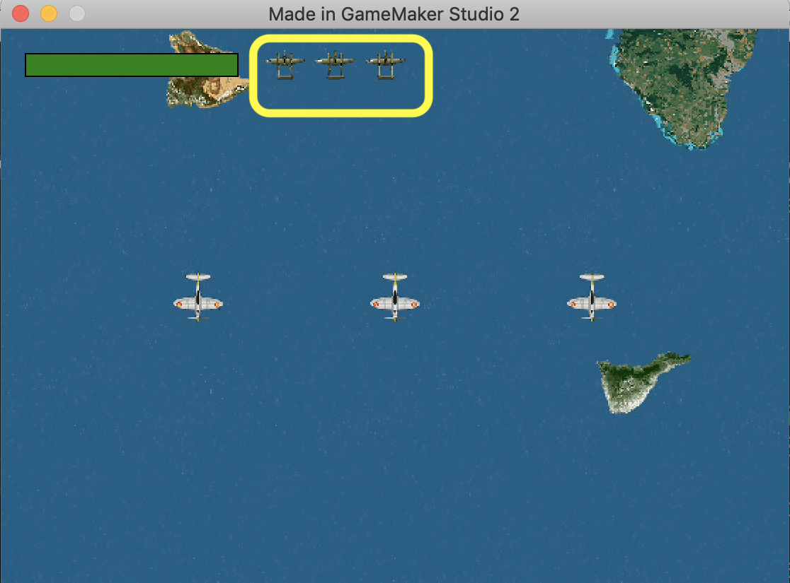
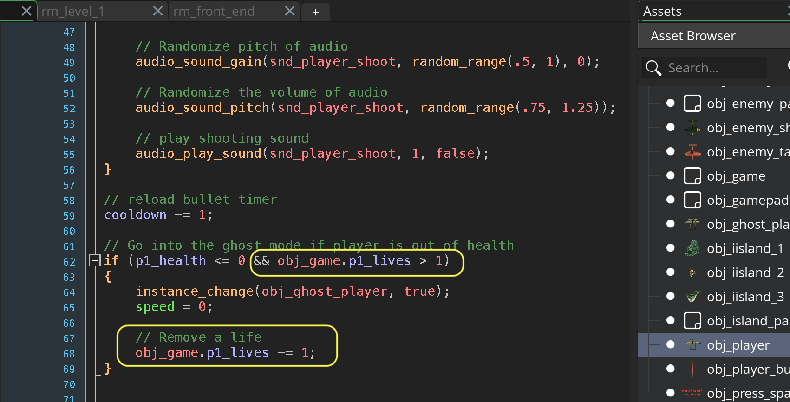
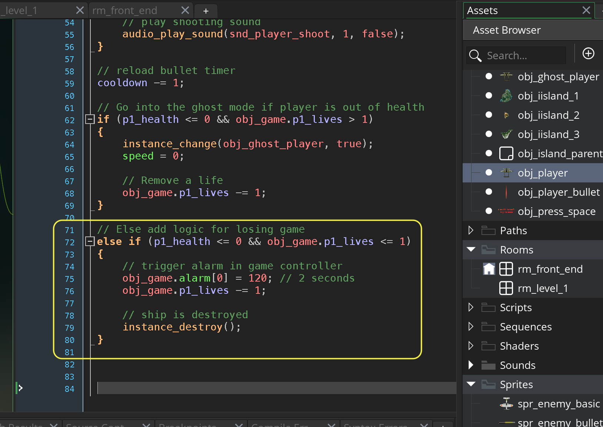
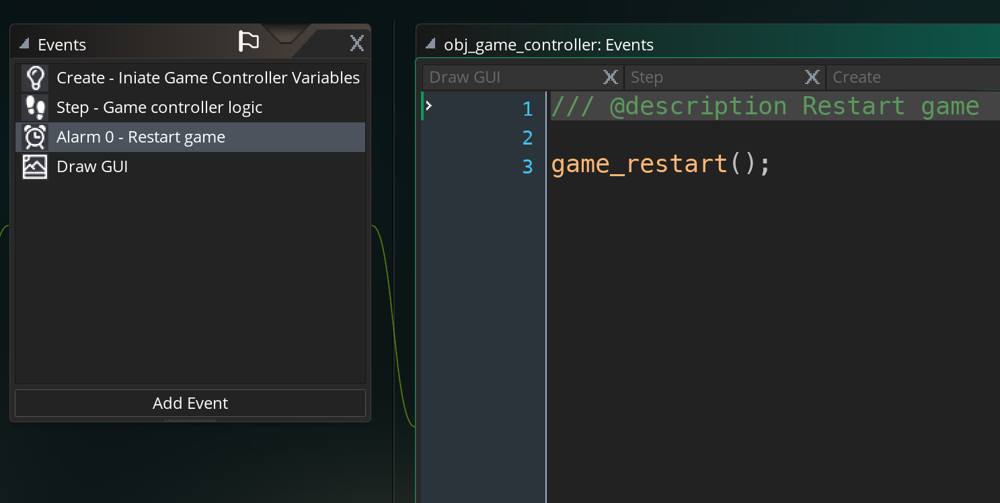
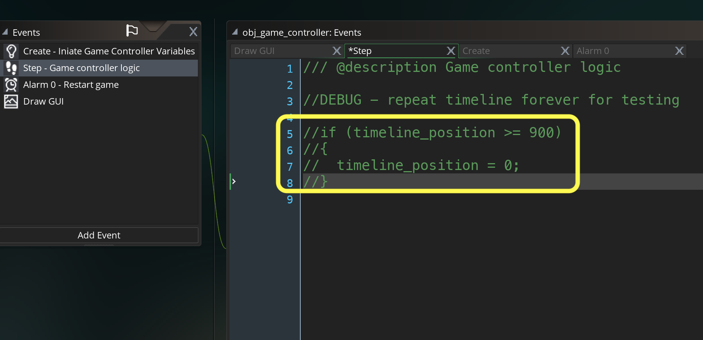
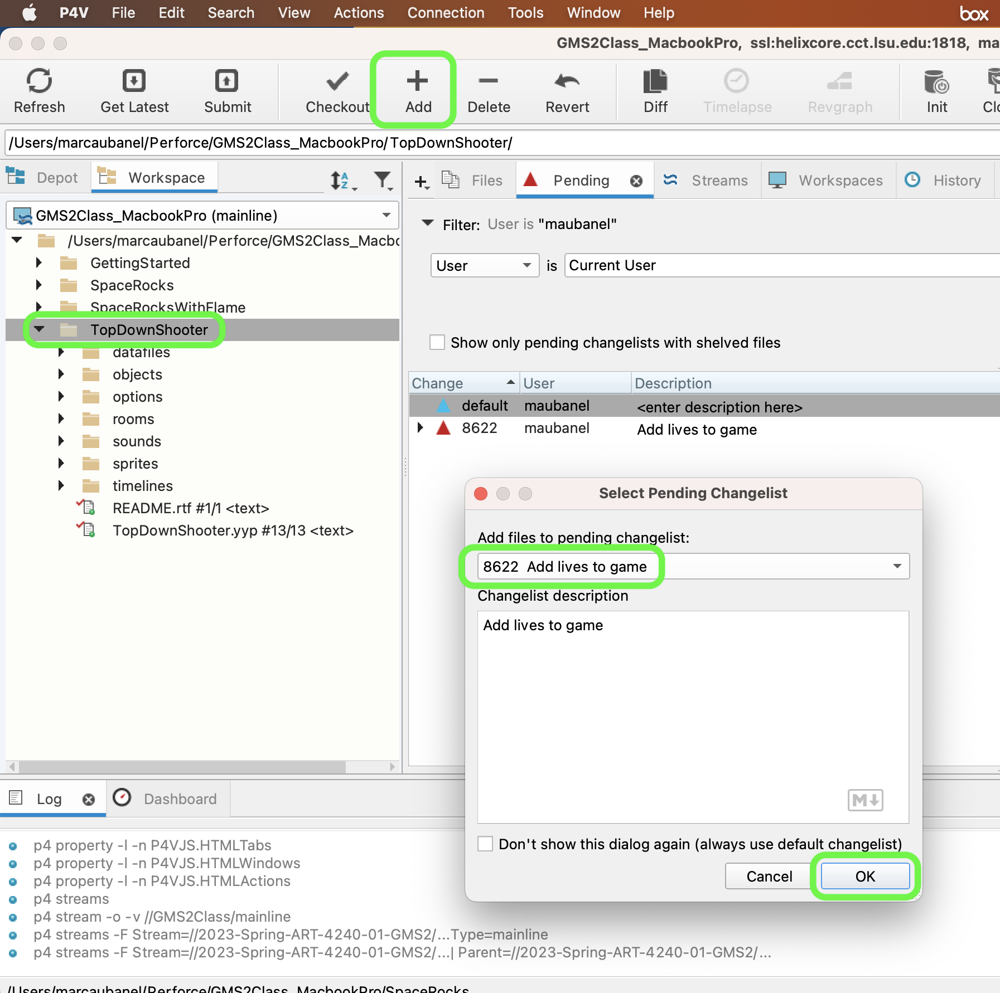
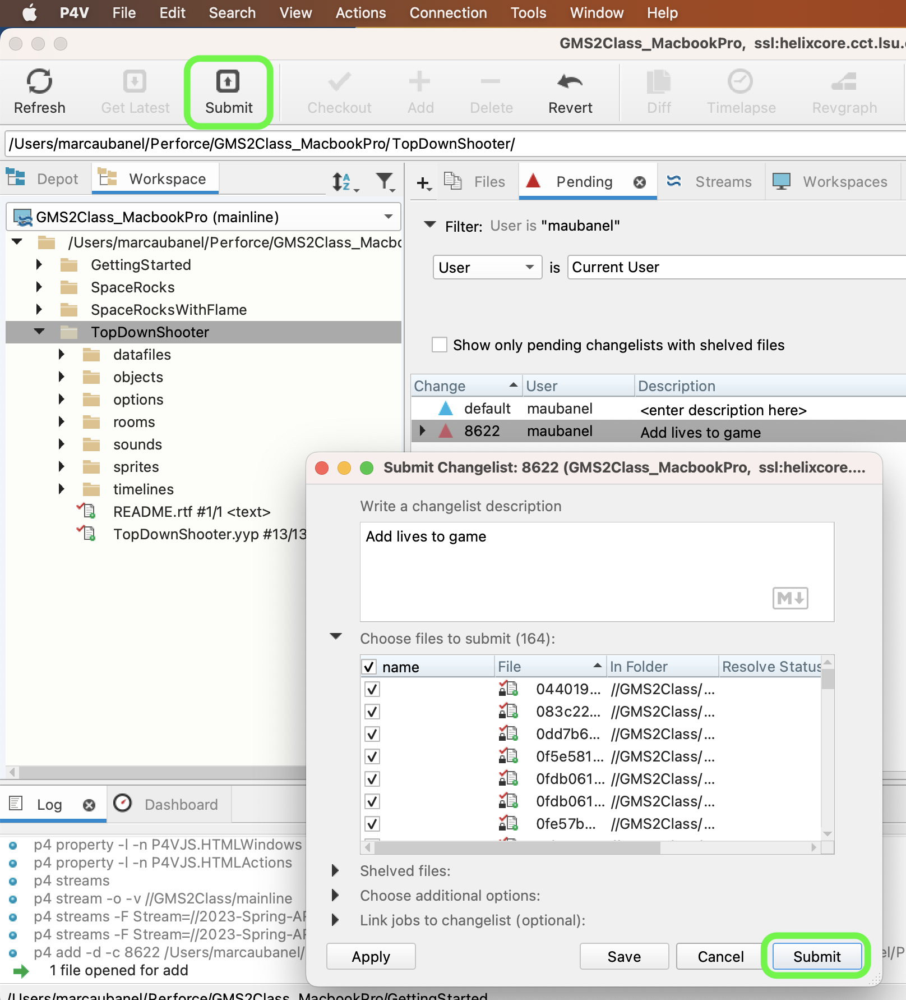

### Lives

[previous](../front-end/README.md#user-content-front-end) • [home](../README.md#user-content-gms2-top-down-shooter)

The final item left to do in the walk through is to add lives to the game.

 

---

##### `Step 1.`\|`TDS`|:small_blue_diamond:

Open up **P4v**.  Select the top folder of the **GameMaker** project. Press the <kbd>Checkout</kbd> button.  Checkout out all files in P4V so that they are all writable (otherwise they will be read only and none of the changes will be saved). Select a **New** changelist and add a message describing the unit of work you will be performing. Press the <kbd>OK</kbd> button.

Open up the project you are working on in **GameMaker**. 

*Open* the **obj_game | Create** event and add a new *variable* called `p1_lives`.  There is a built in GameMaker variable called `lives` that is global but there is only one.  We might want to add a second player to this game so we will create our own variable name for this. 
		
Why don't we add this to the player object? The player object is destroyed at death then restarted.  If we kept the varibale there it would get reset.  It is best to keep track of global game settings in an object that we will not alter during game.  Our **obj_game** was designed for this. 

##### `Step 2.`\|`TDS`|:small_blue_diamond: :small_blue_diamond: 

Add to the bottom of **obj_game_controller: Draw GUI** event and draw the lives to the screen.

##### `Step 3.`\|`TDS`|:small_blue_diamond: :small_blue_diamond: :small_blue_diamond:

Now *press* the <kbd>Play</kbd> button in the top menu bar to launch the game. Now we should see three planes representing our health being drawn on the HUD next to our health:

##### `Step 4.`\|`TDS`|:small_blue_diamond: :small_blue_diamond: :small_blue_diamond: :small_blue_diamond:

Now that we have added lives, we need to subtract one each time the player dies.  We only want to subtract a life if there are lives left. We don't want to go to ghost mode if the player has no lives left.  Open up obj_player: Step event and go to the end where we check if health is less or equal to `0`.  We add a check to see if there are any player lives left. Open up **obj_player: Step Event** and make the changes.

##### `Step 5.`\|`TDS`| :small_orange_diamond:

We need to now deal with a player who has run out of health but has no lives left after this one.  We would like to:

* Subtract our final life (there is one life left)
* Destroy the player object as the game is over
* Restart the game, but we will call an alarm so it will restart in 2 seconds.  The * * Alarm needs to be on obj_game as the player alarm would be destroyed with the player

Go back to **obj_player: Step** event and add after the previous condition.

##### `Step 6.`\|`TDS`| :small_orange_diamond: :small_blue_diamond:

Now *open* up **obj_game** and press the <kbd>Add Event</kbd> button to add an **Alarm | Alarm0** event and call the game restart function.

##### `Step 7.`\|`TDS`| :small_orange_diamond: :small_blue_diamond: :small_blue_diamond:

Now *press* the <kbd>Play</kbd> button in the top menu bar to launch the game. This is sped up below but represents the final flow of the game:

##### `Step 8.`\|`TDS`| :small_orange_diamond: :small_blue_diamond: :small_blue_diamond: :small_blue_diamond:

*Undo* our looping timeline and make a few doze interesting waves and finish the level.  Comment out the loop in **obj_game_controller: Step** event.

##### `Step 9.`\|`TDS`| :small_orange_diamond: :small_blue_diamond: :small_blue_diamond: :small_blue_diamond: :small_blue_diamond:

Select the **File | Save Project** then press **File | Quit** to make sure everything in the game is saved. If you are using **GitHub** open up **GitHub Desktop** and add a title and longer description (if necessary) and press the <kbd>Commit to main</kbd> button. Finish by pressing **Push origin** to update the server with the latest changes.

Open up **P4V**.  Select the top folder and press the **Add** button.  We want to add all the new files we created during this last session.  Add these files to the last change list you used at the begining of the session (in my case it was `Spaceship I portion of walkthrough`). Press the <kbd>OK</kbd> button.

Now you can submit the changelist by pressing both <kbd>Submit</kbd> buttons.

| `top.down.shooter`\|`THE END`| 
| :--- |
| **That's All Folks!** Thanks for sticking around. That is it for this tutorial but there is so much more that you can do with this game.  First you can start by adding more waves.  Have fun! |

<!--  -->

| [previous](../front-end/README.md#user-content-front-end)| [home](../README.md#user-content-gms2-top-down-shooter) |
|---|---|
