### Player Taking Damage

[previous](../player-health/README.md#user-content-player-health) • [home](../README.md#user-content-gms2-top-down-shooter) • [next](../ghost-mode/README.md#user-content-ghost-mode)

Lets add the animation for the player getting hit by bullet and subtract points from its health. We will reuse the animation for the enemy getting hit. 

 

---

##### `Step 1.`\|`TDS`|:small_blue_diamond:

Open up **P4v**.  Select the top folder of the **GameMaker** project. Press the <kbd>Checkout</kbd> button.  Checkout out all files in P4V so that they are all writable (otherwise they will be read only and none of the changes will be saved). Select a **New** changelist and add a message describing the unit of work you will be performing. Press the <kbd>OK</kbd> button.

Open up the project you are working on in **GameMaker**. 

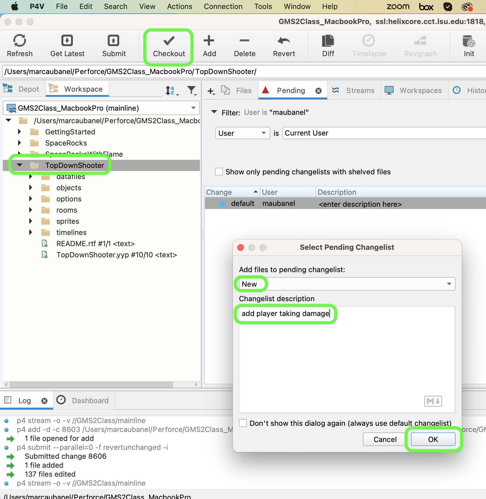

Open **obj_enemy_bullet** and press the <kbd>Add Event</kbd> button and add a **Collision | obj_player** event.

##### `Step 2.`\|`TDS`|:small_blue_diamond: :small_blue_diamond: 

*Add* to this new script an instance of **obj_enemy_explosion** and *deduct* from the player's health `p1_health` and destroy the bullet.  We do not destroy the player as we only would do this if there is no health left. Let add this logic to the **obj_enemy_bullet: Collision obj_player** Event.

##### `Step 3.`\|`TDS`|:small_blue_diamond: :small_blue_diamond: :small_blue_diamond:

Now for testing purposes I just want these three waves to continue for ever.  *Add* a **Step | Step** event script to **obj_game** and lets loop at `900` frames the timeline forever:

##### `Step 4.`\|`TDS`|:small_blue_diamond: :small_blue_diamond: :small_blue_diamond: :small_blue_diamond:

Now *press* the <kbd>Play</kbd> button in the top menu bar to launch the game. You should now see an explosion and the health should depleat to beyond 0. Also the enemies will just keep respawning.

##### `Step 5.`\|`TDS`| :small_orange_diamond:

I would like the explosion to be above the player and not behind him.  This is not currenlty possible as our top most layer in the room is **Instance_Player**.  Lets open **rm_lvl_1** and add an instance layer to the top called Explosion:

##### `Step 6.`\|`TDS`| :small_orange_diamond: :small_blue_diamond:

In **obj_enemy_bullet: Collision | obj_player player** script change the layer from `"Instance_Player"` to `"Explosion"`.

##### `Step 7.`\|`TDS`| :small_orange_diamond: :small_blue_diamond: :small_blue_diamond:

Now *press* the <kbd>Play</kbd> button in the top menu bar to launch the game. Now explosions should be on top of the player.

##### `Step 8.`\|`TDS`| :small_orange_diamond: :small_blue_diamond: :small_blue_diamond: :small_blue_diamond:

Now lets deal with enemy plane and player collision.  This will destroy the plane and do triple damage of `30` points.  Lets try two explosions. Double click **obj_enemy_parent** and press <kbd>Add Event</kbd> button and select **Collision | obj_player**:

##### `Step 9.`\|`TDS`| :small_orange_diamond: :small_blue_diamond: :small_blue_diamond: :small_blue_diamond: :small_blue_diamond:

Add two explosions and take away triple health damage to bullets inside the **obj_enemy_parent Collision obj_player** event script.

##### `Step 10.`\|`TDS`| :large_blue_diamond:

Now *press* the <kbd>Play</kbd> button in the top menu bar to launch the game. Now run into an enemy to see if it works.

##### `Step 11.`\|`TDS`| :large_blue_diamond: :small_blue_diamond: 

Now play test the game and adjust your **Collision Masks** on the player sprite and enemy sprites to your liking.  I like to have them a bit loose and not take the entire sprite.  Here are the settings that I liked, but choose your own, based on your preference.

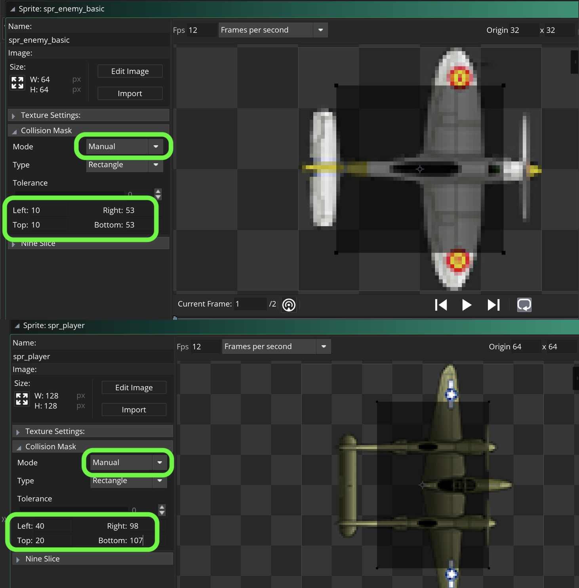

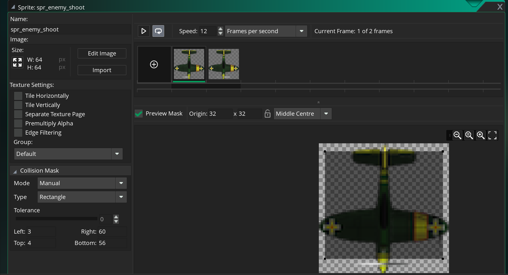

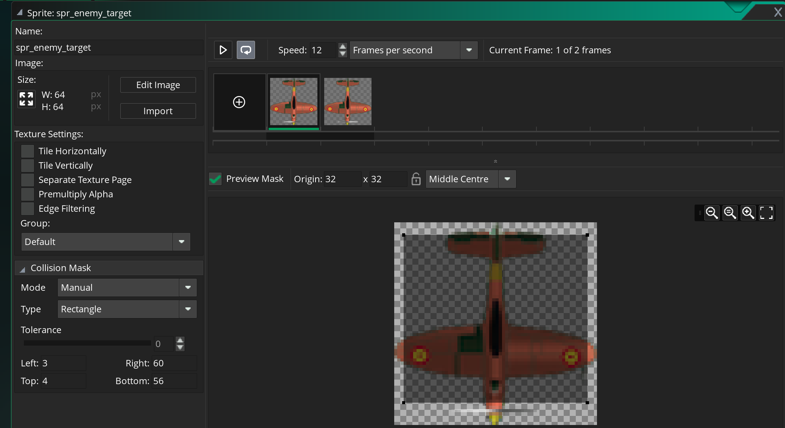

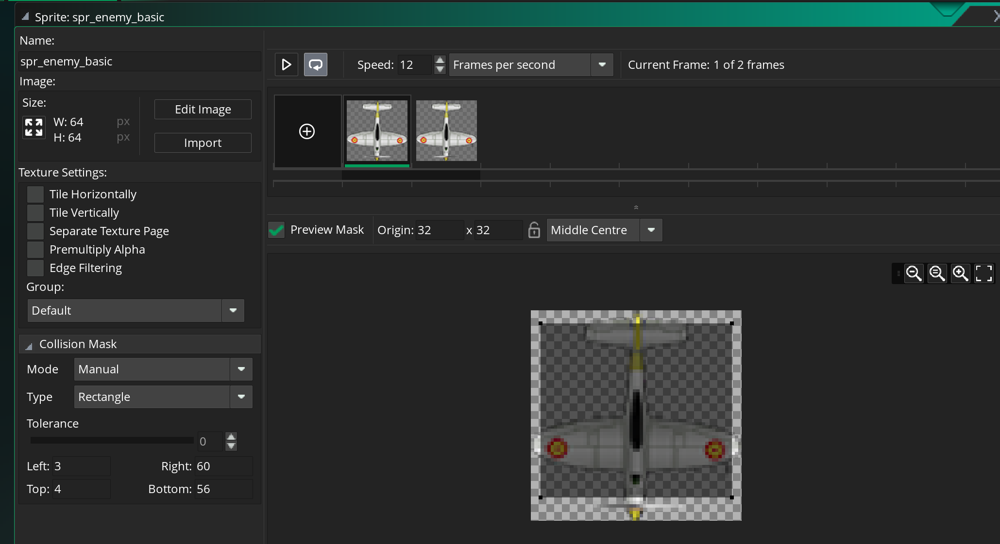

##### `Step 12.`\|`TDS`| :large_blue_diamond: :small_blue_diamond: :small_blue_diamond: 

Lets not have the targeting planes shoot backwards or the shooting planes shoot when they are below the player.  We will check to see if the player is in front of the enemy before firing.  Open **obj_enemy_shoot: Step** event and add a check for the player plane behind the enemy.

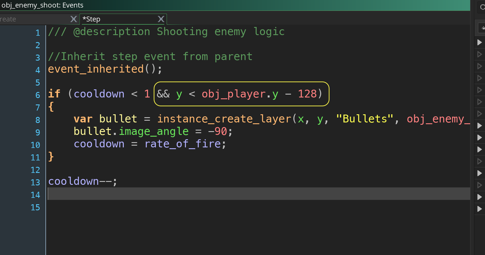

##### `Step 13.`\|`TDS`| :large_blue_diamond: :small_blue_diamond: :small_blue_diamond:  :small_blue_diamond: 

Do the same thing in **obj_enemy_target: Step Event**.

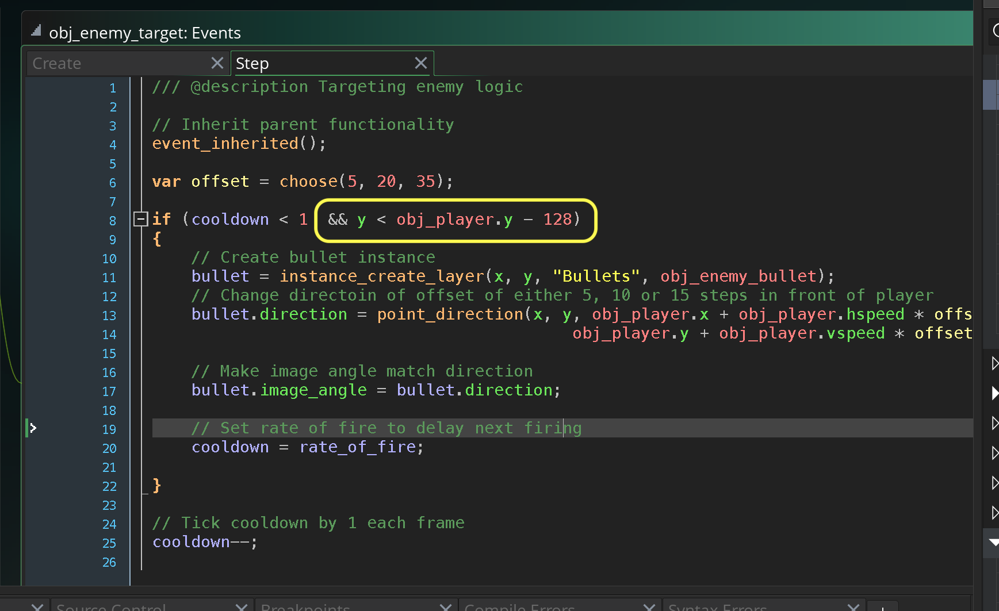

##### `Step 14.`\|`TDS`| :large_blue_diamond: :small_blue_diamond: :small_blue_diamond: :small_blue_diamond:  :small_blue_diamond: 

Now *press* the <kbd>Play</kbd> button in the top menu bar to launch the game. Now the enemies shouldn't shoot before moving upwards.

##### `Step 15.`\|`TDS`| :large_blue_diamond: :small_orange_diamond: 

The other thing I want to adjust is to not have all the planes fire at exactly the same time. This makes them feel robotic and not very natural.  Lets adjust the **rate_of_fire** timing to be different. Open `tl_lvl_1` timeline and adjust the spawner for **obj_enemy_shoot**.  We need to get an instance reference then adjust the **rate_of_fire** and **cooldown** variables.

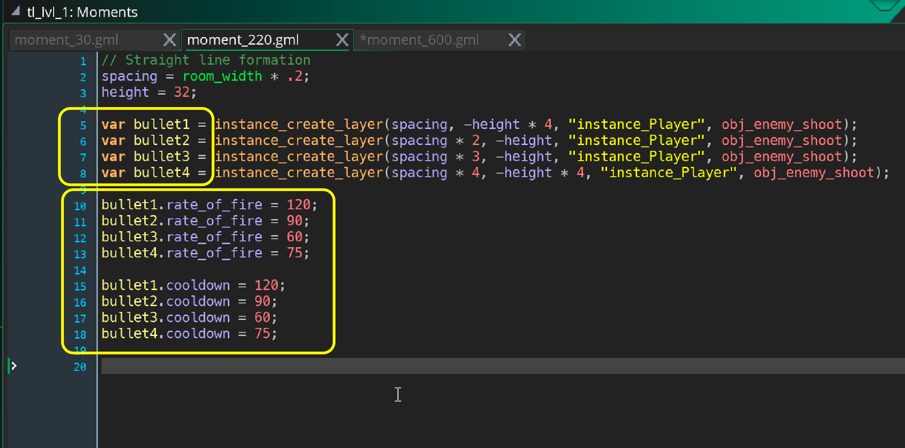

##### `Step 16.`\|`TDS`| :large_blue_diamond: :small_orange_diamond:   :small_blue_diamond: 

Repeat this for the spawning scripts for obj_enemy_target

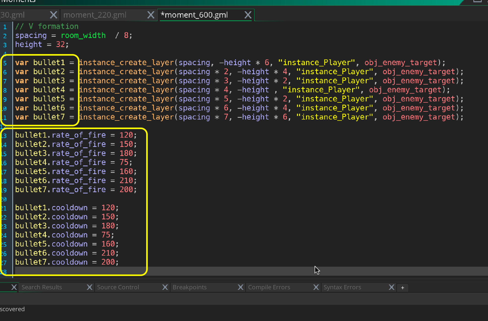

##### `Step 17.`\|`TDS`| :large_blue_diamond: :small_orange_diamond: :small_blue_diamond: :small_blue_diamond:

Now *press* the <kbd>Play</kbd> button in the top menu bar to launch the game. Now the timing seems more natural.  

##### `Step 18.`\|`TDS`| :large_blue_diamond: :small_orange_diamond: :small_blue_diamond: :small_blue_diamond: :small_blue_diamond:

Select the **File | Save Project**, then press **File | Quit** (PC) **Game Maker | Quit** on Mac to make sure everything in the game is saved.

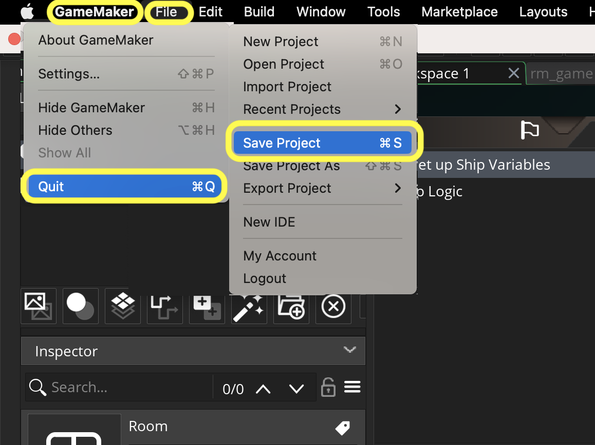

Open up **P4V**.  Select the top folder and press the **Add** button.  We want to add all the new files we created during this last session.  Add these files to the last change list you used at the begining of the session (in my case it was `Spaceship I portion of walkthrough`). Press the <kbd>OK</kbd> button.

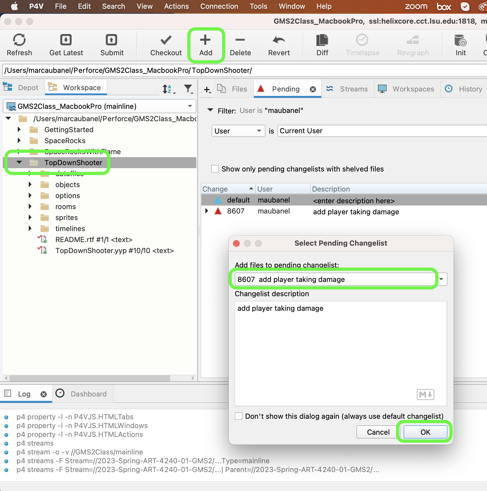

Now you can submit the changelist by pressing both <kbd>Submit</kbd> buttons.

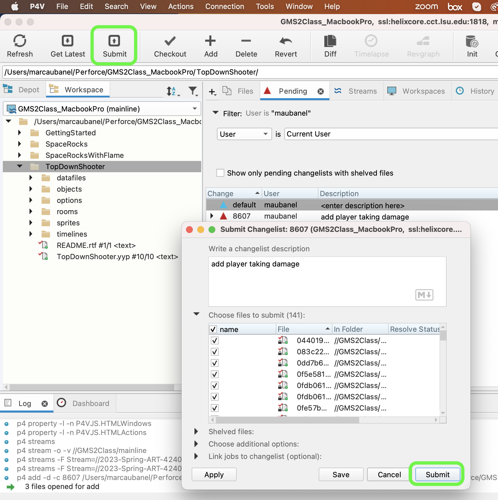

<!--  -->

| [previous](../player-health/README.md#user-content-player-health)| [home](../README.md#user-content-gms2-top-down-shooter) | [next](../ghost-mode/README.md#user-content-ghost-mode)|
|---|---|---|
