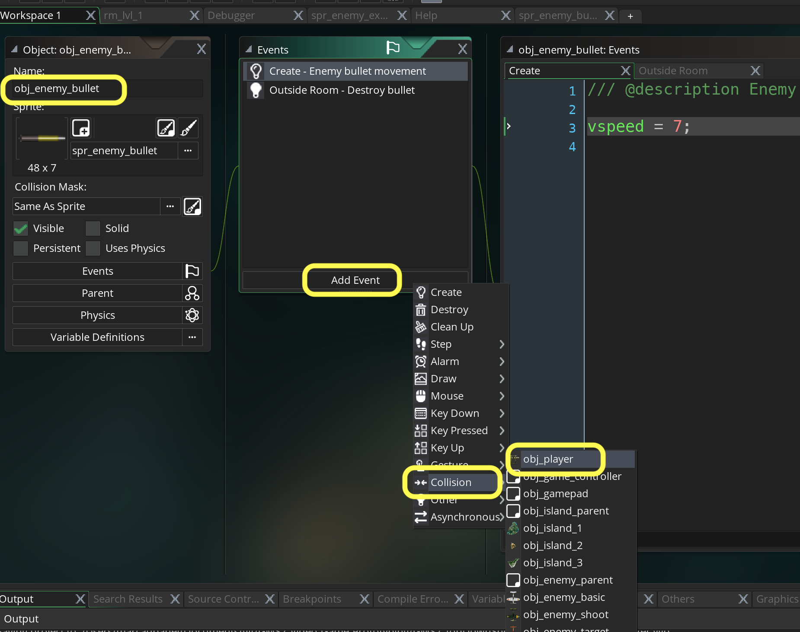
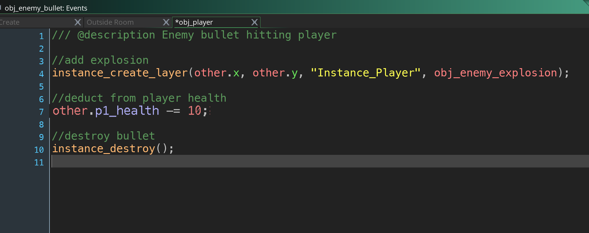
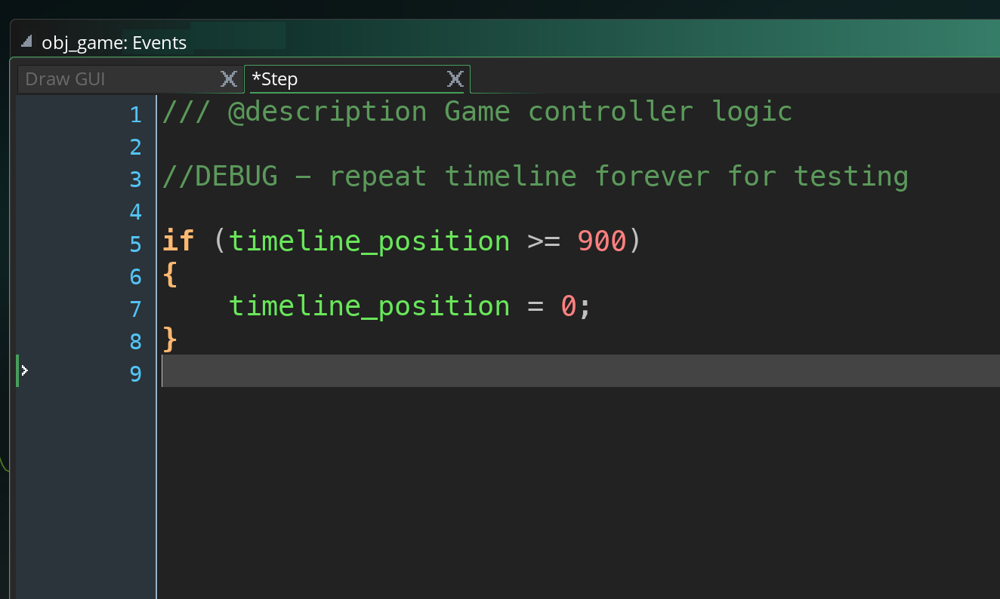
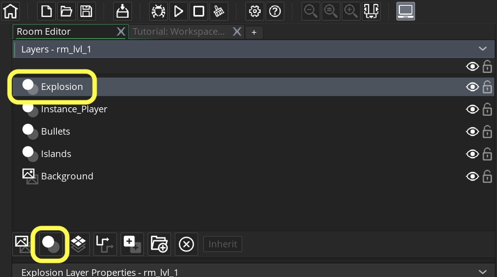
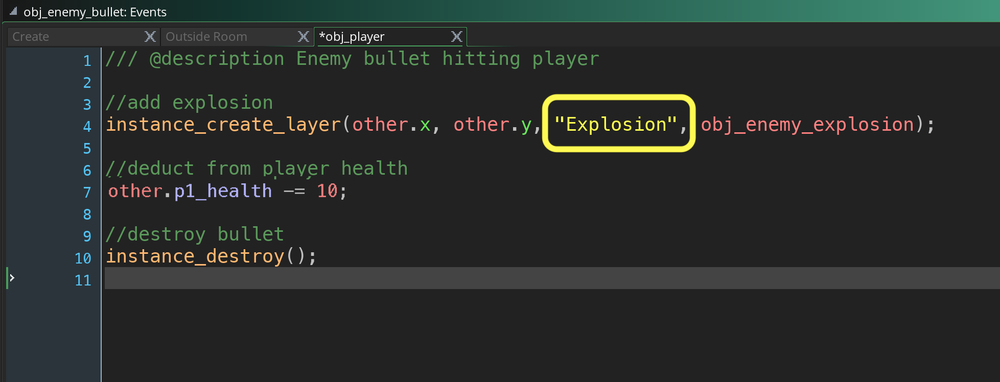
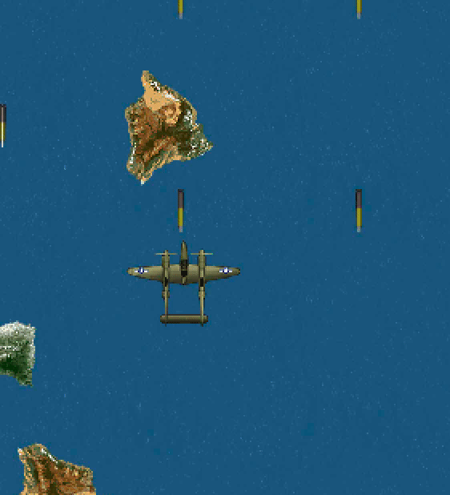
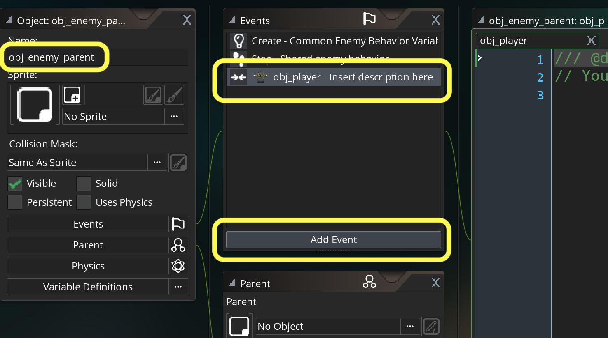
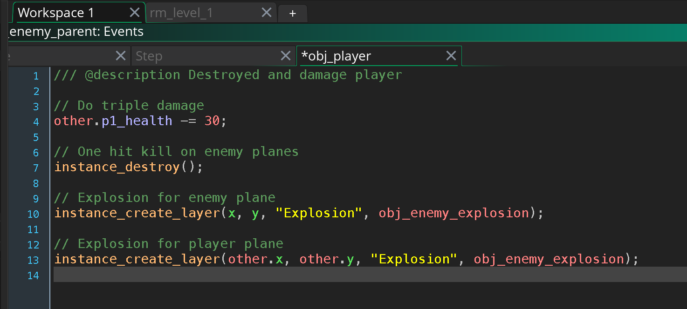
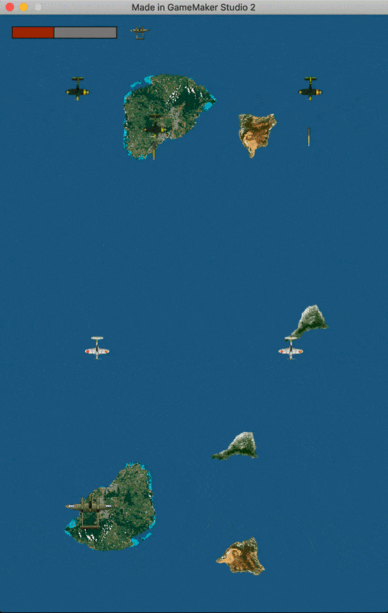

### Player Taking Damage

[previous](../player-health/README.md#user-content-player-health) • [home](../README.md#user-content-gms2-top-down-shooter) • [next](../ghost-mode/README.md#user-content-ghost-mode)

Lets add the animation for the player getting hit by bullet and subtract points from its health. We will reuse the animation for the enemy getting hit. 

 

---

##### `Step 1.`\|`SPCRK`|:small_blue_diamond:

Open **obj_enemy_bullet** and press the <kbd>Add Event</kbd> button and add a **Collision | obj_player** event.

##### `Step 2.`\|`FHIU`|:small_blue_diamond: :small_blue_diamond: 

*Add* to this new script an instance of **obj_enemy_explosion** and *deduct* from the player's health `p1_health` and destroy the bullet.  We do not destroy the player as we only would do this if there is no health left. Let add this logic to the **obj_enemy_bullet: Collision obj_player** Event.

##### `Step 3.`\|`SPCRK`|:small_blue_diamond: :small_blue_diamond: :small_blue_diamond:

Now for testing purposes I just want these three waves to continue for ever.  *Add* a **Step | Step** event script to obj_game and lets loop at `900` frames the timeline forever:

##### `Step 4.`\|`SPCRK`|:small_blue_diamond: :small_blue_diamond: :small_blue_diamond: :small_blue_diamond:

Now *press* the <kbd>Play</kbd> button in the top menu bar to launch the game. You should now see an explosion and the health should depleat to beyond 0. Also the enemies will just keep respawning.

##### `Step 5.`\|`SPCRK`| :small_orange_diamond:

I would like the explosion to be above the player and not behind him.  This is not currenlty possible as our top most layer in the room is **Instance_Player**.  Lets open **rm_lvl_1** and add an instance layer to the top called Explosion:

##### `Step 6.`\|`SPCRK`| :small_orange_diamond: :small_blue_diamond:

In **obj_enemy_bullet: Collision | obj_player player** script change the layer from `"Instance_Player"` to `"Explosion"`.

##### `Step 7.`\|`SPCRK`| :small_orange_diamond: :small_blue_diamond: :small_blue_diamond:

Now *press* the <kbd>Play</kbd> button in the top menu bar to launch the game. Now explosions should be on top of the player.

##### `Step 8.`\|`SPCRK`| :small_orange_diamond: :small_blue_diamond: :small_blue_diamond: :small_blue_diamond:

Now lets deal with enemy plane and player collision.  This will destroy the plane and do triple damage of `30` points.  Lets try two explosions. Double click **obj_enemy_parent** and press <kbd>Add Event</kbd> button and select **Collision | obj_player**:

##### `Step 9.`\|`SPCRK`| :small_orange_diamond: :small_blue_diamond: :small_blue_diamond: :small_blue_diamond: :small_blue_diamond:

Add two explosions and take away triple health damage to bullets inside the **obj_enemy_parent Collision obj_player** event script.

##### `Step 10.`\|`SPCRK`| :large_blue_diamond:

Now *press* the <kbd>Play</kbd> button in the top menu bar to launch the game. Now run into an enemy to see if it works.

##### `Step 11.`\|`SPCRK`| :large_blue_diamond: :small_blue_diamond: 

##### `Step 12.`\|`SPCRK`| :large_blue_diamond: :small_blue_diamond: :small_blue_diamond: 

##### `Step 13.`\|`SPCRK`| :large_blue_diamond: :small_blue_diamond: :small_blue_diamond:  :small_blue_diamond: 

##### `Step 14.`\|`SPCRK`| :large_blue_diamond: :small_blue_diamond: :small_blue_diamond: :small_blue_diamond:  :small_blue_diamond: 

##### `Step 15.`\|`SPCRK`| :large_blue_diamond: :small_orange_diamond: 

##### `Step 16.`\|`SPCRK`| :large_blue_diamond: :small_orange_diamond:   :small_blue_diamond: 

##### `Step 17.`\|`SPCRK`| :large_blue_diamond: :small_orange_diamond: :small_blue_diamond: :small_blue_diamond:

##### `Step 18.`\|`SPCRK`| :large_blue_diamond: :small_orange_diamond: :small_blue_diamond: :small_blue_diamond: :small_blue_diamond:

##### `Step 19.`\|`SPCRK`| :large_blue_diamond: :small_orange_diamond: :small_blue_diamond: :small_blue_diamond: :small_blue_diamond: :small_blue_diamond:

##### `Step 20.`\|`SPCRK`| :large_blue_diamond: :large_blue_diamond:

##### `Step 21.`\|`SPCRK`| :large_blue_diamond: :large_blue_diamond: :small_blue_diamond:

___

| [previous](../player-health/README.md#user-content-player-health)| [home](../README.md#user-content-gms2-top-down-shooter) | [next](../ghost-mode/README.md#user-content-ghost-mode)|
|---|---|---|
