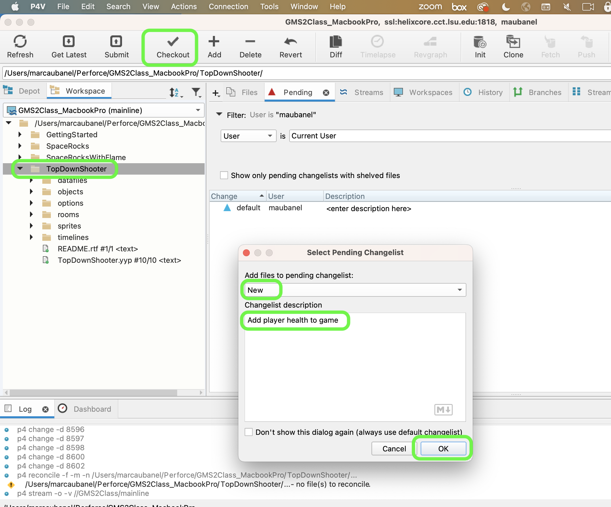
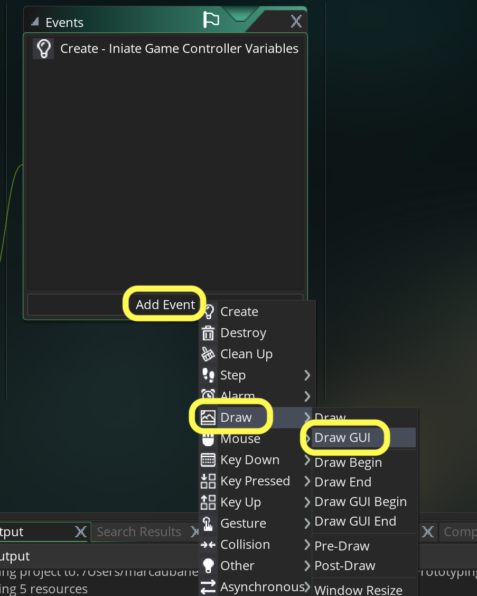
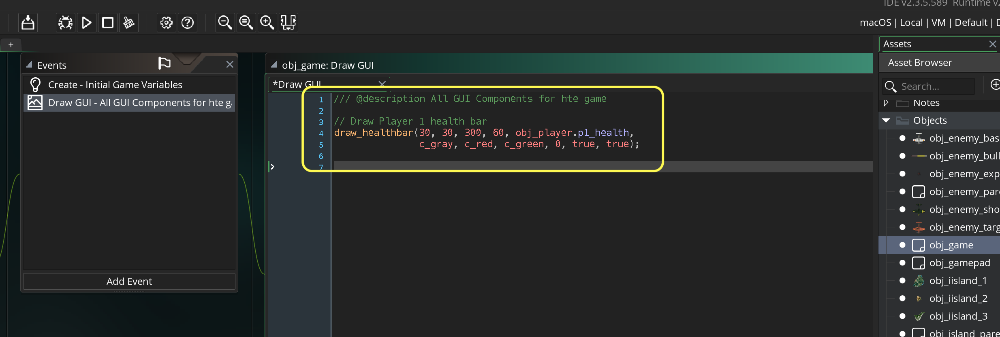
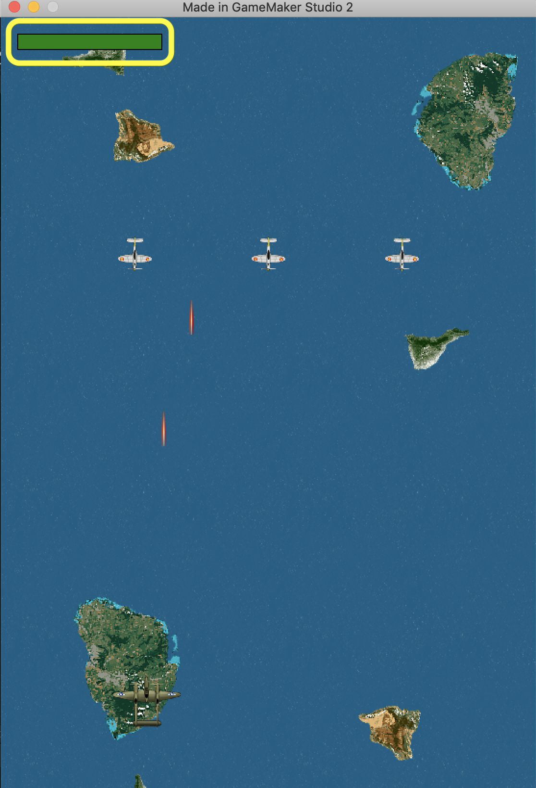
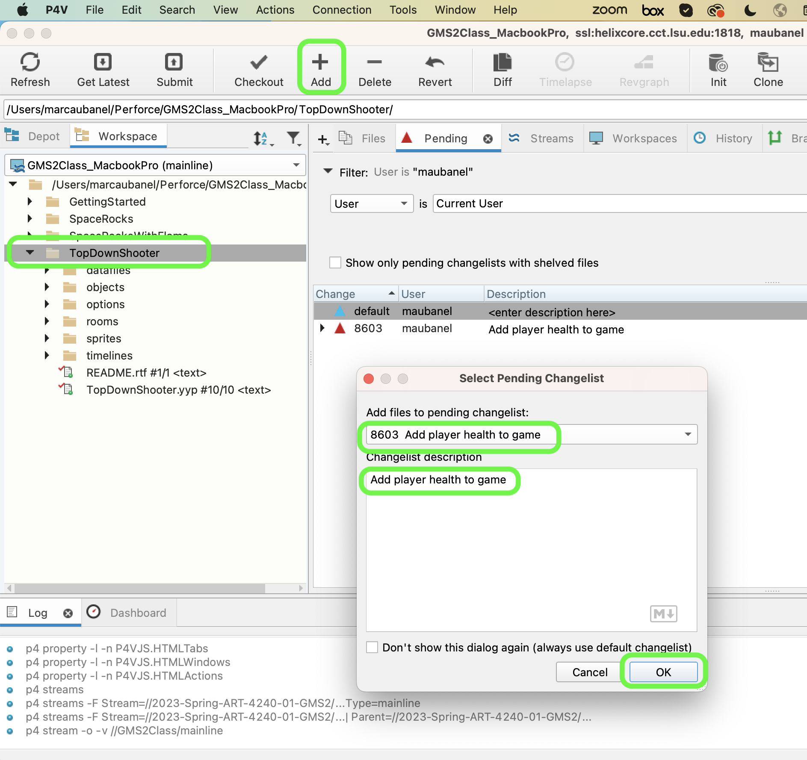
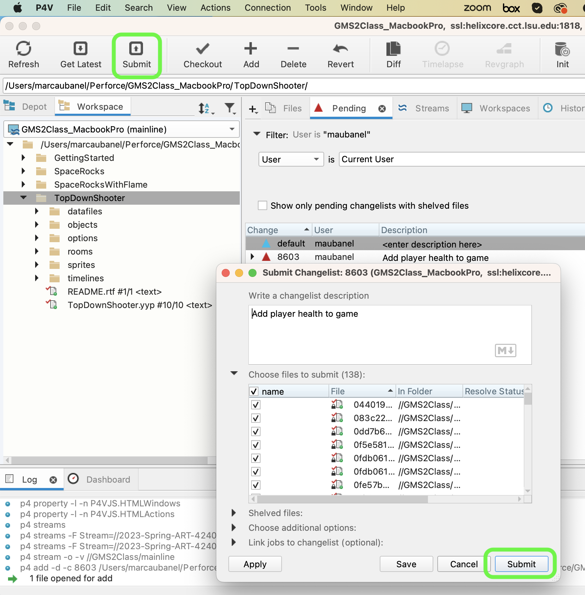

### Player Health

[previous](../targeting-enemies/README.md#user-content-targeting-enemies) • [home](../README.md#user-content-gms2-top-down-shooter) • [next](../player-damage/README.md#user-content-player-taking-damage)

We now want the planes to take on damage from being hit. Since the enemies currently have  no health and and are one hit kills, lets implement health on the player.  I will let you decide if you want to add health to the enemies on your own!

 

---

##### `Step 1.`\|`TDS`|:small_blue_diamond:

Open up **P4v**.  Select the top folder of the **GameMaker** project. Press the <kbd>Checkout</kbd> button.  Checkout out all files in P4V so that they are all writable (otherwise they will be read only and none of the changes will be saved). Select a **New** changelist and add a message describing the unit of work you will be performing. Press the <kbd>OK</kbd> button.

Open up the project you are working on in **GameMaker**. 

OK, so the easiest way to represent player health is through a health bar. We will not use the globally available health variable that GameMaker gives us as we might add multiplayer in the future and need more than one.

*Double click* the **obj_player: Create** event script and add a new variable for player health at the bottom called `p1_health`.

##### `Step 2.`\|`TDS`|:small_blue_diamond: :small_blue_diamond: 

Lets draw a health bar.  There is an event specifically made for GUI's where we don't have to worry about level layers in the room.  The **Draw GUI** event will always draw over game instances.  Press the <kbd>Add Event</kbd> button on **obj_game** and select **Draw | Draw GUI**.  This stays relative to camera space (instead of level space) and always renders in front of all other artwork regardless of the layer. 

##### `Step 3.`\|`TDS`|:small_blue_diamond: :small_blue_diamond: :small_blue_diamond:

We will be using the **[draw_healthbar(x1, y1, x2, y2, amount, backcol, mincol, maxcol, direction, showback, showborder)]()**.  Now there are a lot of options here.  The **x1, y1, x2, y2** represent the top left corner and bottom right corner of the health bar.  **backcol** is the color behind the healthbar.  The **mincol** is when health is low (usually red) and the **maxcol** is when health is high, usually green.  The **direction** is the angle of the health bar.  **0** will represent left to right the most common representation. **showback** and **showborder** represents how you want to healthbar to look regrading a background and/or border.
	
Here are the settings I picked and added to the **obj_game | Draw | Draw Gui**.

##### `Step 4.`\|`TDS`|:small_blue_diamond: :small_blue_diamond: :small_blue_diamond: :small_blue_diamond:

Now *press* the <kbd>Play</kbd> button in the top menu bar to launch the game. You should see a healthbar that is green at 100%:

##### `Step 5.`\|`TDS`| :small_orange_diamond:

Select the **File | Save Project**, then press **File | Quit** (PC) **Game Maker | Quit** on Mac to make sure everything in the game is saved.

Open up **P4V**.  Select the top folder and press the **Add** button.  We want to add all the new files we created during this last session.  Add these files to the last change list you used at the begining of the session (in my case it was `Spaceship I portion of walkthrough`). Press the <kbd>OK</kbd> button.

Now you can submit the changelist by pressing both <kbd>Submit</kbd> buttons.

<!--  -->

| [previous](../targeting-enemies/README.md#user-content-targeting-enemies)| [home](../README.md#user-content-gms2-top-down-shooter) | [next](../player-damage/README.md#user-content-player-taking-damage)|
|---|---|---|
