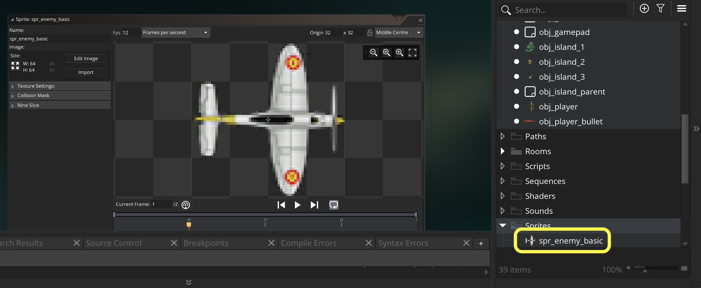
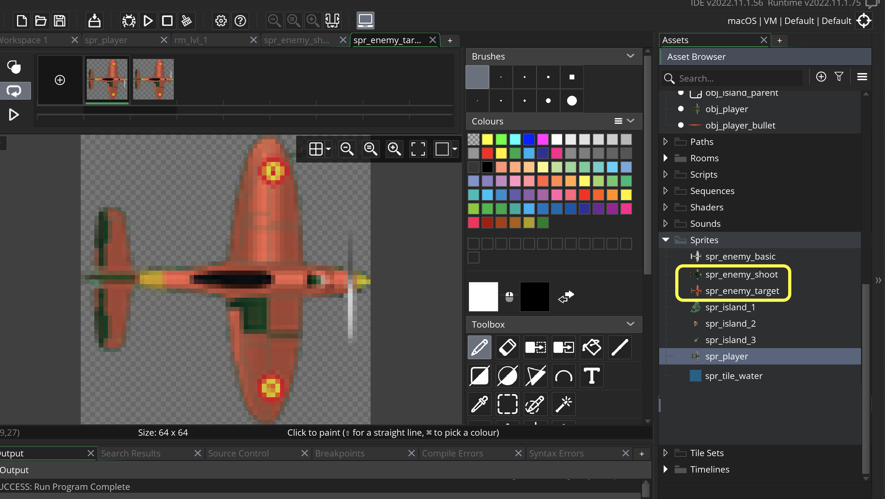
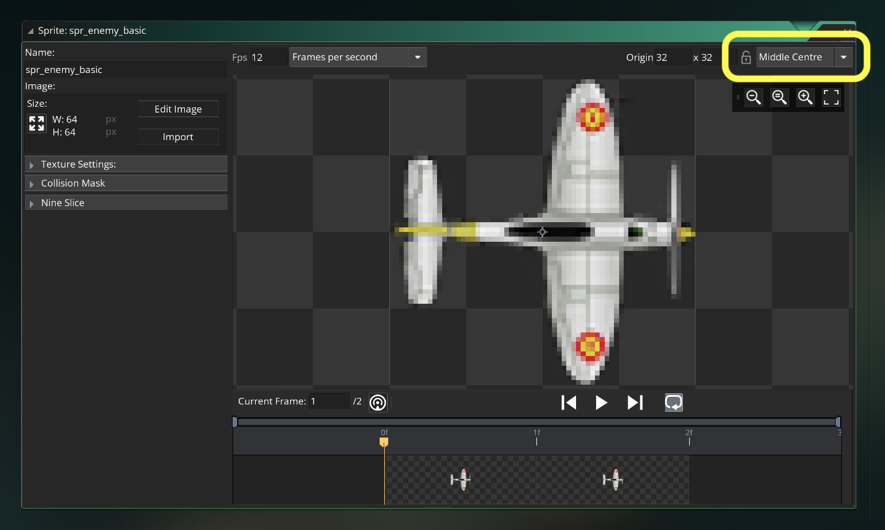
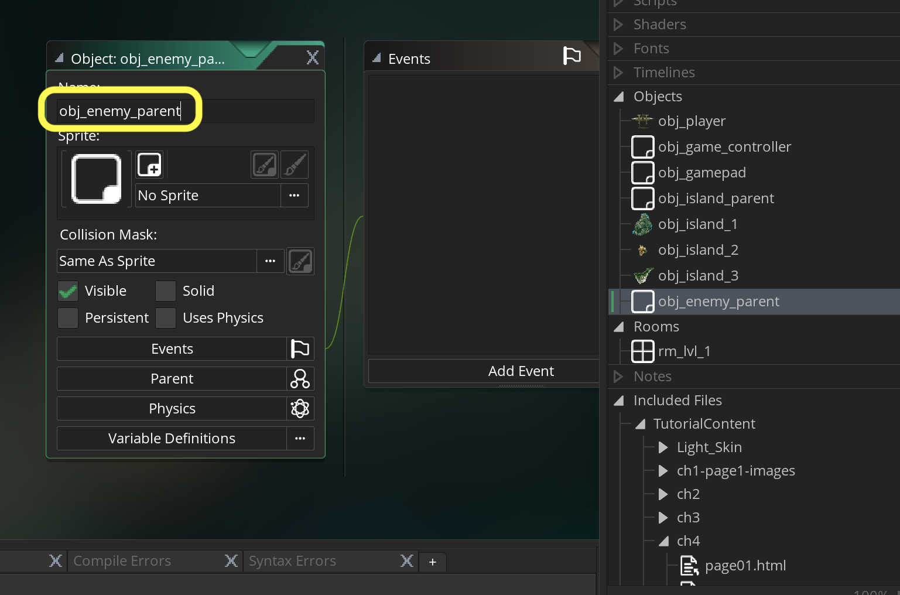
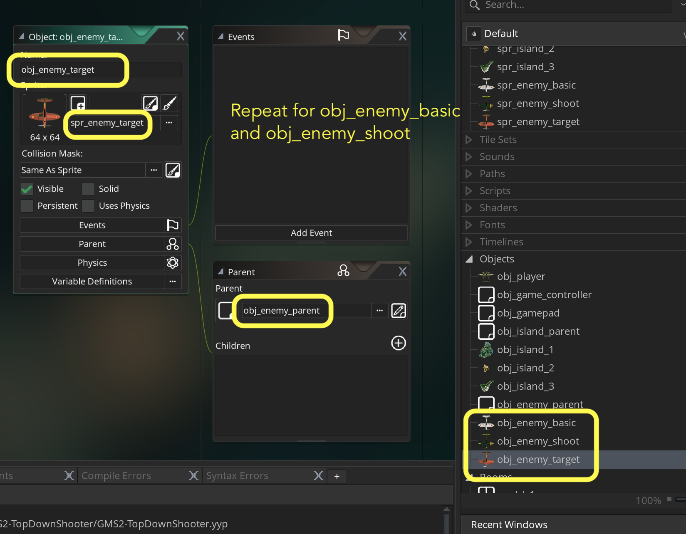

### Setting Up Three Enemy Types

[previous](../scrolling-islands/README.md#user-content-scrolling-islands) • [home](../README.md#user-content-gms2-top-down-shooter) • [next](../basic-timelines/README.md#user-content-basic-enemy-and-timelines)

We will have three type of enemy planes. One that just flies, another that shoots straight down and a third type that shoots in the direction of the player.  Lets get started.

 

---

##### `Step 1.`\|`SPCRK`|:small_blue_diamond:

The enemy sprites have 2 frames and they are 64 x 64 pixels. We will import them as a sprite sheet (or strip). Download [spr_enemy_basic_sprite_sheet.png](../Assets/Sprites/spr_enemy_basic_sprite_sheet.png).

*Create* a new **Sprite** by clickng on by *right clicking* on the **Sprites** title and selecting **Create | Sprite**. Then press the <kbd>Edit Image</kbd> button. *Click* the **Image** menu item on the top and select **Import strip image**. Download `spr_enemy_basic_sprite_sheet.png`. 

Set the **Player Width** and **Player Height** to `64`.  Set the **Number of Frames** and the **Number per Row** to `2`. Press the <kbd>Convert</kbd> button.  Select the sprite and reduce the **Framerate** to `24` fps.

##### `Step 2.`\|`FHIU`|:small_blue_diamond: :small_blue_diamond: 

*Name* the new sprite: `spr_enemy_basic`. Basic stands for an enemy that doesn't shoot.  It just flies and has no projectile weapons.

##### `Step 3.`\|`SPCRK`|:small_blue_diamond: :small_blue_diamond: :small_blue_diamond:

Repeat this by doing the same for [spr_enemy_shoot_sprite_sheet.png](../Assets/Sprites/spr_enemy_shoot_sprite_sheet.png) and [spr_enemy_target_sprite_sheet.png](../Assets/Sprites/spr_enemy_target_sprite_sheet.png).  **Import** these sprite strips and call them `spr_enemy_shoot` and `spr_enemy_target`. Adjust the **Framerate** to `12` FPS.

##### `Step 4.`\|`SPCRK`|:small_blue_diamond: :small_blue_diamond: :small_blue_diamond: :small_blue_diamond:

Make sure the origin is set to Middle Center on all three enemy sprites.

##### `Step 5.`\|`SPCRK`| :small_orange_diamond:

Now we will use another parent object to hold our common behavior as well as act as our collision object that we will be checking when firing bullets. Create a new **Game Object** and call it *obj_enemy_parent*. Again, as we did with `obj_island_parent` **DO NOT** assign a sprite to it. We will just be adding common logic to all planes to this object.

##### `Step 6.`\|`SPCRK`| :small_orange_diamond: :small_blue_diamond:

Now *create* three new **Game Objects**: `obj_enemy_basic`, `obj_enemy_shoot` and `obj_enemy_target` and assign the associated sprite and inherit the parent obj_enemy_parent. Now we are set up to start implementing the enemy logic.

##### `Step 7.`\|`SPCRK`| :small_orange_diamond: :small_blue_diamond: :small_blue_diamond:

Select the **File | Save Project** then press **File | Quit** to make sure everything in the game is saved. If you are using **GitHub** open up **GitHub Desktop** and add a title and longer description (if necessary) and press the <kbd>Commit to main</kbd> button. Finish by pressing **Push origin** to update the server with the latest changes.

___

<!--  -->

| [previous](../scrolling-islands/README.md#user-content-scrolling-islands)| [home](../README.md#user-content-gms2-top-down-shooter) | [next](../basic-timelines/README.md#user-content-basic-enemy-and-timelines)|
|---|---|---|
