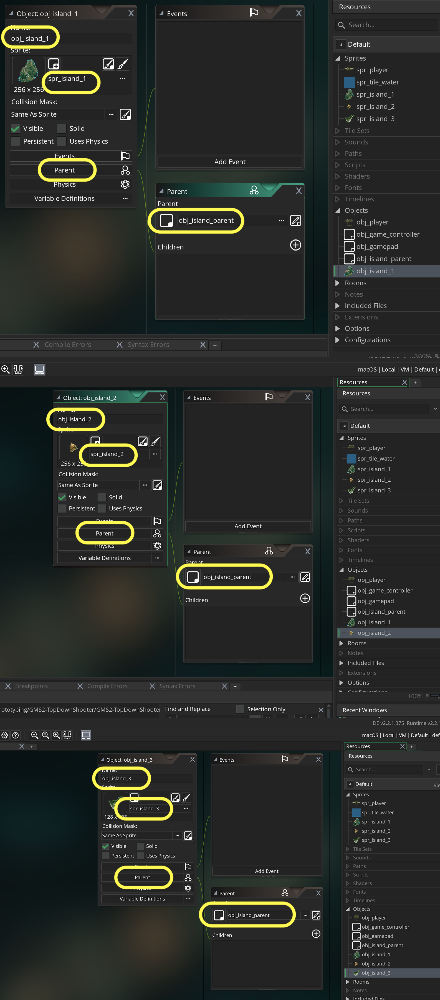

### Scrolling Islands

[previous](../scrolling-water/README.md#user-content-scrolling-water) • [home](../README.md#user-content-gms2-top-down-shooter) • [next](../preparing-enemies/README.md#user-content-setting-up-three-enemy-types)

Now that the water is moving, lets give it more impact by adding islands to fly over.  The islands play no part in gameplay, it is just eye candy. 

All the islands will have the same behavior.  We could do what was done in the Space Rocks game and assign the sprite in the create event.  There is another way for multiple objects to share the same behavior/scripts.  It is by using a parent and child relationship.  We will put the entire behavior in the parent script and the child will inherit this behavior without having to retype the script allowing us to have one script for three islands.  

Let's break it down:

* Import spr_island_1, spr_island_2 and spr_island_3 sprites and center them 
* Create an obj_island_parent script
* Scroll the island parent at the same speed as the water
* When the island scrolls off the bottom place it randomly on the X axes at a random rotation in an EMPTY spot.
* Create an obj_island_1, obj_island_2, and obj_island_3 objects inheriting from the parent * obj_island_parent
* Place three islands on the level/map

 

---

##### `Step 1.`\|`SPCRK`|:small_blue_diamond:

Lets start by downloading the 3 island sprites **[spr_island_1.png](../Assets/Sprites/spr_island_1.png)**, **[spr_island_2.png](../Assets/Sprites/spr_island_2.png)** and **[spr_island_3.png](../Assets/Sprites/spr_island_3.png)**. 

*Create* three new sprites by *right clicking* **Sprites** and select **Create | Sprite** sthree times.  Press the **Import** button on each sprite and import the above sprites.. You can download them from   TutorialResources | Sprites . *Name* the three sprites: `spr_island_1`, `spr_island_2` and `spr_island_3`.

##### `Step 2.`\|`FHIU`|:small_blue_diamond: :small_blue_diamond: 

Since we want the islands to all share the same behavior, we will create a **Game Object** that will act as a **Parent** that all the children will inherit from. This allows us to write the **Island** logic once and be able to debug and tune it but all islands will inherit the behavior.
	
*Create* a blank **Game Object** called `obj_island_parent` that we will write all our scripts for and the three islands will inherit from. DO NOT assign a sprite to it.	

##### `Step 3.`\|`SPCRK`|:small_blue_diamond: :small_blue_diamond: :small_blue_diamond:

Now create three new objects and assign the appropriate sprite and attach the `obj_island_parent` to the **Parent** selector. Call them `obj_island_1`, `obj_island_2` and `obj_island_3`:

##### `Step 4.`\|`SPCRK`|:small_blue_diamond: :small_blue_diamond: :small_blue_diamond: :small_blue_diamond:

Open **rm_lvl_1** and create a new **Instance** Layer and call it **Islands** and put it between the **Instance_Player** and the **Background** layer. We want the plane to be above the islands, and the islands to be in front of the water. The layers in **GameMaker** are like those in **Photoshop** in terms of rendering order.

##### `Step 5.`\|`SPCRK`| :small_orange_diamond:

*Creatively* drag and drop 6-8 islands and place them on the Islands layer in the room. You can select an island with the left mouse click then when the circular arrow appears you can rotate the sprite so they are not all in the same orientation. You can also just double click on the island (make sure you are on the Island layer) to bring up the instance editor and type in a new value in the Rotation field.  Here is how I filled in my room.

##### `Step 6.`\|`SPCRK`| :small_orange_diamond: :small_blue_diamond:

Run the game by pressing the  Play Button and the background scrolls and islands stay put. 

##### `Step 7.`\|`SPCRK`| :small_orange_diamond: :small_blue_diamond: :small_blue_diamond:

##### `Step 8.`\|`SPCRK`| :small_orange_diamond: :small_blue_diamond: :small_blue_diamond: :small_blue_diamond:

##### `Step 9.`\|`SPCRK`| :small_orange_diamond: :small_blue_diamond: :small_blue_diamond: :small_blue_diamond: :small_blue_diamond:

##### `Step 10.`\|`SPCRK`| :large_blue_diamond:

##### `Step 11.`\|`SPCRK`| :large_blue_diamond: :small_blue_diamond: 

##### `Step 12.`\|`SPCRK`| :large_blue_diamond: :small_blue_diamond: :small_blue_diamond: 

##### `Step 13.`\|`SPCRK`| :large_blue_diamond: :small_blue_diamond: :small_blue_diamond:  :small_blue_diamond: 

##### `Step 14.`\|`SPCRK`| :large_blue_diamond: :small_blue_diamond: :small_blue_diamond: :small_blue_diamond:  :small_blue_diamond: 

##### `Step 15.`\|`SPCRK`| :large_blue_diamond: :small_orange_diamond: 

##### `Step 16.`\|`SPCRK`| :large_blue_diamond: :small_orange_diamond:   :small_blue_diamond: 

##### `Step 17.`\|`SPCRK`| :large_blue_diamond: :small_orange_diamond: :small_blue_diamond: :small_blue_diamond:

##### `Step 18.`\|`SPCRK`| :large_blue_diamond: :small_orange_diamond: :small_blue_diamond: :small_blue_diamond: :small_blue_diamond:

##### `Step 19.`\|`SPCRK`| :large_blue_diamond: :small_orange_diamond: :small_blue_diamond: :small_blue_diamond: :small_blue_diamond: :small_blue_diamond:

##### `Step 20.`\|`SPCRK`| :large_blue_diamond: :large_blue_diamond:

##### `Step 21.`\|`SPCRK`| :large_blue_diamond: :large_blue_diamond: :small_blue_diamond:

___

| [previous](../scrolling-water/README.md#user-content-scrolling-water)| [home](../README.md#user-content-gms2-top-down-shooter) | [next](../preparing-enemies/README.md#user-content-setting-up-three-enemy-types)|
|---|---|---|
