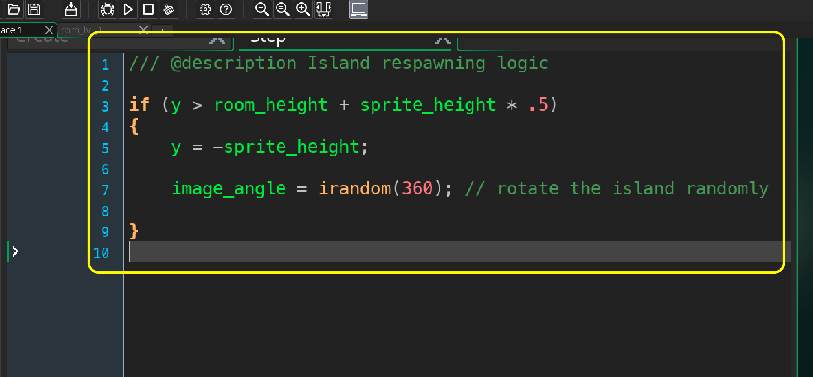

### Scrolling Islands

[previous](../scrolling-water/README.md#user-content-scrolling-water) • [home](../README.md#user-content-gms2-top-down-shooter) • [next](../preparing-enemies/README.md#user-content-setting-up-three-enemy-types)

Now that the water is moving, lets give it more impact by adding islands to fly over.  The islands play no part in gameplay, it is just eye candy. 

All the islands will have the same behavior.  We could do what was done in the Space Rocks game and assign the sprite in the create event.  There is another way for multiple objects to share the same behavior/scripts.  It is by using a parent and child relationship.  We will put the entire behavior in the parent script and the child will inherit this behavior without having to retype the script allowing us to have one script for three islands.  

Let's break it down:

* Import spr_island_1, spr_island_2 and spr_island_3 sprites and center them 
* Create an obj_island_parent script
* Scroll the island parent at the same speed as the water
* When the island scrolls off the bottom place it randomly on the X axes at a random rotation in an EMPTY spot.
* Create an obj_island_1, obj_island_2, and obj_island_3 objects inheriting from the parent * obj_island_parent
* Place three islands on the level/map

 

---

##### `Step 1.`\|`SPCRK`|:small_blue_diamond:

Lets start by downloading the 3 island sprites **[spr_island_1.png](../Assets/Sprites/spr_island_1.png)**, **[spr_island_2.png](../Assets/Sprites/spr_island_2.png)** and **[spr_island_3.png](../Assets/Sprites/spr_island_3.png)**. 

*Create* three new sprites by *right clicking* **Sprites** and select **Create | Sprite** sthree times.  Press the **Import** button on each sprite and import the above sprites.. You can download them from   TutorialResources | Sprites . *Name* the three sprites: `spr_island_1`, `spr_island_2` and `spr_island_3`.

##### `Step 2.`\|`FHIU`|:small_blue_diamond: :small_blue_diamond: 

Since we want the islands to all share the same behavior, we will create a **Game Object** that will act as a **Parent** that all the children will inherit from. This allows us to write the **Island** logic once and be able to debug and tune it but all islands will inherit the behavior.
	
*Create* a blank **Game Object** called `obj_island_parent` that we will write all our scripts for and the three islands will inherit from. **DO NOT** assign a sprite to it.	

##### `Step 3.`\|`SPCRK`|:small_blue_diamond: :small_blue_diamond: :small_blue_diamond:

Now create three new objects and assign the appropriate sprite and attach the `obj_island_parent` to the **Parent** selector. Call them `obj_island_1`, `obj_island_2` and `obj_island_3`:

##### `Step 4.`\|`SPCRK`|:small_blue_diamond: :small_blue_diamond: :small_blue_diamond: :small_blue_diamond:

Open **rm_lvl_1** and create a new **Instance** Layer and call it **Islands** and put it between the **Instance_Player** and the **Background** layer. We want the plane to be above the islands, and the islands to be in front of the water. The layers in **GameMaker** are like those in **Photoshop** in terms of rendering order.

##### `Step 5.`\|`SPCRK`| :small_orange_diamond:

We want to center all the sprites so open up **spr_island_1**,**spr_island_2** and **spr_island_3** and set the **Origin** to `Middle | Center`.

*Creatively* drag and drop 6-8 islands and place them on the Islands layer in the room. You can select an island with the left mouse click then when the circular arrow appears you can rotate the sprite so they are not all in the same orientation. 

##### `Step 6.`\|`SPCRK`| :small_orange_diamond: :small_blue_diamond:

Now *press* the <kbd>Play</kbd> button in the top menu bar to launch the game and the background scrolls and islands stay put. 

##### `Step 7.`\|`SPCRK`| :small_orange_diamond: :small_blue_diamond: :small_blue_diamond:

We created a parent so that we just need to add scripts to it and all the children will inherit from it. *Double click* the **obj_island_parent**.  Press the <kbd>Add Event</kbd> and select a **Create** event. Adjust the object's `vspeed`.  We will use the **macro** we just created for this to ensure the islands move at the same speed as the water.

##### `Step 8.`\|`SPCRK`| :small_orange_diamond: :small_blue_diamond: :small_blue_diamond: :small_blue_diamond:

Now *press* the <kbd>Play</kbd> button in the top menu bar to launch the game. The background scrolls with islands disappear off screen. 

##### `Step 9.`\|`SPCRK`| :small_orange_diamond: :small_blue_diamond: :small_blue_diamond: :small_blue_diamond: :small_blue_diamond:

Double click **obj_island_parent**.   Press the <kbd>Add Event</kbd> and select a **Step | Step** event. Move the island back to the top of the screen when it goes off the bottom.  We will also randomize the angle by 0 to 360 degrees.

##### `Step 10.`\|`SPCRK`| :large_blue_diamond:

Now *press* the <kbd>Play</kbd> button in the top menu bar to launch the game. The background scrolls with islands now looping back onto the top of the screen.

##### `Step 11.`\|`SPCRK`| :large_blue_diamond: :small_blue_diamond: 

Now lets randomize the islands position along the X axis so that it looks like we are flying through new spaces rather than the same one over and over again. Since this is not affecting gameplay using a random number will just add to the realism of the game.  Edit the **obj_island_parent: Step** event script and add a single line to place the island randomly along the x axis.

##### `Step 12.`\|`SPCRK`| :large_blue_diamond: :small_blue_diamond: :small_blue_diamond: 

Now *press* the <kbd>Play</kbd> button in the top menu bar to launch the game. The background scrolls with islands now looping back onto the top of the screen and randomize on the x axis.  This looks good except for the occasional overlap when islands are on top of each other like so:

##### `Step 13.`\|`SPCRK`| :large_blue_diamond: :small_blue_diamond: :small_blue_diamond:  :small_blue_diamond: 

Lets try five times to position the island successfully.  If it can't do it within 5 tries then we will just live with this overlap.  We will use a **[repeat(real)](https://manual.yoyogames.com/GameMaker_Language/GML_Overview/Language_Features/repeat.htm)**. What we want to do is check each time if there is a collision and then stop the loop when we get no collision.

Before we place the island we will need to check that the area it will be in is empty. We will have to do some collision detection in script to check for free space. For some simple collision detection we will look at a new function called **[place_meeting(x, y, obj)](https://manual.yoyogames.com/GameMaker_Language/GML_Reference/Movement_And_Collisions/Collisions/place_meeting.htm)**. Remember that ! is a logical **not** so if we put this before the function it looks to see if the collision is false (the space is empty).
	
If it is we will stop the loop.  This is done with the **[break](https://manual.yoyogames.com/GameMaker_Language/GML_Overview/Language_Features/break.htm)** statement.  This will quit the loop if the collision ends up being false Open up the **obj_island_parent: Step** event and add the following script.

##### `Step 14.`\|`SPCRK`| :large_blue_diamond: :small_blue_diamond: :small_blue_diamond: :small_blue_diamond:  :small_blue_diamond: 

Now *press* the <kbd>Play</kbd> button in the top menu bar to launch the game. We should have the islands working as well as we will need for this tutorial. Now reposition the islands so that the distribution is even vertically.  The room should look like the video.

##### `Step 15.`\|`SPCRK`| :large_blue_diamond: :small_orange_diamond: 

Select the **File | Save Project** then press **File | Quit** to make sure everything in the game is saved. If you are using **GitHub** open up **GitHub Desktop** and add a title and longer description (if necessary) and press the <kbd>Commit to main</kbd> button. Finish by pressing **Push origin** to update the server with the latest changes.

___

| [previous](../scrolling-water/README.md#user-content-scrolling-water)| [home](../README.md#user-content-gms2-top-down-shooter) | [next](../preparing-enemies/README.md#user-content-setting-up-three-enemy-types)|
|---|---|---|
