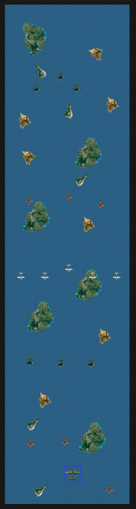
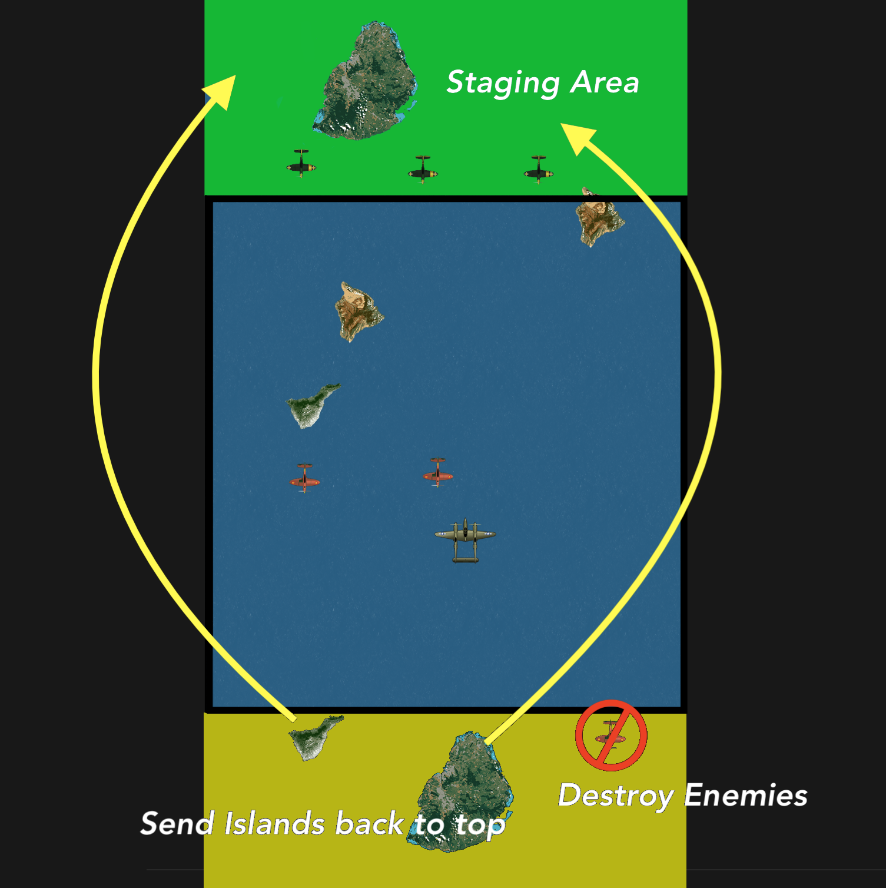
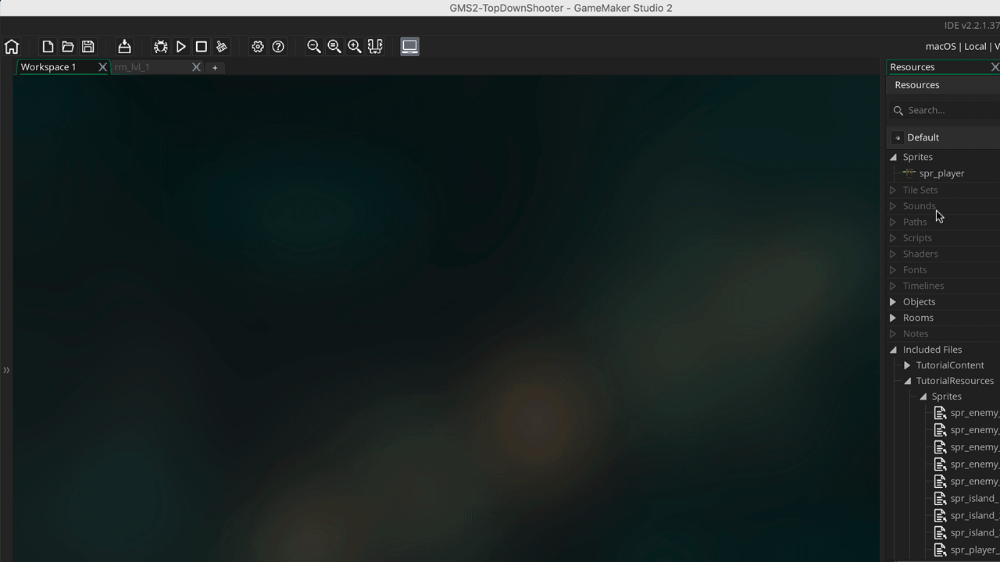
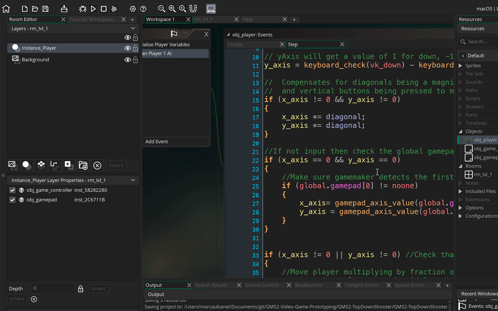
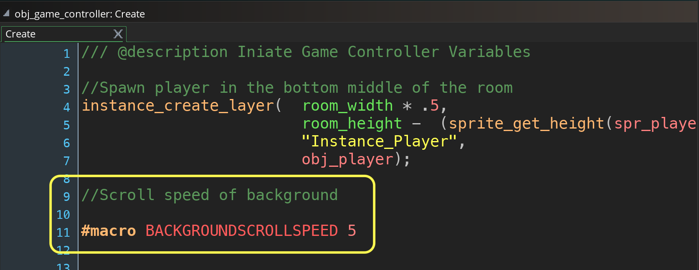
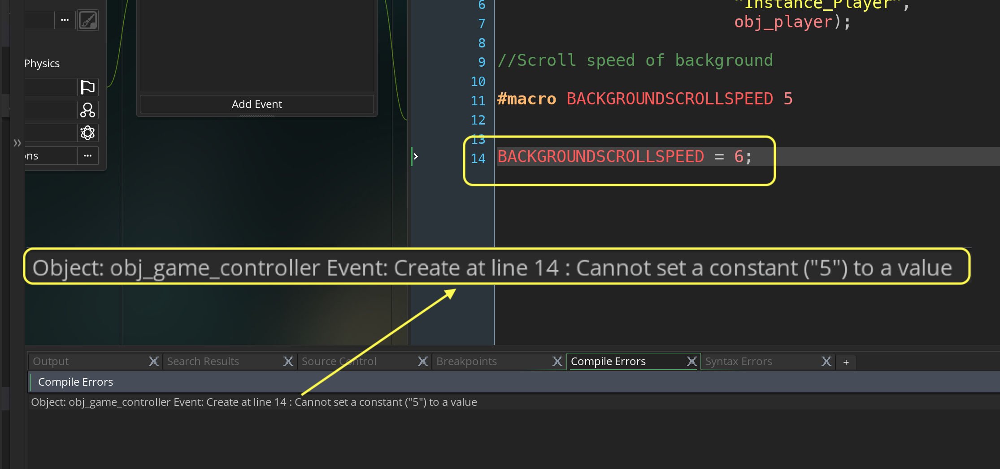
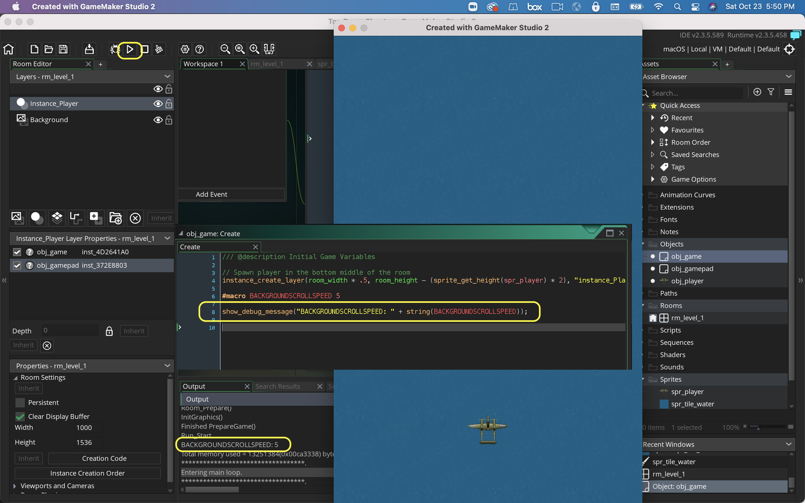
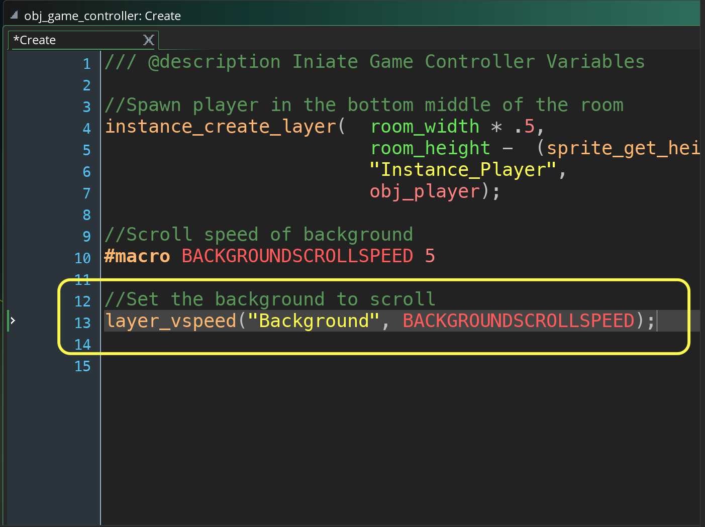

### Scrolling Water

[previous](../joystick/README.md#user-content-moving-ship-with-joystick) • [home](../README.md#user-content-gms2-top-down-shooter) • [next](../scrolling-islands/README.md#user-content-scrolling-islands)

We are supposed to be in a plane over the high seas.  Lets get a texture and have it move to look like we are flying over water.

 

---

##### `Step 1.`\|`SPCRK`|:small_blue_diamond:

There are two ways I can think of to deal with the room (level). We could just make a very tall room and put all of our graphics and enemies in the room. We can move the plane up each frame so it scrolls through it. 

##### `Step 2.`\|`FHIU`|:small_blue_diamond: :small_blue_diamond: 

The other option would be to have the room where the plane doesn't move but the background scrolls like on a conveyor belt. There is a staging area where islands and enemies are spawned then they move downwards on screen.  When islands fall off the bottom they get sent back to the staging area.  When the enemies go off the bottom they are destroyed.

##### `Step 3.`\|`SPCRK`|:small_blue_diamond: :small_blue_diamond: :small_blue_diamond:

So we are going to load a 256 x 256 background tile for water (ocean).  This tile will match on all sides and we will fill the entire screen up with water.  After that we will add islands to fly over to give a better sense of motion.
		

Download [spr_tile_water.png](../Assets/Sprites/spr_tile_water.png). *Right click* on **Sprites** and select **Create | Sprite**.  Name this new sprite `spr_tile_water`.  *Press* the **Import** button and select the sprite in your **Downloads** folder called **spr_tile_water.png**.  *Name* the sprite `spr_tile_water`.

##### `Step 4.`\|`SPCRK`|:small_blue_diamond: :small_blue_diamond: :small_blue_diamond: :small_blue_diamond:

Open room **rm_lvl_1** and click on the **Background** layer and make sure the **Background Layer Properties** tab is open.

Please note that on instance layers that you can only drag Game Objects onto it. On Background layers you can only drag Sprites.

This brings up a **Background Properties** menu below with the colour and selection box with **No Sprite**. Click on this and select `spr_tile_water`.

Press the **Vertical Tile**  and **Horizontal Tile**  check boxes. Look at what happens to the level.

##### `Step 5.`\|`SPCRK`| :small_orange_diamond:

We will be scrolling water underneath us.  The islands will need to scroll at the same speed as the water.  We want to use the same value for both objects.  We could use a global variable name but there is a safer way. Since this variable doesn't change we can make it a constant.
	
We will be using a **[macros](https://manual.yoyogames.com/GameMaker_Language/GML_Overview/Variables/Constants.htm)**.  We want to use a constant that is unmutable (cannot be changed).  What this means is that we don't want someone on the team to change this value.  When we use the keyword macro this makes the variable a constant.  This macro constant is global in scope and can be accessed anywhere by any object.	
	
Notice we do not use the assignment operator =.  It is a naming convention to use **ALL CAPS** when naming constants. Open the **obj_game_ Create** event script and add to the bottom the macro. There is also **No** semi-column at the end as well.

##### `Step 6.`\|`SPCRK`| :small_orange_diamond: :small_blue_diamond:

Lets prove it is a constant.  Lets try resetting the macro to `6`.  Notice the game will not compile when you press run:

##### `Step 7.`\|`SPCRK`| :small_orange_diamond: :small_blue_diamond: :small_blue_diamond:

Lets double check that it resolves the constant to the value 5 we have set.  *Delete* the above entry and instead add a `show_debug_message(string)`.  Notice that it prints the message just like a normal variable.

##### `Step 8.`\|`SPCRK`| :small_orange_diamond: :small_blue_diamond: :small_blue_diamond: :small_blue_diamond:

*Delete* the `show_debug_message(string)` line.  Now lets scroll the background.  We are using **[layer_vspeed(layer_id, vspd)](https://manual.yoyogames.com/GameMaker_Language/GML_Reference/Asset_Management/Rooms/General_Layer_Functions/layer_vspeed.htm)**. The **layer_id** parameter is the name of the background layer in the room which defaults to **Background**.  The **vspd** is pixels per second with positive moving downwards and negative moving upwards.

##### `Step 9.`\|`SPCRK`| :small_orange_diamond: :small_blue_diamond: :small_blue_diamond: :small_blue_diamond: :small_blue_diamond:

Now *press* the <kbd>Play</kbd> button in the top menu bar to launch the game.  Notice that the water now scrolls downwards making the plane feel like it is moving up the screen.  Next up we will add islands to the level.

##### `Step 10.`\|`SPCRK`| :large_blue_diamond:

Select the **File | Save Project** then press **File | Quit** to make sure everything in the game is saved. If you are using **GitHub** open up **GitHub Desktop** and add a title and longer description (if necessary) and press the <kbd>Commit to main</kbd> button. Finish by pressing **Push origin** to update the server with the latest changes.

___

| [previous](../joystick/README.md#user-content-moving-ship-with-joystick)| [home](../README.md#user-content-gms2-top-down-shooter) | [next](../scrolling-islands/README.md#user-content-scrolling-islands)|
|---|---|---|
