### Setting Up

[home](../README.md#user-content-gms2-ue4-space-rocks) • [next](../spaceship-i/README.md#user-content-the-spaceship-i)

Lets get started with setting up version control and starting the project.

 

---

##### `Step 1.`\|`SPCRK`|:small_blue_diamond:

Go to [New GML Project](https://github.com/maubanel/GMS2-Snippets/blob/main/new-gml/README.md#user-content-new-gml-project) and create a project called `Space Rocks`.

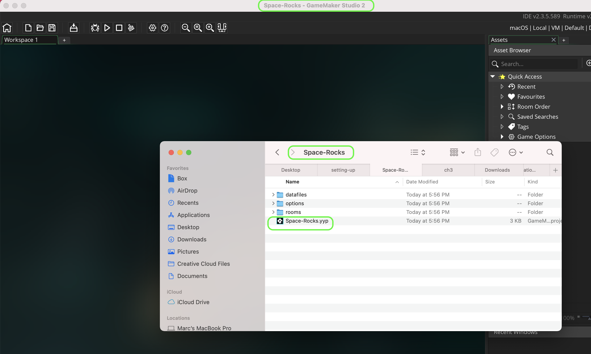

##### `Step 2.`\|`FHIU`|:small_blue_diamond: :small_blue_diamond: 

Click on the **[GitHub Classroom Link](https://classroom.github.com/a/KhAozDsc)** if you want a repository to use for the game. Press the <kbd>Accept this assignment</kbd> button. 

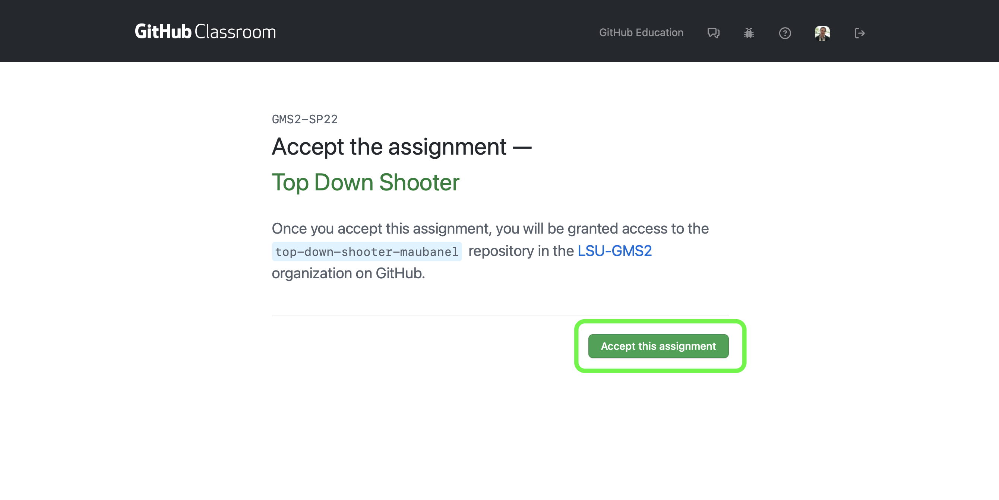

##### `Step 3.`\|`SPCRK`|:small_blue_diamond: :small_blue_diamond: :small_blue_diamond:

You will now be sent to a message that says the repository is being configured.  Wait a few seconds then press the refresh button.

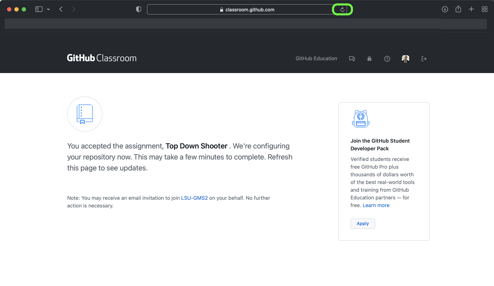

##### `Step 4.`\|`SPCRK`|:small_blue_diamond: :small_blue_diamond: :small_blue_diamond: :small_blue_diamond:

Eventually you will get a link to the repository that **GitHub Classroom** has created.  *Click* on the link to your new repository.

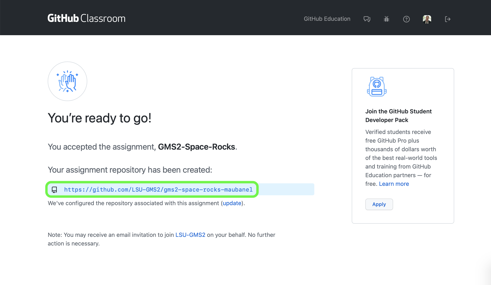

##### `Step 5.`\|`SPCRK`| :small_orange_diamond:

You get to your empty repository on **GitHub**.

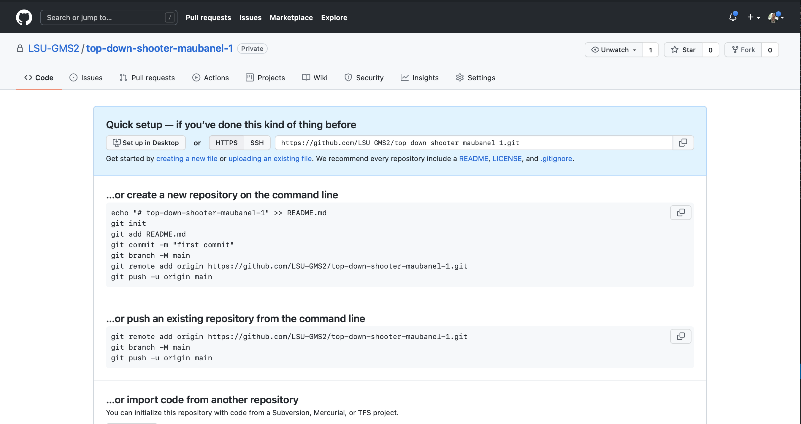

##### `Step 6.`\|`SPCRK`| :small_orange_diamond: :small_blue_diamond:

Open up **GitHub Desktop** and select **File | New Repository** to create a **GitHub** repository inside the **GameMaker Space Rocks** project you just created.

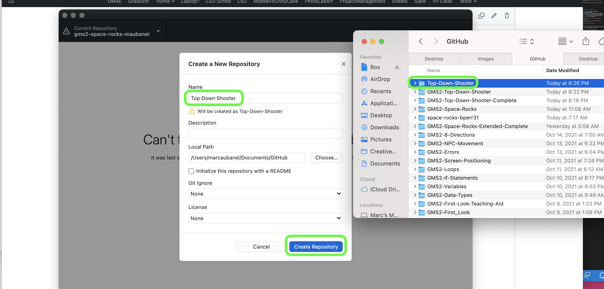

##### `Step 7.`\|`SPCRK`| :small_orange_diamond: :small_blue_diamond: :small_blue_diamond:

Now we want the project to be in the same folder as the `.yyp` project filename (in this case Space Rocks).  You then need to set the **name** the exact name of the folder that holds the project.  So in my case the folder that contained the project was **Documents | GitHub**.  So I use this as the **Local Path**.  For the **Name** I use the project folder `Space-Rocks`. It has to be spelled EXACTLY the same way as the one that holds the **GameMaker** project. This way it will create a git repository in this folder without creating a new folder.

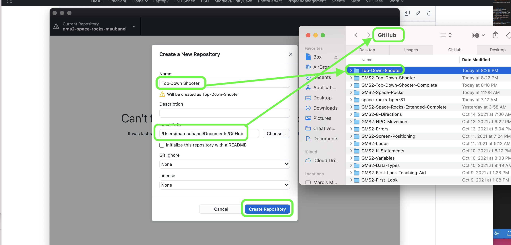

##### `Step 8.`\|`SPCRK`| :small_orange_diamond: :small_blue_diamond: :small_blue_diamond: :small_blue_diamond:

When you see them there has to be a `.git` hidden folder in the **same** directory as the project file (in my case **Space-Rocks.yyp**).

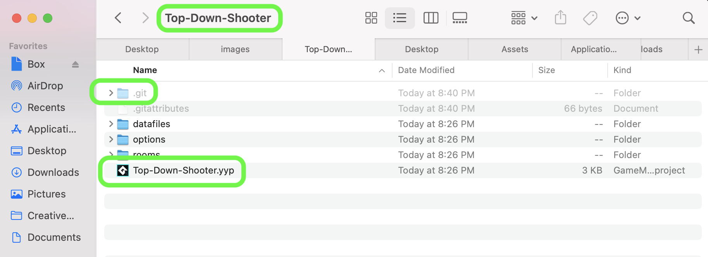

##### `Step 9.`\|`SPCRK`| :small_orange_diamond: :small_blue_diamond: :small_blue_diamond: :small_blue_diamond: :small_blue_diamond:

Press **Repository | Open in Terminal** on mac and **Repository | Open in ???** on PC.

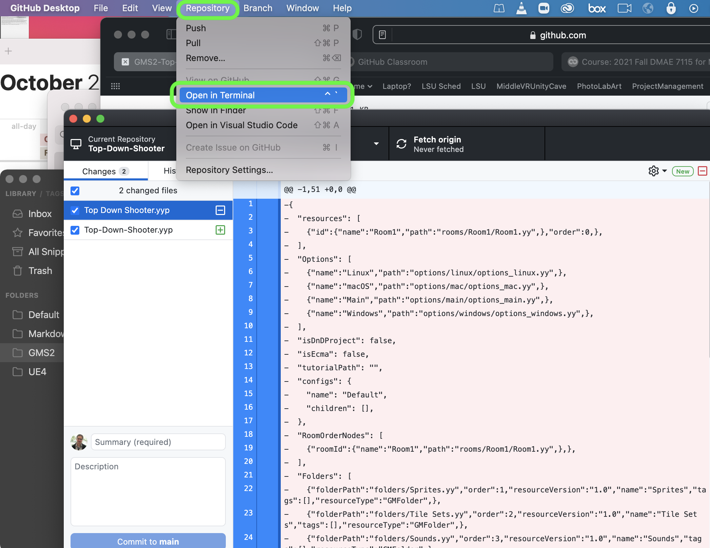

Now the only way we know that it works properly is to turn on the ability to see hidden files and folders.  Go to [Microsoft Resources](https://support.microsoft.com/en-us/windows/show-hidden-files-0320fe58-0117-fd59-6851-9b7f9840fdb2) for windows 10 instructions for turning on hidden files and folders.  Read this [article](https://www.macworld.co.uk/how-to/show-hidden-files-mac-3520878/) for instructions on the mac.

##### `Step 10.`\|`SPCRK`| :large_blue_diamond:

You now need to connect this new repository to the one you created in the second step in this walk through.  Copy and paste the line that includes `git remote add origin`... and press enter.

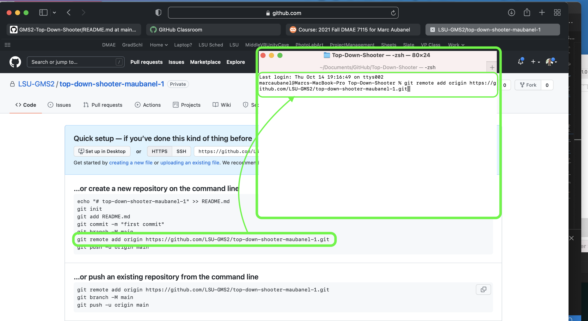

##### `Step 11.`\|`SPCRK`| :large_blue_diamond: :small_blue_diamond: 

Now type `git push -u origin main` to push your work to **GitHub**.  The project is now set up and you will be able to use **GitHub** desktop without command line for the rest of the project.

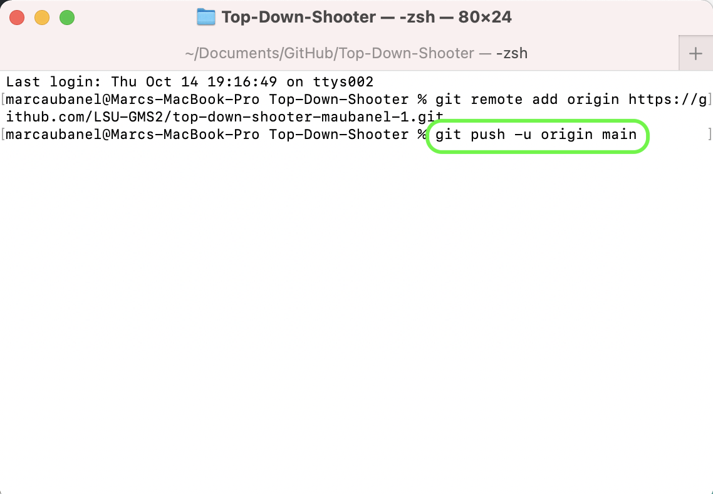

___

| [home](../README.md#user-content-gms2-ue4-space-rocks) | [next](../spaceship-i/README.md#user-content-the-spaceship-i)|
|---|---|
