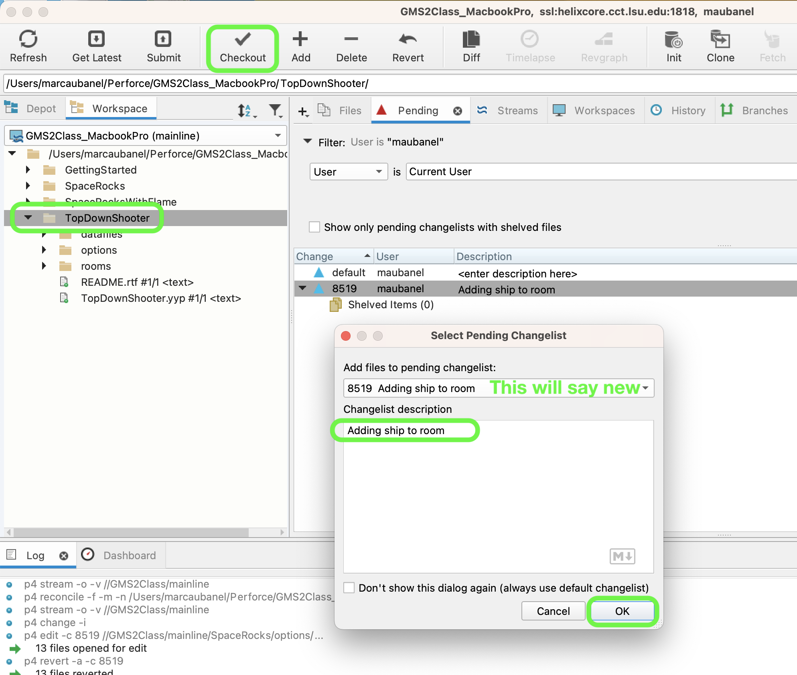
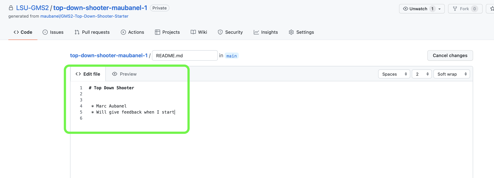
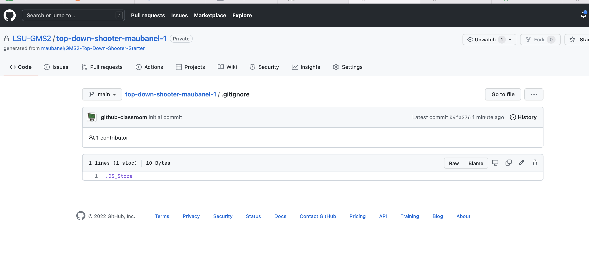
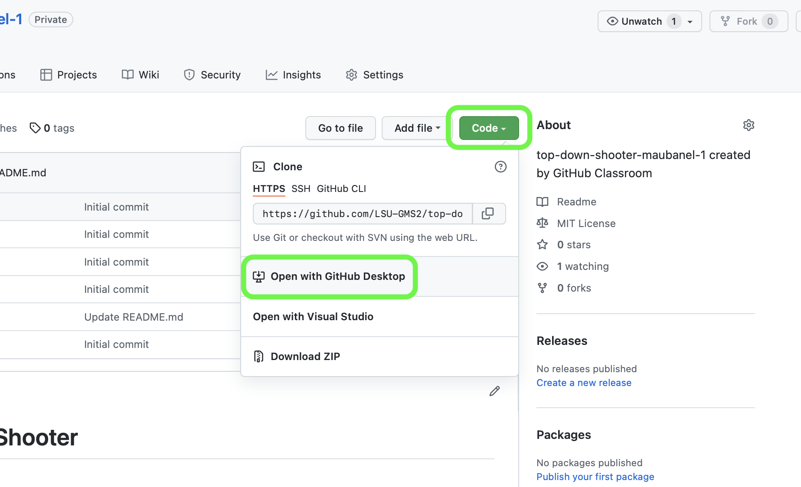
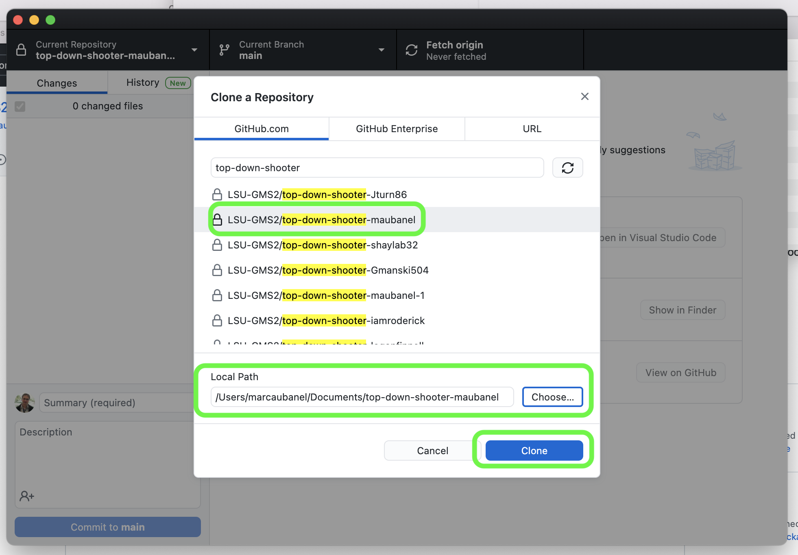
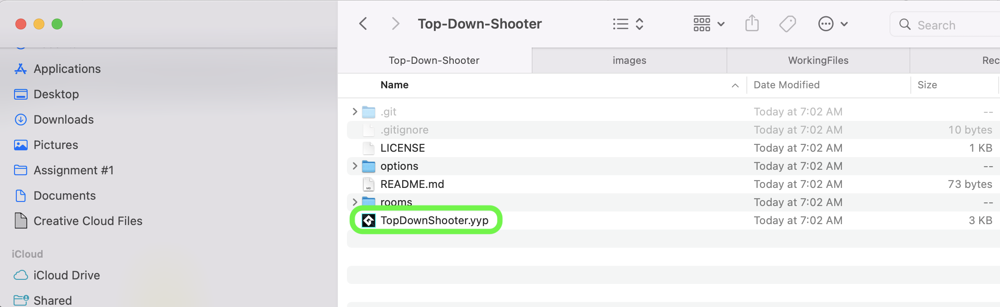
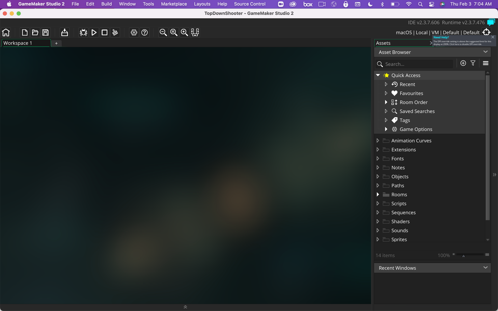

### Setting Up

[home](../README.md#user-content-gms2-top-down-shooter) • [next](../ship-room/README.md#user-content-getting-ship-in-room)

Lets get started with setting up version control and starting the project.

 

---

##### `Step 1.`\|`TDS`|:small_blue_diamond:

Open up **P4v**.  Select the top folder of the **GameMaker** project. Press the <kbd>Checkout</kbd> button.  Checkout out all files in P4V so that they are all writable (otherwise they will be read only and none of the changes will be saved). Select a **New** changelist and add a message describing the unit of work you will be performing. Press the <kbd>OK</kbd> button.

Open up the project you are working on in **GameMaker**. 

Click on the **[GitHub Classroom Link](https://classroom.github.com/a/zDQ4NVnj)** if you want a repository to use for the game. Press the <kbd>Accept this assignment</kbd> button. 

##### `Step 2.`\|`TDS`|:small_blue_diamond: :small_blue_diamond: 

You will now be sent to a message that says the repository is being configured.  Wait a few seconds then press the refresh button.

##### `Step 3.`\|`TDS`|:small_blue_diamond: :small_blue_diamond: :small_blue_diamond:

Eventually you will get a link to the repository that **GitHub Classroom** has created.  *Click* on the link to your new repository.

##### `Step 4.`\|`TDS`|:small_blue_diamond: :small_blue_diamond: :small_blue_diamond: :small_blue_diamond:

Now I have created a projet for you to start with.  This is a **Blank GML** projet that is called `TopDownShooter`.  Notice that the **README.md** file is displayed on your repository front page.  We also have the folder and all the files for an empty project.

##### `Step 5.`\|`TDS`| :small_orange_diamond:

Press the **Pencil** icon next to the **README.md** file to edit this file.  Change it to your name and please add feedback to this as you go along.

##### `Step 6.`\|`TDS`| :small_orange_diamond: :small_blue_diamond:

I allow you to use all the assets and scritps that I have created over the years to you own liking.  I publish them with the MIT open source license.  If you want to repricate you can leave this license alone.  This means that you are releasing your work as open source.  If you do not want this please change the LICENSE to one that you would like to use. More information can be found on [GitHub](https://docs.github.com/en/repositories/managing-your-repositorys-settings-and-features/customizing-your-repository/licensing-a-repository).

##### `Step 7.`\|`TDS`| :small_orange_diamond: :small_blue_diamond: :small_blue_diamond:

This `.gitignore` file tells GitHub which files to not upload and sync with the project.  In this case the only file we do not need at the hidden `.DS_Store` files that macs create.  You can leave this file alone as it will not do anyting on a PC.

##### `Step 8.`\|`TDS`| :small_orange_diamond: :small_blue_diamond: :small_blue_diamond: :small_blue_diamond:

Press the green <kbd>Code</kbd> button and select **Open With GitHub Desktop**.

##### `Step 9.`\|`TDS`| :small_orange_diamond: :small_blue_diamond: :small_blue_diamond: :small_blue_diamond: :small_blue_diamond:

Select a directory to save the project to (DO NOT SAVE TO ONE DRIVE!). Press the <kbd>Clone</kbd> button when you are ready.

##### `Step 10.`\|`TDS`| :large_blue_diamond:

Navigate to the directory you cloned it in.  Double click on `TopDownShooter.yyp`.

##### `Step 11.`\|`TDS`| :large_blue_diamond: :small_blue_diamond:

Now you have a blank project and you are ready to start!

Open up **P4V**.  Select the top folder and press the **Add** button.  We want to add all the new files we created during this last session.  Add these files to the last change list you used at the begining of the session (in my case it was `Spaceship I portion of walkthrough`). Press the <kbd>OK</kbd> button.

Now you can submit the changelist by pressing both <kbd>Submit</kbd> buttons.

<!--  -->

| [home](../README.md#user-content-gms2-ue4-space-rocks) | [next](../ship-room/README.md#user-content-gms2-top-down-shooter)|
|---|---|
