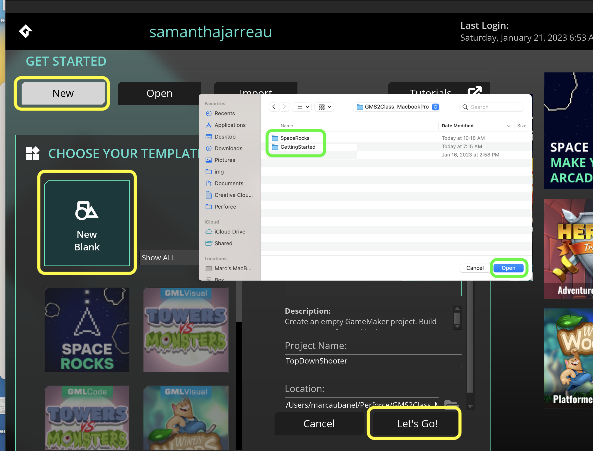
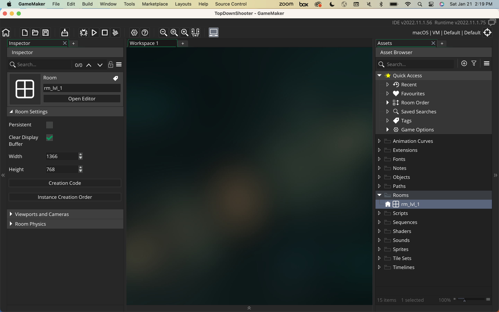
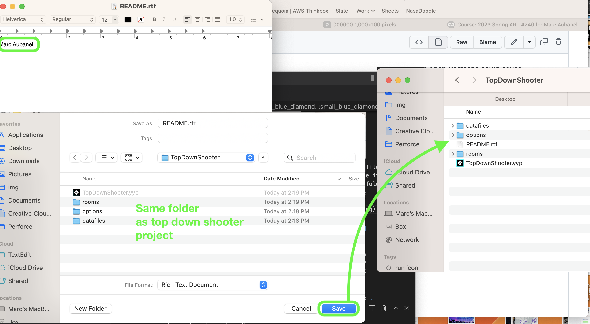
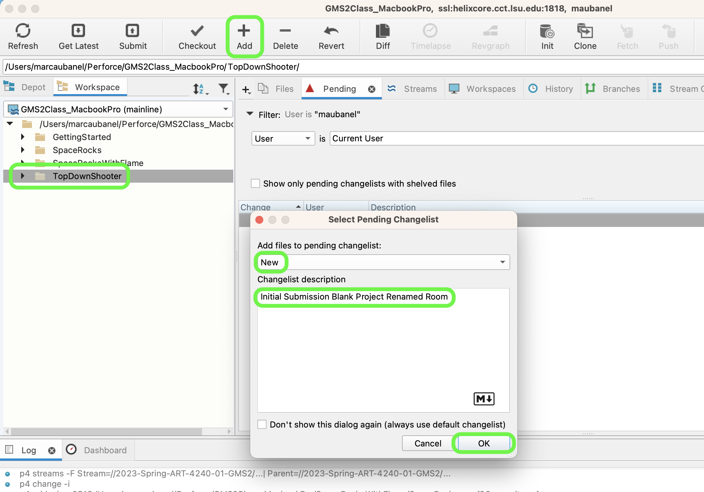
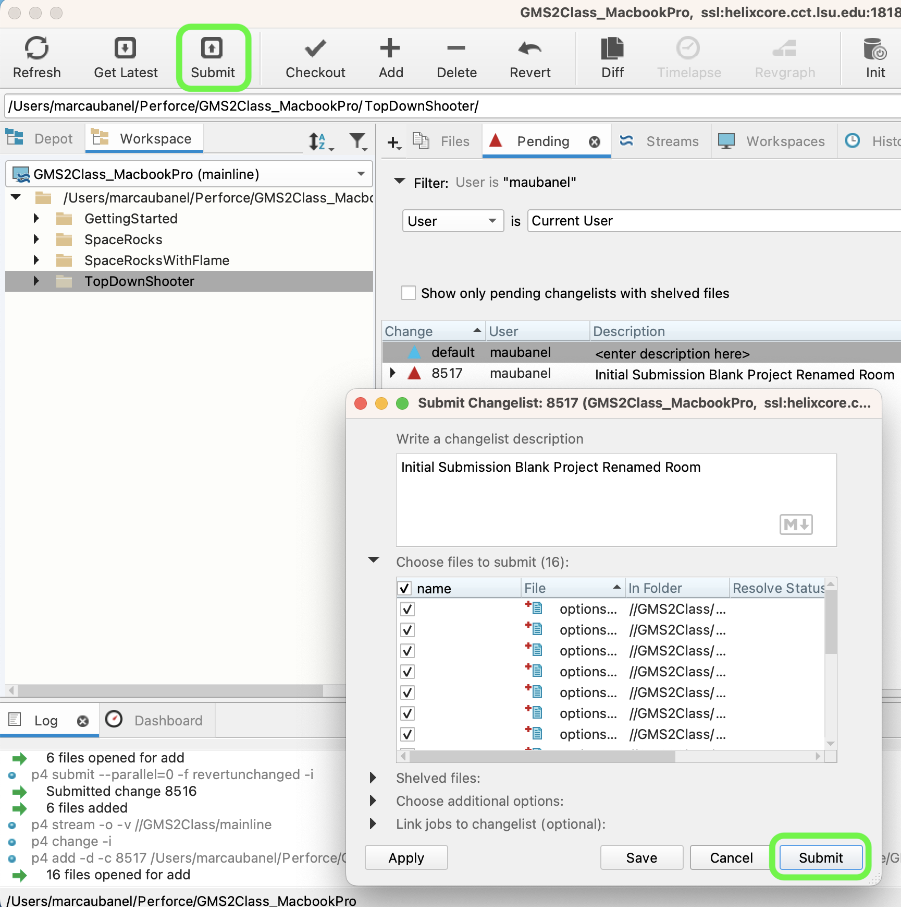
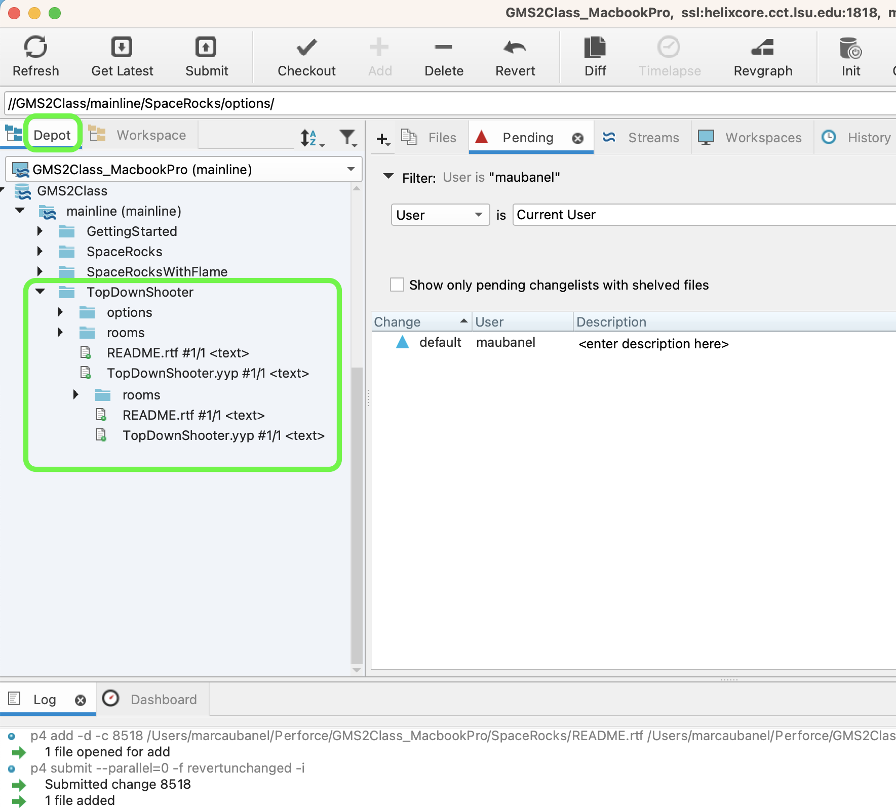

### Setting Up

[home](../README.md#user-content-gms2-top-down-shooter) • [next](../ship-room/README.md#user-content-getting-ship-in-room)

Lets get started with setting up version control and starting the project.

 

---

##### `Step 1.`\|`SPCRK`|:small_blue_diamond:

Pres the <kbd>New</kbd> then the <kbd>New Blank</kbd> to create a new blank project. Call the project `TopDownShooter`. Put it in the same folder that contains your **Perforce** repository. It should appear in the same folder as the first project **Getting Started** and **Space Rocks**. Select this directory by pressing the <kbd>Open</kbd> button. Press the <kbd>Lets Go!</kbd> button to start our new project.

##### `Step 2.`\|`SPCRK`|:small_blue_diamond: :small_blue_diamond: 

Now you should have an empty game with the defaul room!

##### `Step 3.`\|`SPCRK`|:small_blue_diamond: :small_blue_diamond: :small_blue_diamond:

Now you should have an empty game with the defaul room!

##### `Step 4.`\|`SPCRK`|:small_blue_diamond: :small_blue_diamond: :small_blue_diamond: :small_blue_diamond:

All work we do in **Perforce** needs to be done when the project is no longer open.  An open **GameMaker** and an open **Perforce** could cause corruption issues with your project.  Select **GameMaker | Quit**.

##### `Step 5.`\|`SPCRK`| :small_orange_diamond:

Create a text file in TextEdit (Mac) or NotePad (PC) and create a file called `README`.  In the file just write you name on the first line.  Save it in the directory that contains your **SpaceRocks.yyp** file in the route folder of the project.

##### `Step 6.`\|`SPCRK`| :small_orange_diamond: :small_blue_diamond:

Now we want to add all these new files to our **Perforce** server. Open up **P4V** and select the **SpaceRocks** folder.  Now to add all these new files to the server press the <kbd>Add</kbd> button.

##### `Step 7.`\|`SPCRK`| :small_orange_diamond: :small_blue_diamond: :small_blue_diamond:

Select a **New** changelist and an appropriate message describing what we did.  Press the <kbd>OK</kbd> button.

##### `Step 8.`\|`SPCRK`| :small_orange_diamond: :small_blue_diamond: :small_blue_diamond: :small_blue_diamond:

Press the <kbd>Submit</kbd> button and the changlist window comes up.  Press the <kbd>Submit</kbd> button on this pop up Window.

##### `Step 9.`\|`SPCRK`| :small_orange_diamond: :small_blue_diamond: :small_blue_diamond: :small_blue_diamond: :small_blue_diamond:

Notice that tracked files have a small green dot on all the files. That means they are now being tracked by **Perforce** and are up to date with the **Depot** (server).

##### `Step 10.`\|`SPCRK`| :large_blue_diamond:

Confirm that you have properly uploaded to the **Depot** by selecting the tab and you should see the **SpaceRocks** folder up on the server!

<!--  -->

| [home](../README.md#user-content-gms2-ue4-space-rocks) | [next](../ship-room/README.md#user-content-gms2-top-down-shooter)|
|---|---|
