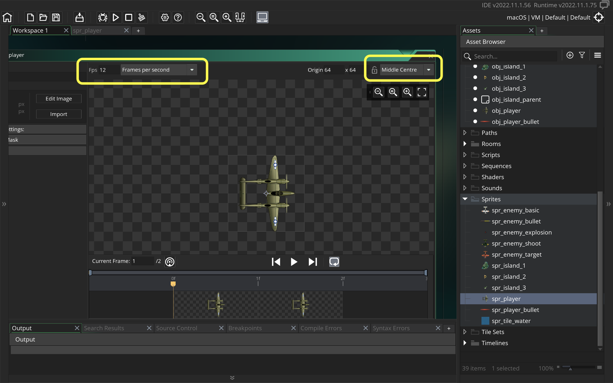
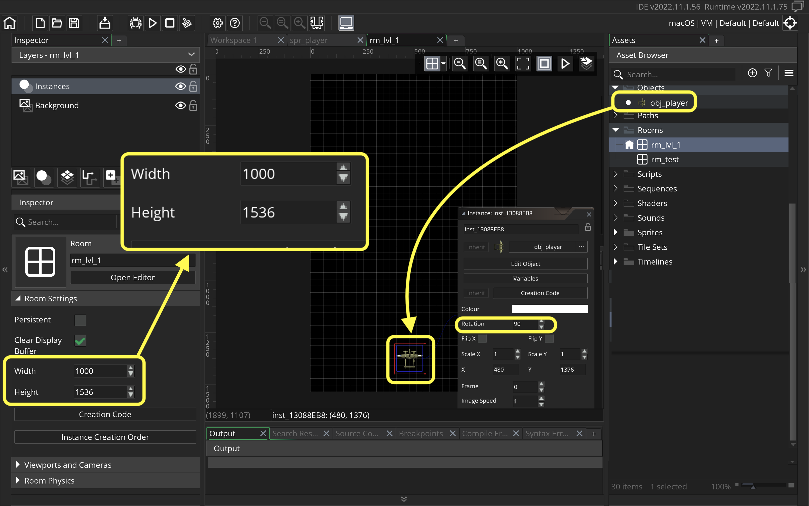
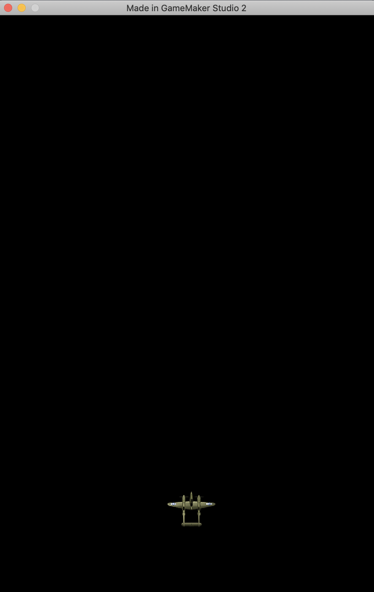
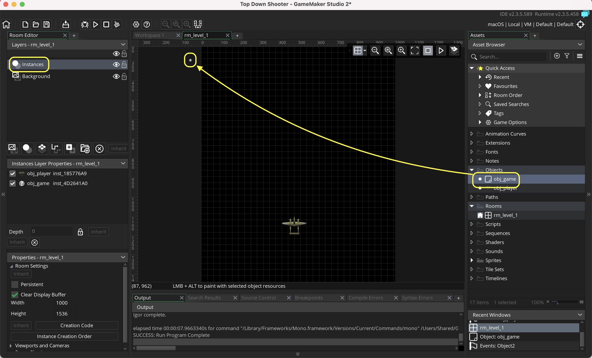
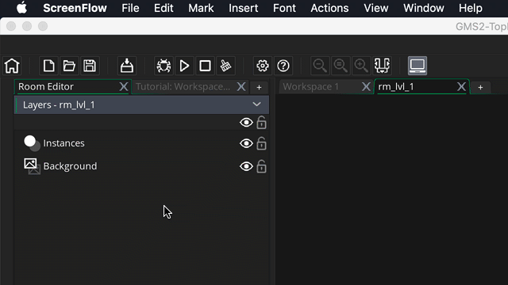
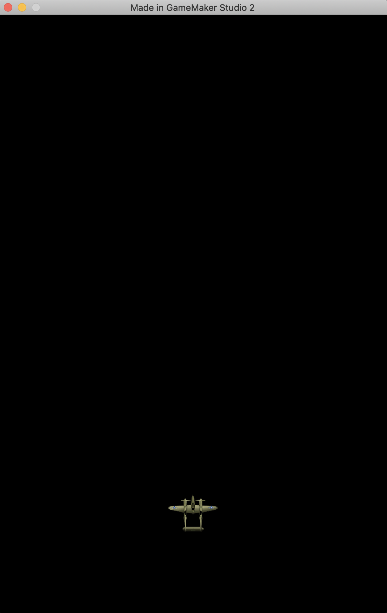

### Getting Ship in Room

[previous](../setting-up/README.md#user-content-setting-up) • [home](../README.md#user-content-gms2-ue4-space-rocks) • [next](../)

Lets get the world war 2 plane into the level.

 

---

##### `Step 1.`\|`SPCRK`|:small_blue_diamond:

Lets start by importing the player.  *Right click* on **Sprites** in the Resources tab and select **Create | Sprite**.  Name the new sprite `spr_player` and then press <kbd>Edit Image</kbd> button.

##### `Step 2.`\|`FHIU`|:small_blue_diamond: :small_blue_diamond: 

Download [spr_player_sprite_sheet.png](../Assets/Sprites/spr_player_sprite_sheet.png). The player is 128 x 128 pixels large and there are two frames to its animation.  Both frames are included in a sprite sheet so we can't import the sprite directly.  We select **Image | Import Strip Image** from the top drop down menus.  Find the `spr_player_sprite_sheet` png that you downloaded.

##### `Step 3.`\|`SPCRK`|:small_blue_diamond: :small_blue_diamond: :small_blue_diamond:

This brings up the **Convert to Frames** menu.  In this we need to make some adjustments.  *Change* both the **Frame Width** and **Frame Height** to `128`.  There are two frames so ajust the **Number of Frames** to `2` and **Frames per Row** to `2`. *Press* the <kbd>Convert</kbd> button to import the new sprite.

##### `Step 4.`\|`SPCRK`|:small_blue_diamond: :small_blue_diamond: :small_blue_diamond: :small_blue_diamond:

Press play on the animation menu to see the speed of the animation.  It defaults to 15 Frames per Second and you can adjust the playback speed. I prefer 12.  We also want to center the sprite on the place so choose Middle Center for the Origin of the sprite.

##### `Step 5.`\|`SPCRK`| :small_orange_diamond:

Create a new **Game Object** by selecting **Objects | Create | Object** and call it `obj_player`. Bind the spr_player you created above.

##### `Step 6.`\|`SPCRK`| :small_orange_diamond: :small_blue_diamond:

*Edit* the existing room by *renaming* it to `rm_lvl_1` (you can *right click *on the name and select **Rename**). 	

Now if you look at the video the game is in portrait mode. Lets set the room dimensions to: 1000 x 1536. Go to the **Properties** tab in the **Room Editor** and expand it. Set the **Width** to `1000` and **Height** to `1536`.

*Drag and drop* the `obj_player` into to the bottom of the room from the **Resources** menu.

##### `Step 7.`\|`SPCRK`| :small_orange_diamond: :small_blue_diamond: :small_blue_diamond:

Now *press* the <kbd>Play</kbd> button in the top menu bar to launch the game. Make sure that you see the plane in a dark background layer that should look like the below photo.

##### `Step 8.`\|`SPCRK`| :small_orange_diamond: :small_blue_diamond: :small_blue_diamond: :small_blue_diamond:

OK, now we don't want to place the player plane in the room. Since the player will die and have to reappear, we want to control the plane being added through scripting.

	
We need to have a **Game Object** that handles the common game issues from level to level. Create a new empty **Game Object** called `obj_game_controller`. *Add* it to the room.  Since we don't have a sprite on it there will be nothing shown in the game but it will still run the object's script events.

##### `Step 9.`\|`SPCRK`| :small_orange_diamond: :small_blue_diamond: :small_blue_diamond: :small_blue_diamond: :small_blue_diamond:

*Double click* on **room_lvl_1** and *delete* the **obj_player** to remove from the room.
		
Then, *rename* the layer **Instances** to **Instance_Player**.  These layers are like **Photoshop** where the ones on top render first and the ones underneath render beneath it.  We want our player to be at the top of the layers.

##### `Step 10.`\|`SPCRK`| :large_blue_diamond:

Now create a new **obj_game_controller: Create Event** script and *spawn* the player in the bottom center of the game room:

*Please Note: Notice that we can put the same script over multiple lines.  We don't want to go so wide that we can't read the entire line and miss important information.  We can split up a long line of script as necessary.  I am using a comma as a spot to separate the code.*

*Open* up **obj_game_controller: Create Event**.

##### `Step 11.`\|`SPCRK`| :large_blue_diamond: :small_blue_diamond: 

Now *press* the <kbd>Play</kbd> button in the top menu bar to launch the game. Make sure that you see the plane appears (only one, you should have deleted the old one) in the bottom center of the room.  We will soon be adding controls to move the ship with keyboard input.

##### `Step 12.`\|`SPCRK`| :large_blue_diamond: :small_blue_diamond: :small_blue_diamond: 

Select the **File | Save Project** then press **File | Quit** to make sure everything in the game is saved. If you are using **GitHub** open up **GitHub Desktop** and add a title and longer description (if necessary) and press the <kbd>Commit to main</kbd> button. Finish by pressing **Push origin** to update the server with the latest changes.

___

| [previous](../setting-up/README.md#user-content-setting-up)| [home](../README.md#user-content-gms2-ue4-space-rocks) | [next](../)|
|---|---|---|
