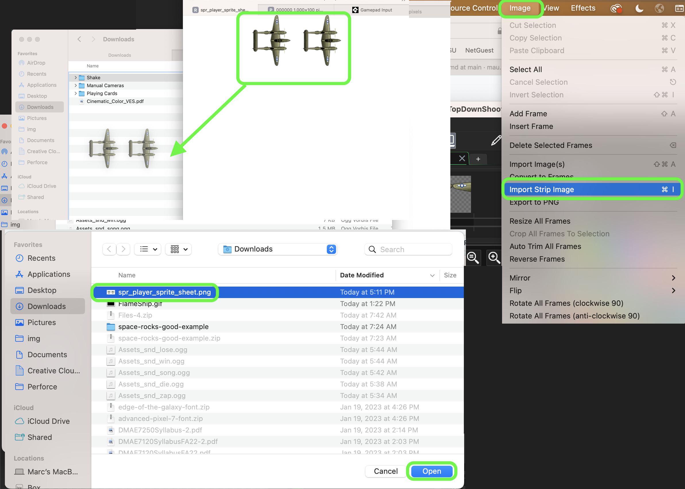
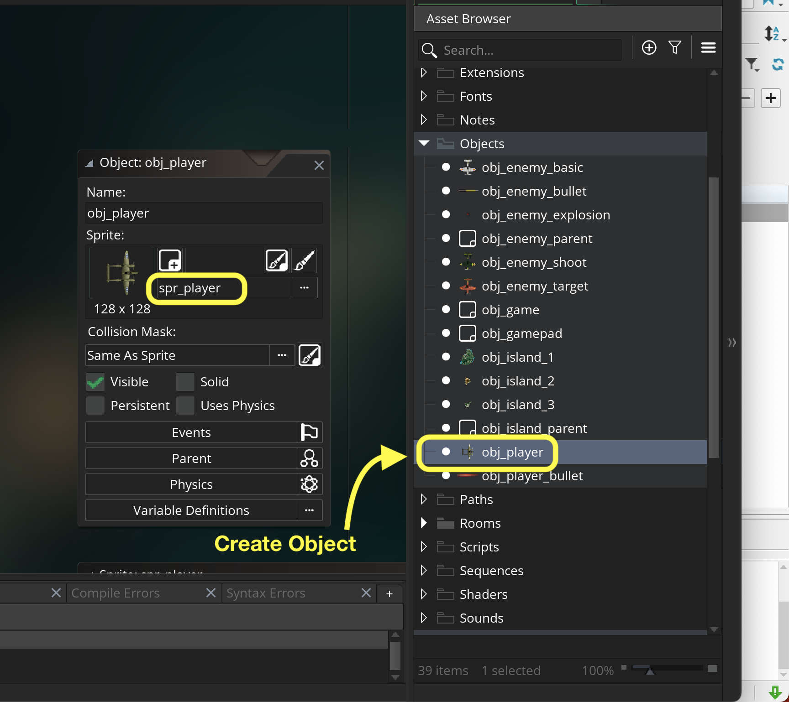
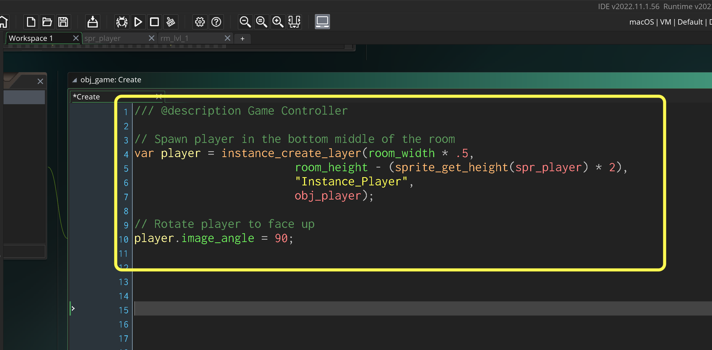

### Getting Ship in Room

[previous](../setting-up/README.md#user-content-setting-up) • [home](../README.md#user-content-gms2-ue4-space-rocks) • [next](../keyboard/README.md#user-content-moving-ship-with-keyboard)

Lets get the world war 2 plane into the level.

 

---

##### `Step 1.`\|`TDS`|:small_blue_diamond:

Open up **P4v**.  Select the top folder of the **GameMaker** project. Press the <kbd>Checkout</kbd> button.  Checkout out all files in P4V so that they are all writable (otherwise they will be read only and none of the changes will be saved). Select a **New** changelist and add a message describing the unit of work you will be performing. Press the <kbd>OK</kbd> button.

Open up the project you are working on in **GameMaker**. 

##### `Step 2.`\|`TDS`|:small_blue_diamond: :small_blue_diamond: 

Lets start by importing the player.  *Right click* on **Sprites** in the Resources tab and select **Create | Sprite**.  Name the new sprite `spr_player` and then press <kbd>Edit Image</kbd> button.

##### `Step 3.`\|`TDS`|:small_blue_diamond: :small_blue_diamond: :small_blue_diamond:

Download [spr_player_sprite_sheet.png](../Assets/Sprites/spr_player_sprite_sheet.png). The player is 128 x 128 pixels large and there are two frames to its animation.  Both frames are included in a sprite sheet so we can't import the sprite directly.  We select **Image | Import Strip Image** from the top drop down menus.  Find the `spr_player_sprite_sheet` png that you downloaded.

##### `Step 4.`\|`TDS`|:small_blue_diamond: :small_blue_diamond: :small_blue_diamond: :small_blue_diamond:

This brings up the **Convert to Frames** menu.  In this we need to make some adjustments.  *Change* both the **Frame Width** and **Frame Height** to `128`.  There are two frames so ajust the **Number of Frames** to `2` and **Frames per Row** to `2`. *Press* the <kbd>Convert</kbd> button to import the new sprite.

##### `Step 5.`\|`TDS`| :small_orange_diamond:

Press play on the animation menu to see the speed of the animation.  It defaults to `15` **Frames per Second** and you can adjust the playback speed. I prefer `12`.  We also want to center the sprite on the place so choose **Middle Center** for the **Origin** of the sprite.

##### `Step 6.`\|`TDS`| :small_orange_diamond: :small_blue_diamond:

Create a new **Game Object** by selecting **Objects | Create | Object** and call it `obj_player`. Bind the spr_player you created above.

##### `Step 7.`\|`TDS`| :small_orange_diamond: :small_blue_diamond: :small_blue_diamond:

Open up **rm_lvl_1**.

Now if you look at the video the game is in portrait mode. Lets set the room dimensions to: 1000 x 1536. Go to the **Properties** tab in the **Room Editor** and expand it. Set the **Width** to `1000` and **Height** to `1536`.

*Drag and drop* the `obj_player` into to the bottom of the room from the **Resources** menu.

##### `Step 8.`\|`TDS`| :small_orange_diamond: :small_blue_diamond: :small_blue_diamond: :small_blue_diamond:

Now *press* the <kbd>Play</kbd> button in the top menu bar to launch the game. Make sure that you see the plane in a dark background layer that should look like the below photo.

##### `Step 9.`\|`TDS`| :small_orange_diamond: :small_blue_diamond: :small_blue_diamond: :small_blue_diamond: :small_blue_diamond:

OK, now we don't want to place the player plane in the room. Since the player will die and have to reappear, we want to control the plane being added through scripting.

We will use the **Intances** layer to hold just the player.  So lets make it clear to everyone that this will only hold the player.
		
Then, *rename* the layer **Instances** to **Instance_Player**.  These layers are like **Photoshop** where the ones on top render first and the ones underneath render beneath it.  We want our player to be at the top of the layers.

##### `Step 10.`\|`TDS`| :large_blue_diamond:

Create a new game object called `obj_game`.  Do not assign a sprite.  We will use this as a game controller to store all game global variables.

##### `Step 11.`\|`TDS`| :large_blue_diamond: :small_blue_diamond: 

Open up **obj_game** and press the <kbd>Add Event</kbd> button and add a **Create Event** script and *spawn* the player in the bottom center of the game room.

*Please Note: Notice that we can put the same script over multiple lines.  We don't want to go so wide that we can't read the entire line and miss important information.  We can split up a long line of script as necessary.  I am using a comma as a spot to separate the code.*

##### `Step 12.`\|`TDS`| :large_blue_diamond: :small_blue_diamond: :small_blue_diamond:

Add a new Instance layer called `Game`. Remove `obj_player` from room and add `obj_game` to room on **Game** instance layer. 

##### `Step 13.`\|`TDS`| :large_blue_diamond: :small_blue_diamond: :small_blue_diamond: :small_blue_diamond: 

Now *press* the <kbd>Play</kbd> button in the top menu bar to launch the game. Make sure that you see the plane appears (only one, you should have deleted the old one) in the bottom center of the room.  We will soon be adding controls to move the ship with keyboard input.

##### `Step 14.`\|`TDS`| :large_blue_diamond: :small_blue_diamond: :small_blue_diamond: :small_blue_diamond:  :small_blue_diamond: 

Select the **File | Save Project**, then press **File | Quit** (PC) **Game Maker | Quit** on Mac to make sure everything in the game is saved.

##### `Step 15.`\|`TDS`| :large_blue_diamond: :small_orange_diamond: 

Open up **P4V**.  Select the top folder and press the **Add** button.  We want to add all the new files we created during this last session.  Add these files to the last change list you used at the begining of the session (in my case it was `Spaceship I portion of walkthrough`). Press the <kbd>OK</kbd> button.

##### `Step 16.`\|`TDS`| :large_blue_diamond: :small_orange_diamond:   :small_blue_diamond: 

Now you can submit the changelist by pressing both <kbd>Submit</kbd> buttons.

Open up **P4V**.  Select the top folder and press the **Add** button.  We want to add all the new files we created during this last session.  Add these files to the last change list you used at the begining of the session (in my case it was `Spaceship I portion of walkthrough`). Press the <kbd>OK</kbd> button.

Now you can submit the changelist by pressing both <kbd>Submit</kbd> buttons.

<!--  -->

| [previous](../setting-up/README.md#user-content-setting-up)| [home](../README.md#user-content-gms2-ue4-space-rocks) | [next](../keyboard/README.md#user-content-moving-ship-with-keyboard)|
|---|---|---|
