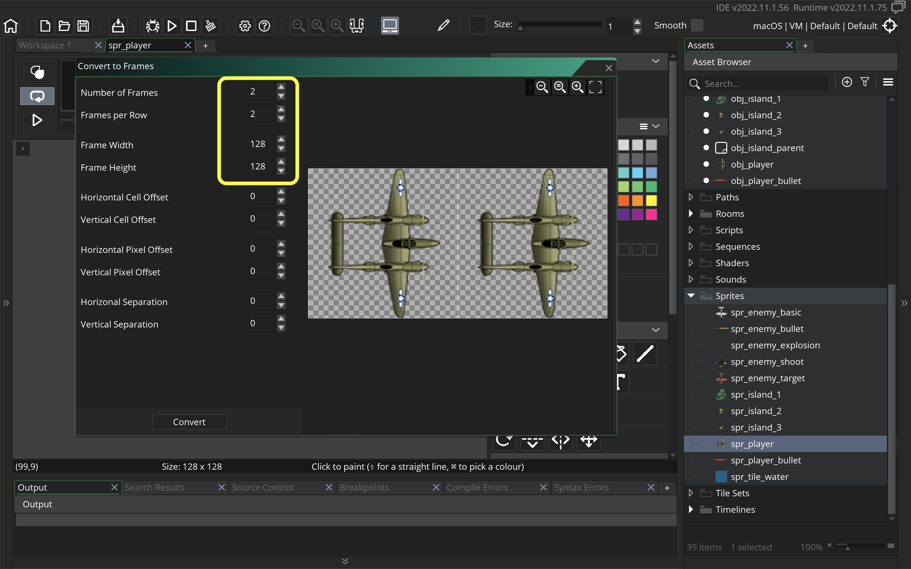

### Getting Ship in Room]

[previous](../setting-up/README.md#user-content-setting-up) • [home](../README.md#user-content-gms2-ue4-space-rocks) • [next](../)

Lets get the world war 2 plane into the level.

 

---

##### `Step 1.`\|`SPCRK`|:small_blue_diamond:

Lets start by importing the player.  *Right click* on **Sprites** in the Resources tab and select **Create | Sprite**.  Name the new sprite `spr_player` and then press <kbd>Edit Image</kbd> button.

##### `Step 2.`\|`FHIU`|:small_blue_diamond: :small_blue_diamond: 

Download [spr_player_sprite_sheet.png](../Assets/Sprites/spr_player_sprite_sheet.png). The player is 128 x 128 pixels large and there are two frames to its animation.  Both frames are included in a sprite sheet so we can't import the sprite directly.  We select **Image | Import Strip Image** from the top drop down menus.  Find the `spr_player_sprite_sheet` png that you downloaded.

##### `Step 3.`\|`SPCRK`|:small_blue_diamond: :small_blue_diamond: :small_blue_diamond:

This brings up the **Convert to Frames** menu.  In this we need to make some adjustments.  *Change* both the **Frame Width** and **Frame Height** to `128`.  There are two frames so ajust the **Number of Frames** to `2` and **Frames per Row** to `2`. *Press* the <kbd>Convert</kbd> button to import the new sprite.

##### `Step 4.`\|`SPCRK`|:small_blue_diamond: :small_blue_diamond: :small_blue_diamond: :small_blue_diamond:

Press play on the animation menu to see the speed of the animation.  It defaults to 15 Frames per Second and you can adjust the playback speed. I prefer 12.  We also want to center the sprite on the place so choose Middle Center for the Origin of the sprite.

##### `Step 5.`\|`SPCRK`| :small_orange_diamond:

Create a new **Game Object** by selecting **Objects | Create | Object** and call it `obj_player`. Bind the spr_player you created above.

##### `Step 6.`\|`SPCRK`| :small_orange_diamond: :small_blue_diamond:

##### `Step 7.`\|`SPCRK`| :small_orange_diamond: :small_blue_diamond: :small_blue_diamond:

##### `Step 8.`\|`SPCRK`| :small_orange_diamond: :small_blue_diamond: :small_blue_diamond: :small_blue_diamond:

##### `Step 9.`\|`SPCRK`| :small_orange_diamond: :small_blue_diamond: :small_blue_diamond: :small_blue_diamond: :small_blue_diamond:

##### `Step 10.`\|`SPCRK`| :large_blue_diamond:

##### `Step 11.`\|`SPCRK`| :large_blue_diamond: :small_blue_diamond: 

##### `Step 12.`\|`SPCRK`| :large_blue_diamond: :small_blue_diamond: :small_blue_diamond: 

##### `Step 13.`\|`SPCRK`| :large_blue_diamond: :small_blue_diamond: :small_blue_diamond:  :small_blue_diamond: 

##### `Step 14.`\|`SPCRK`| :large_blue_diamond: :small_blue_diamond: :small_blue_diamond: :small_blue_diamond:  :small_blue_diamond: 

##### `Step 15.`\|`SPCRK`| :large_blue_diamond: :small_orange_diamond: 

##### `Step 16.`\|`SPCRK`| :large_blue_diamond: :small_orange_diamond:   :small_blue_diamond: 

##### `Step 17.`\|`SPCRK`| :large_blue_diamond: :small_orange_diamond: :small_blue_diamond: :small_blue_diamond:

##### `Step 18.`\|`SPCRK`| :large_blue_diamond: :small_orange_diamond: :small_blue_diamond: :small_blue_diamond: :small_blue_diamond:

##### `Step 19.`\|`SPCRK`| :large_blue_diamond: :small_orange_diamond: :small_blue_diamond: :small_blue_diamond: :small_blue_diamond: :small_blue_diamond:

##### `Step 20.`\|`SPCRK`| :large_blue_diamond: :large_blue_diamond:

##### `Step 21.`\|`SPCRK`| :large_blue_diamond: :large_blue_diamond: :small_blue_diamond:

___

| [previous](../setting-up/README.md#user-content-setting-up)| [home](../README.md#user-content-gms2-ue4-space-rocks) | [next](../)|
|---|---|---|
