### Shooting Enemies

[previous](../shooting/README.md#user-content-shooting) • [home](../README.md#user-content-gms2-top-down-shooter) • [next](../targeting-enemies/README.md#user-content-targeting-enemies)

Now we have an enemy that is just a flying obstacle but does not attack the player.  Lets create an enemy type that shoots straight down the screen.

 

---

##### `Step 1.`\|`TDS`|:small_blue_diamond:

Open up **P4v**.  Select the top folder of the **GameMaker** project. Press the <kbd>Checkout</kbd> button.  Checkout out all files in P4V so that they are all writable (otherwise they will be read only and none of the changes will be saved). Select a **New** changelist and add a message describing the unit of work you will be performing. Press the <kbd>OK</kbd> button.

Open up the project you are working on in **GameMaker**. 

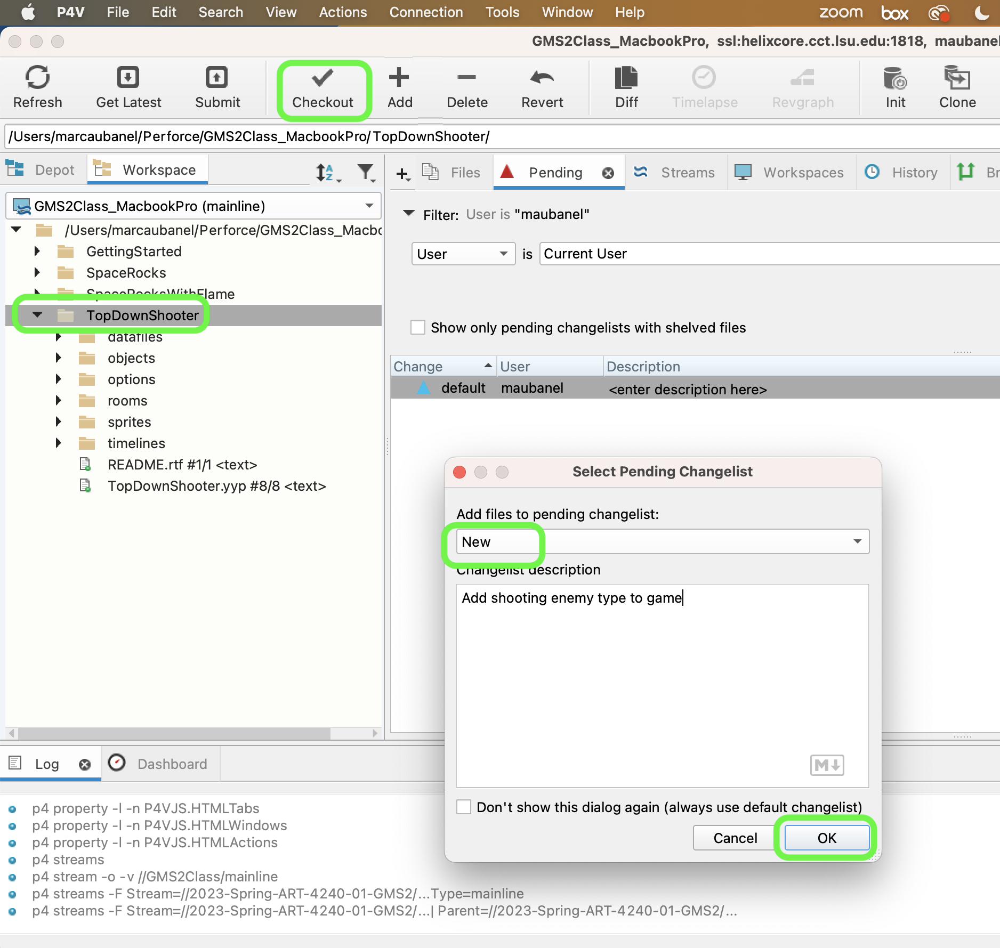

##### `Step 2.`\|`TDS`|:small_blue_diamond: :small_blue_diamond: 

*Create* a wave of the new planes. Open **Timelines | tl_lvl_1**  and press the <kbd>Add</kbd> button to create a Moment at `240` (or 4 seconds in) with a V wave of four enemy shooters. Add to the script a wave for the shooting enemy type.

##### `Step 3.`\|`TDS`|:small_blue_diamond: :small_blue_diamond: :small_blue_diamond:

Now *press* the <kbd>Play</kbd> button in the top menu bar to launch the game.  You should see a second wave follow close behind the first one.  Notice that the explosion works for this one as we have put all the code in the parent which it inherits from.

##### `Step 4.`\|`TDS`|:small_blue_diamond: :small_blue_diamond: :small_blue_diamond: :small_blue_diamond:

*Download* the enemy bullet [spr_enemy_bullet.png](../Assets/Sprites/spr_enemy_bullet.png). *Create* a new **Sprite** and call it `spr_enemy_bullet`. Load **spr_enemy_bullet.png** by pressing the <kbd>Import</kbd> button and select `spr_enemy_bullet.png`.  Call it `spr_enemy_bullet`. Adjust the origin by selecting **Origin** of `Top Center`.

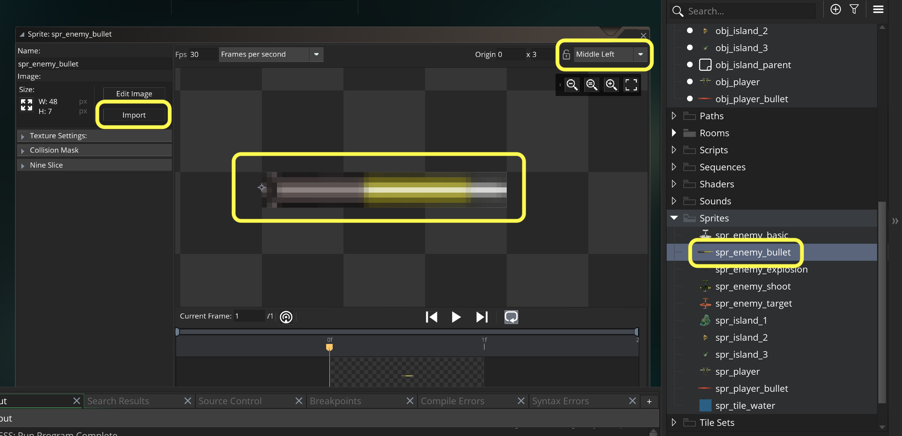

##### `Step 5.`\|`TDS`| :small_orange_diamond:

Create a new **Game Object**  and call it `obj_enemy_bullet` and bind the above sprite to it.

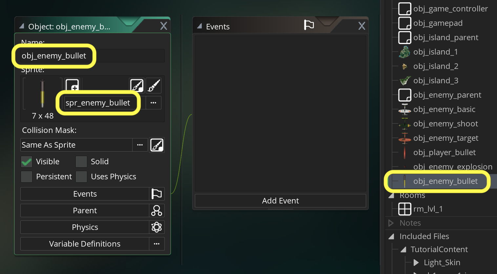

##### `Step 6.`\|`TDS`| :small_orange_diamond: :small_blue_diamond:

Press the <kbd>Add Event</kbd> and select a **Create** event and make the bullet move downwards:

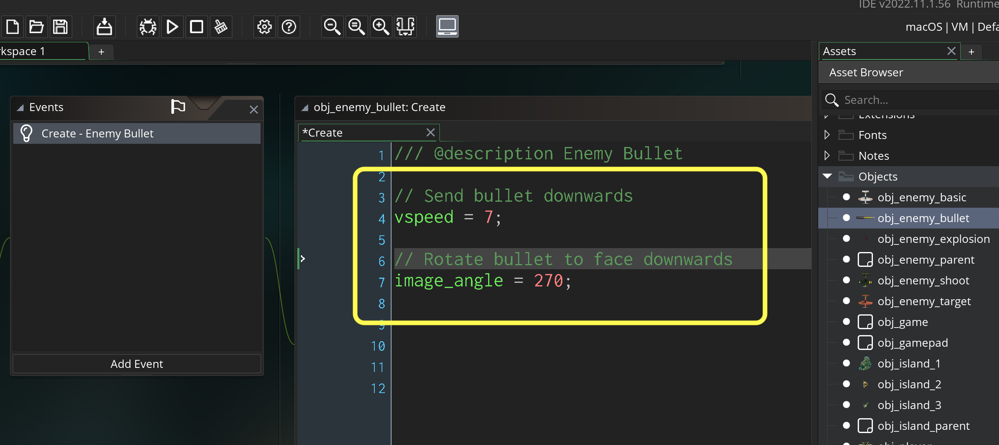

##### `Step 7.`\|`TDS`| :small_orange_diamond: :small_blue_diamond: :small_blue_diamond:

The one thing we have to be careful about inheriting parent scripts is to make sure that if you are adding another event to the child whose parent has the same event type that we need to make sure they both run (if we want them to).  *Double click*  **obj_enemy_shoot** and you will see a greyed out Create event and Step event. This means that the parent already has these event types used with a script.

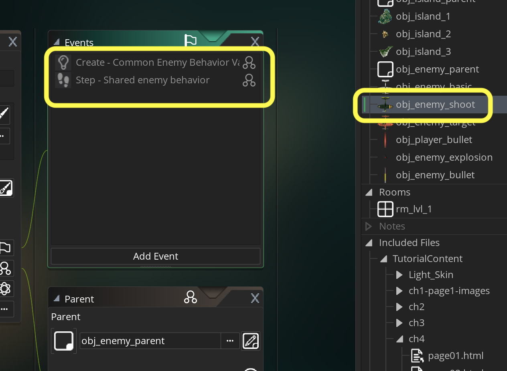

##### `Step 8.`\|`TDS`| :small_orange_diamond: :small_blue_diamond: :small_blue_diamond: :small_blue_diamond:

Our bullet is now set up. We will fire the bullet from the enemy plane that fires and we need to add a rate of fire. Lets create *another new* **Create Event** on **obj_enemy_shoot** and since which will override the parent's event.  We will then add an **[event_inherited()](https://manual.yoyogames.com/GameMaker_Language/GML_Reference/Asset_Management/Objects/Object_Events/event_inherited.htm)**</a> which will run the parent's create event script before our new code.

> This function will call the current event of the parent object of the instance. Normally, when an instance has a parent object, it automatically inherits all the same events as the parent, but if (for example) your parent object has a create event and you add one to your child object, all instances of the child object will run the new create event that you have added and not that which is in the parent object. Should you need to use both the parent object event and the child object event of the same type, you should use this function as it will run the parent object event before continuing with the rest of the code or actions that the child event contains. - GameMaker Manual

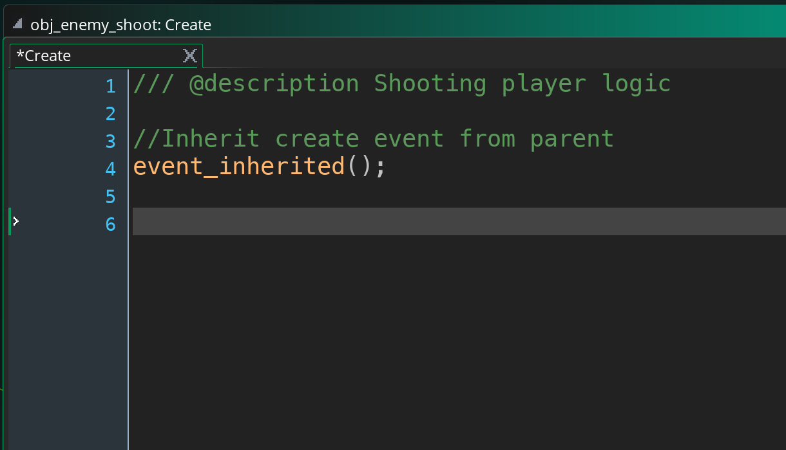

##### `Step 9.`\|`TDS`| :small_orange_diamond: :small_blue_diamond: :small_blue_diamond: :small_blue_diamond: :small_blue_diamond:

Add a `rate_of_fire` and `cooldown` to the shooting enemy just like we did in the player.

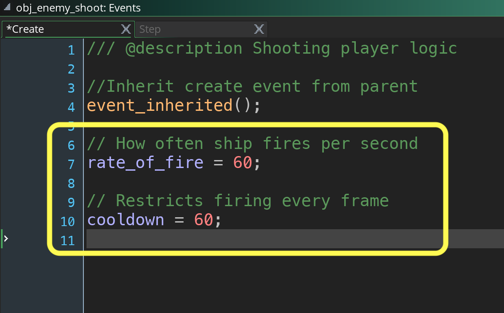

##### `Step 10.`\|`TDS`| :large_blue_diamond:

Add to `obj_player_shoot` and add an overriding **Step | Step** event script on and add shooting after running the parent's step event through calling `event_inherited();`.

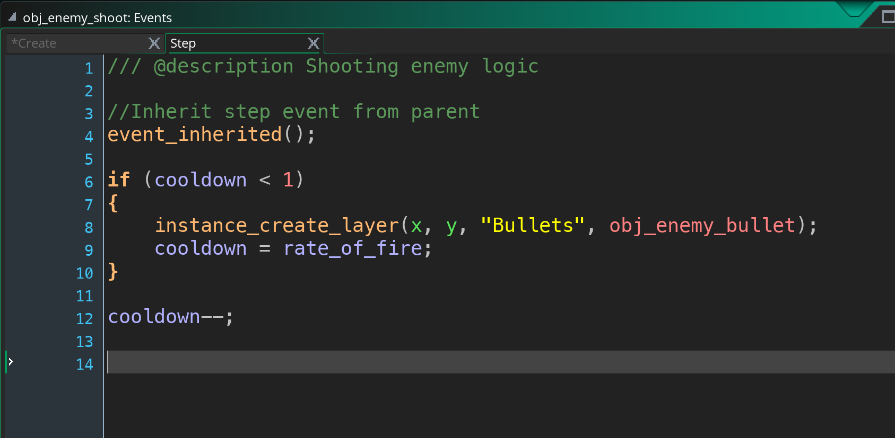

##### `Step 11.`\|`TDS`| :large_blue_diamond: :small_blue_diamond: 

Now *press* the <kbd>Play</kbd> button in the top menu bar to launch the game.  The enemy now shoots (although the bullet does no harm).

##### `Step 12.`\|`TDS`| :large_blue_diamond: :small_blue_diamond: :small_blue_diamond: 

We have a problem with these bullets, again they never disappear and they just keep going.  We don't want a memory leak so lets clean this up the same way we did player bullets.
	
Open **obj_enemy_bullet**. *Create* a new event **Other | Outside Room** script and destroy the bullet.

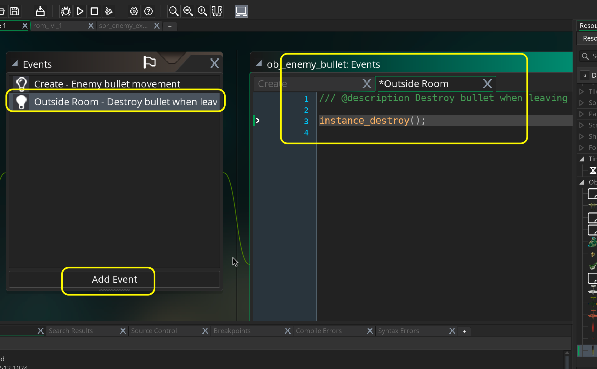

##### `Step 13.`\|`TDS`| :large_blue_diamond: :small_blue_diamond: :small_blue_diamond:  :small_blue_diamond: 

Now *press* the <kbd>Debug Play</kbd> button in the top menu bar to launch the game in debug mode and double check that all bullets and enemy planes are destroyed once they leave the room:

##### `Step 14.`\|`TDS`| :large_blue_diamond: :small_blue_diamond: :small_blue_diamond: :small_blue_diamond:  :small_blue_diamond: 

Select the **File | Save Project**, then press **File | Quit** (PC) **Game Maker | Quit** on Mac to make sure everything in the game is saved.

##### `Step 15.`\|`TDS`| :large_blue_diamond: :small_orange_diamond: 

Open up **P4V**.  Select the top folder and press the **Add** button.  We want to add all the new files we created during this last session.  Add these files to the last change list you used at the begining of the session (in my case it was `Spaceship I portion of walkthrough`). Press the <kbd>OK</kbd> button.

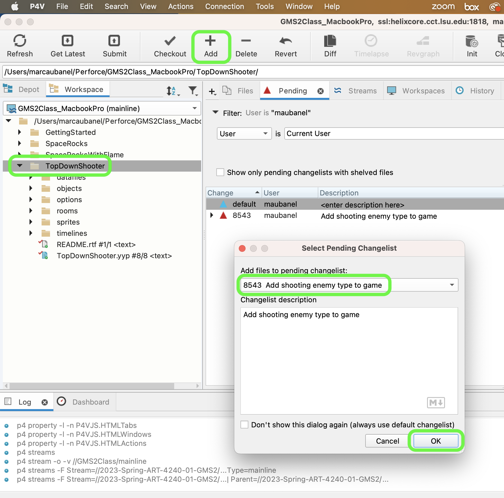

##### `Step 16.`\|`TDS`| :large_blue_diamond: :small_orange_diamond:   :small_blue_diamond: 

Now you can submit the changelist by pressing both <kbd>Submit</kbd> buttons.

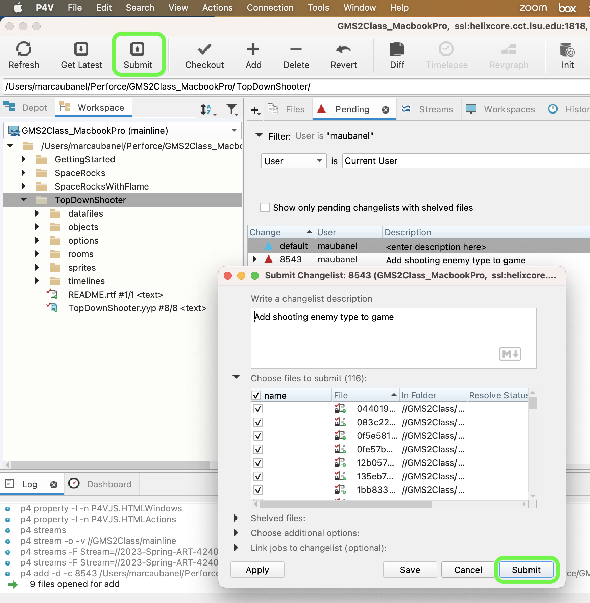

<!--  -->

| [previous](../shooting/README.md#user-content-shooting)| [home](../README.md#user-content-gms2-top-down-shooter) | [next](../targeting-enemies/README.md#user-content-targeting-enemies)|
|---|---|---|
