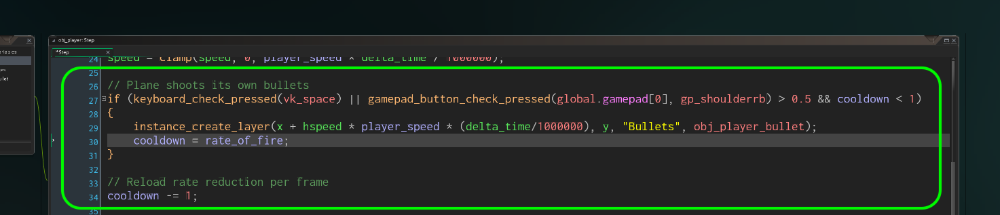

### Shooting

<sub>[previous](../basic-timelines/README.md#user-content-basic-enemy-and-timelines) • [home](../README.md#user-content-gms2-top-down-shooter) • [next](../shooting-enemies/README.md#user-content-shooting-enemies)</sub>


Now there is not much to do without the ability for the player to shoot an enemy.  Lets add this.

<br>

---


##### `Step 1.`\|`SPCRK`|:small_blue_diamond:

Now we should add shooting and collision between bullets and enemies. Download a bullet sprite [spr_player_bullet.png](../Assets/Sprites/spr_player_bullet.png). Create a new **Sprite**, press the **Import** button and add the downloaded file.

Call it `spr_player_bullet` and change the **Origin** to `Bottom Center`.  We want the bullet to spawn at the front of the plane so it is best to have the origin at the bottom of the sprite so it spawns in front of the plane.


##### `Step 2.`\|`FHIU`|:small_blue_diamond: :small_blue_diamond: 

Create a new **Game Object** and call it `obj_player_bullet`. *Assign* the `spr_player_bullet` to the new object.


##### `Step 3.`\|`SPCRK`|:small_blue_diamond: :small_blue_diamond: :small_blue_diamond:
Press the <kbd>Add Event</kbd> and select a **Create** event. Send the bullet upscreen fast!


##### `Step 4.`\|`SPCRK`|:small_blue_diamond: :small_blue_diamond: :small_blue_diamond: :small_blue_diamond:

Open **rm_lvl_1** and add a new **Instance Layer** to the room and call it `Bullets` and place it between **Instance_Player** and **Islands**.


##### `Step 5.`\|`SPCRK`| :small_orange_diamond:

Open the **obj_player: Create** event script for **obj_player** and add the rate of fire for the bullets.  We also want to add a speed relative to room speed (3 times a second) and a variable called cooldown that will be used to limit how often you can fire a bullet (simulate the time for a new bullet to be loaded in the chamber).


##### `Step 6.`\|`SPCRK`| :small_orange_diamond: :small_blue_diamond:

Open the **Step Event** Script for **obj_player** and *add* to the bottom of the script.  First we check if either the space bar or the right shoulder button on the gamepad was pressed and if the cooldown is still valid (set to 1/3 of a second each time the fire is pressed).

We will add an offset horizontally to the bullet or it looks like it fires behind the plane as opposed to outside of its turret as it is hidden during the first frame beneath the plane.  Offsetting it one player moves has it catch up to current frame. When the button fires we set the rate_of_fire.  After that we just subtract the cooldown by 1 so that the bullet will become available again in a third of a second.




##### `Step 7.`\|`SPCRK`| :small_orange_diamond: :small_blue_diamond: :small_blue_diamond:

Now *press* the <kbd>Debug</kbd> button in the top menu bar to launch the game in debug mode (right to the left of the regular run game button). Check the Instances tab below. Notice that the plane fires bullets every time you press the space bar.  Notice that the bullets just keep adding up and are never destroyed.


##### `Step 8.`\|`SPCRK`| :small_orange_diamond: :small_blue_diamond: :small_blue_diamond: :small_blue_diamond:

Now lets destroy the bullet if it leaves the room. We don't want the game to run out of memory because we have too many bullets. Add a **Other | Outside Room** event on **obj_bullet**:


##### `Step 9.`\|`SPCRK`| :small_orange_diamond: :small_blue_diamond: :small_blue_diamond: :small_blue_diamond: :small_blue_diamond:

Now *press* the <kbd>Debug</kbd> button in the top menu bar to launch the game in debug mode. See how the bullets get destroyed once they leave the room.


##### `Step 10.`\|`SPCRK`| :large_blue_diamond:

Now lets deal with the bullet enemy collision. Create a new **Collision Event** script in **obj_bullet** with a **Collision | obj_enemy_parent**.  We collide with the parent as it allows us to get an event with one object as all the enemies inherit from the same parent.  This avoids having to check individually for the plane types.
	
We destroy the bullet itself and use with (other) to access the object that the bullet is colliding with.

```
/// @description All Enemies hit by bullet


// Destroy bullet
instance_destroy();

// Destroy enemy
with (other)
{
	instance_destroy();
}
```


##### `Step 11.`\|`SPCRK`| :large_blue_diamond: :small_blue_diamond: 

Now *press* the <kbd>Play</kbd> button in the top menu bar to launch the game.  Fire away at the planes and you should destroy them (and the bullets):


##### `Step 12.`\|`SPCRK`| :large_blue_diamond: :small_blue_diamond: :small_blue_diamond: 

Lets add some visual fluff and add an explosion animation. Download [spr_enemy_explosion_sprite_sheet.png](../Assets/Sprites/spr_enemy_explosion_sprite_sheet.png). *Create* a new **Sprite** and and call it `spr_enemy_explosion`. Click on the <kbd>Edit Image</kbd> button.

Since this is 5 frames long, I didn't provide separate files. I provided them in a single animation sheet or strip. This means you can import a longer sequence from one file. In this case each frame is **128 x 128** pixels and they are on a single row. To import this we need to click on the Image menu item at the top and select Import Strip Image.

This brings up the **Convert to Frames** menu. In this menu we select the size of each individual frame, how many there are and whether there are any offsets or margins.

Now I know there are **5** frames and they are in a single row. So I select `5` for **Number of Frames** and `5` for **Frames per Row**. Now you can see the default size is 32 x 32 and they show where the five frames line up in the artwork with white boxes. Change it to `128` and `128`.

Press the <kbd>Convert</kbd> button then select <kbd>Yes</kbd> to confirm that you will be replacing the frames.  Change the framerate to `12`.


##### `Step 13.`\|`SPCRK`| :large_blue_diamond: :small_blue_diamond: :small_blue_diamond:  :small_blue_diamond: 

*Name* the sprite `spr_enemy_explosion`. Adjust its origin to Middle Center.


##### `Step 14.`\|`SPCRK`| :large_blue_diamond: :small_blue_diamond: :small_blue_diamond: :small_blue_diamond:  :small_blue_diamond: 

Create a new **Game Object** called `obj_enemy_explosion` and bind the explosion animation you just imported.


##### `Step 15.`\|`SPCRK`| :large_blue_diamond: :small_orange_diamond: 

Now we will trigger the explosion animation in a collision event between the **obj_bullet** and the **obj_enemy_parent**. Why the parent? This way any enemy that inherits from **obj_enemy_parent** will trigger this event, which is exactly what we want with three types of planes. This avoids us having to create three separate collision events. Open the **obj_player_bullet: Collision | obj_enemy_parent** event script and add the new animation.


##### `Step 16.`\|`SPCRK`| :large_blue_diamond: :small_orange_diamond:   :small_blue_diamond: 


##### `Step 17.`\|`SPCRK`| :large_blue_diamond: :small_orange_diamond: :small_blue_diamond: :small_blue_diamond:


##### `Step 18.`\|`SPCRK`| :large_blue_diamond: :small_orange_diamond: :small_blue_diamond: :small_blue_diamond: :small_blue_diamond:


##### `Step 19.`\|`SPCRK`| :large_blue_diamond: :small_orange_diamond: :small_blue_diamond: :small_blue_diamond: :small_blue_diamond: :small_blue_diamond:


##### `Step 20.`\|`SPCRK`| :large_blue_diamond: :large_blue_diamond:


##### `Step 21.`\|`SPCRK`| :large_blue_diamond: :large_blue_diamond: :small_blue_diamond:


___


| [previous](../basic-timelines/README.md#user-content-basic-enemy-and-timelines)| [home](../README.md#user-content-gms2-top-down-shooter) | [next](../shooting-enemies/README.md#user-content-shooting-enemies)|
|---|---|---|
