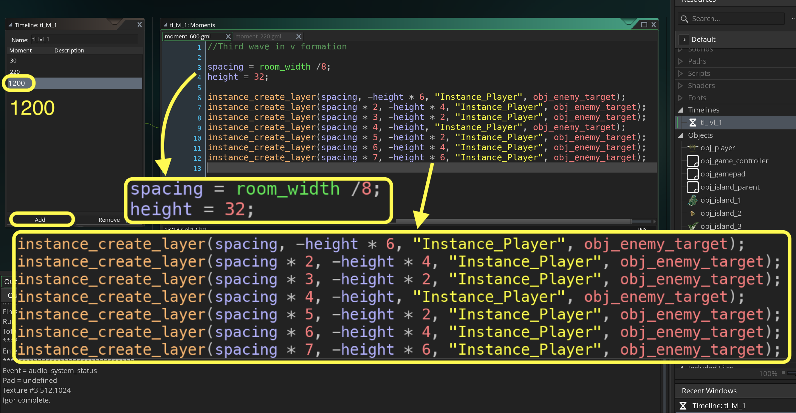
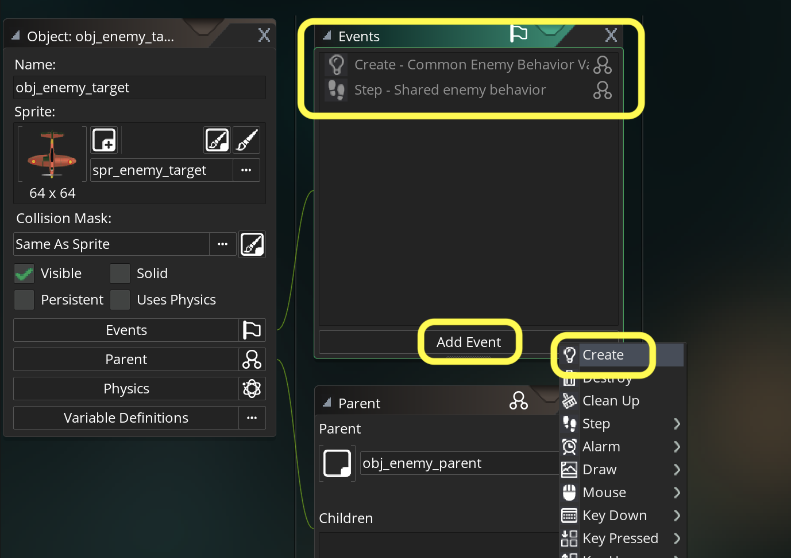
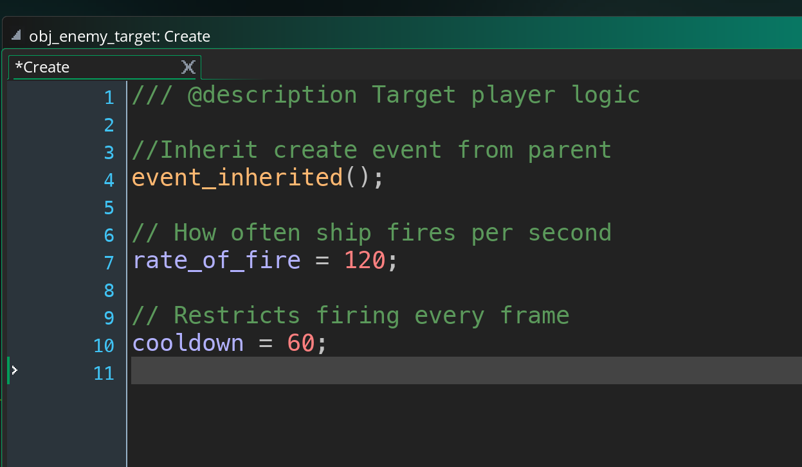
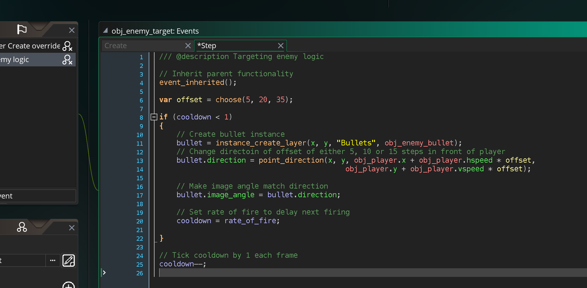
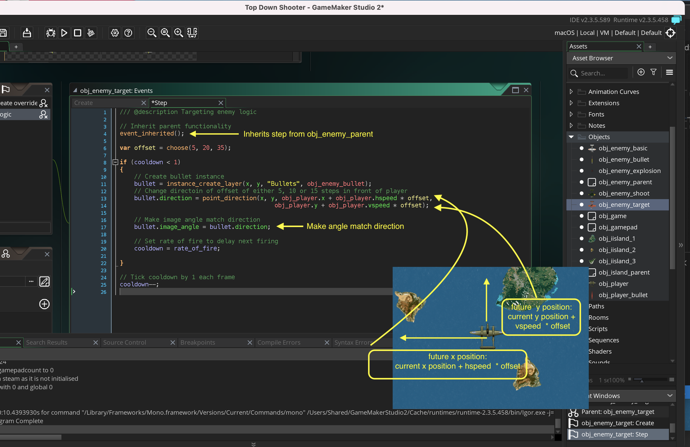
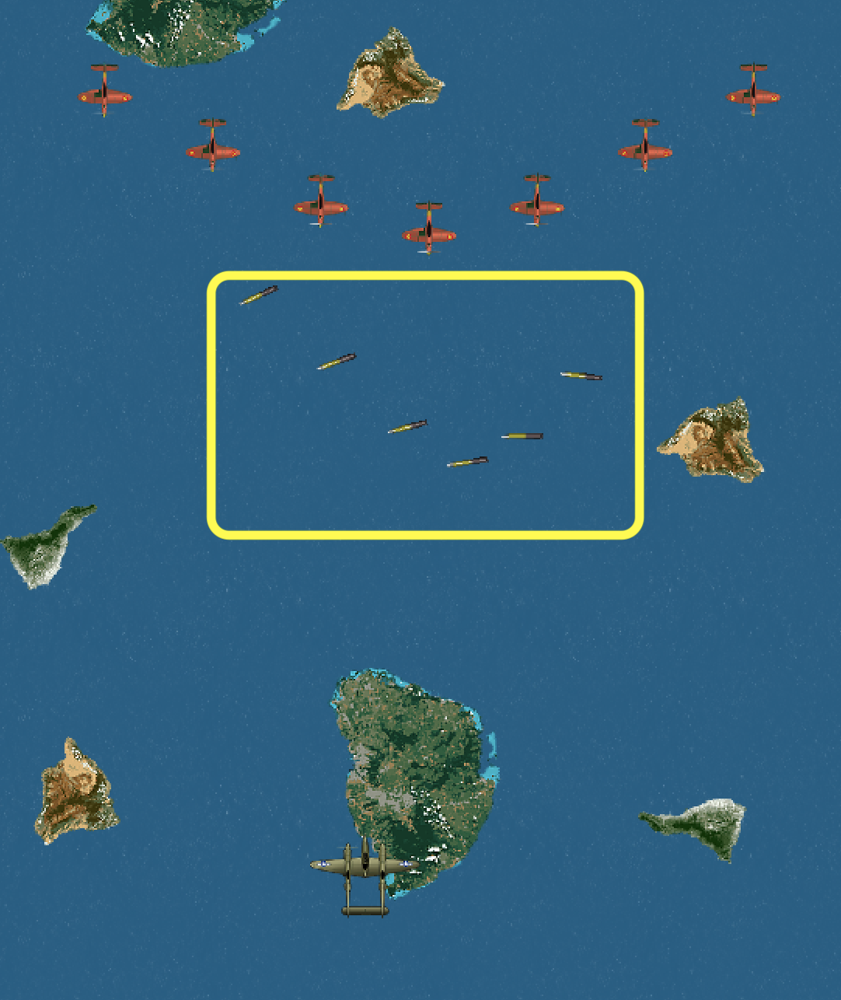
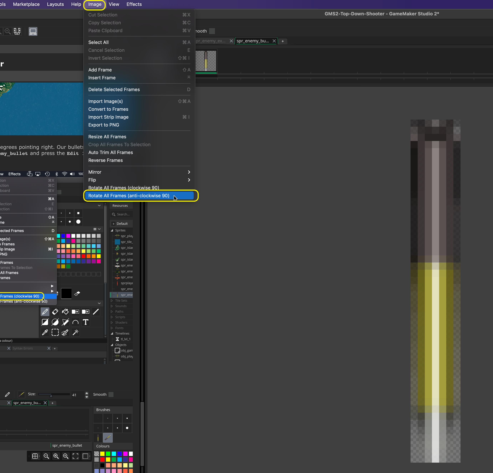
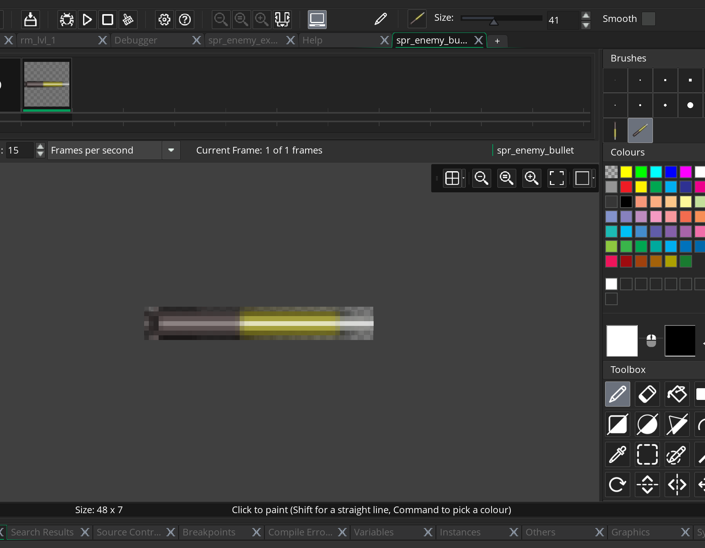

### Targeting Enemies

[previous](../shooting-enemies/README.md#user-content-shooting-enemies) • [home](../README.md#user-content-gms2-top-down-shooter) • [next](../player-health/README.md#user-content-player-health)  
<kbd></kbd> &nbsp;&nbsp; [Player Taking Damage)

Now our final enemy type will target by shooting at the player's future location. 

 

---

##### `Step 1.`\|`SPCRK`|:small_blue_diamond:

Create a wave of the new planes. Open **tl_lvl_1** and press the <kbd>Add</kbd> button for another Moment at `600` (or 10 seconds in) with a V formation of seven enemy targeting shooters. 

##### `Step 2.`\|`FHIU`|:small_blue_diamond: :small_blue_diamond: 

Now *press* the <kbd>Play</kbd> button in the top menu bar to launch the game.  You should see a non-shooting third wave.

##### `Step 3.`\|`SPCRK`|:small_blue_diamond: :small_blue_diamond: :small_blue_diamond:

Lets add the behavior we want in the inheritted class.  Open **obj_enemy_target** and add a new **Create** event.

Please note: There are two events one for parent and one for current target object. Remember to run the parent script by using `event_inherited()`.

##### `Step 4.`\|`SPCRK`|:small_blue_diamond: :small_blue_diamond: :small_blue_diamond: :small_blue_diamond:

Add the same two variables we had in the shooter as well as inheriting the parents create event script.

##### `Step 5.`\|`SPCRK`| :small_orange_diamond:

How do we make the enemies target? We need to calculate an angle between the enemy shooting and the future position of the player. We don't need to use any trig as there is a GameMaker function that does the work for us called **[point_direction(x1, y1, x2, y2)](https://manual.yoyogames.com/GameMaker_Language/GML_Reference/Maths_And_Numbers/Angles_And_Distance/point_direction.htm)**.
	
This function returns an angle in degrees between the positions [x1, y1] and [x2, y2]. We will use this to figure out what direction the targeting plane aims the bullets.  I want the bullet to change angles to match the direction it is going in. This will cause some problems that we will have to address.

*Create* a new **Step | Step** event script on **obj_enemy_target**, inherit functionality from the parent and add targeting logic.

##### `Step 6.`\|`SPCRK`| :small_orange_diamond: :small_blue_diamond:

Lets walk through this.  First we inherit the previous functionality from the the Step event's parent.  Then we store one of three lookups that will offset to a future potential position of the plane.  Then we spawn the bullet and save a reference to that intance.  We then alter its direction based on the offset from the enemy to the player's future position (we use the same math as we used in the player).  Then we set the angle to be the same as the direction. The rest is the same as the shooter enemy.

##### `Step 7.`\|`SPCRK`| :small_orange_diamond: :small_blue_diamond: :small_blue_diamond:

Now *press* the <kbd>Play</kbd> button in the top menu bar to launch the game. Now it doesn't crash but the angle of the bullets are all wrong.

##### `Step 8.`\|`SPCRK`| :small_orange_diamond: :small_blue_diamond: :small_blue_diamond: :small_blue_diamond:

Why is that?  This is because **GameMaker** defaults to `0` degrees pointing right.  Our bullets point down initially so we are off by 90 degrees.  Lets fix this.  Open **spr_enemy_bullet** and press the **Edit Image** button.  *Select* the **Image | Rotate All Frames (anit-clockwise 90)** to rotate sprite counter-clockwise.

##### `Step 9.`\|`SPCRK`| :small_orange_diamond: :small_blue_diamond: :small_blue_diamond: :small_blue_diamond: :small_blue_diamond:

Now the bullet is facing the correct starting angle to represent 0°.

##### `Step 10.`\|`SPCRK`| :large_blue_diamond:

##### `Step 11.`\|`SPCRK`| :large_blue_diamond: :small_blue_diamond: 

##### `Step 12.`\|`SPCRK`| :large_blue_diamond: :small_blue_diamond: :small_blue_diamond: 

##### `Step 13.`\|`SPCRK`| :large_blue_diamond: :small_blue_diamond: :small_blue_diamond:  :small_blue_diamond: 

##### `Step 14.`\|`SPCRK`| :large_blue_diamond: :small_blue_diamond: :small_blue_diamond: :small_blue_diamond:  :small_blue_diamond: 

##### `Step 15.`\|`SPCRK`| :large_blue_diamond: :small_orange_diamond: 

##### `Step 16.`\|`SPCRK`| :large_blue_diamond: :small_orange_diamond:   :small_blue_diamond: 

##### `Step 17.`\|`SPCRK`| :large_blue_diamond: :small_orange_diamond: :small_blue_diamond: :small_blue_diamond:

##### `Step 18.`\|`SPCRK`| :large_blue_diamond: :small_orange_diamond: :small_blue_diamond: :small_blue_diamond: :small_blue_diamond:

##### `Step 19.`\|`SPCRK`| :large_blue_diamond: :small_orange_diamond: :small_blue_diamond: :small_blue_diamond: :small_blue_diamond: :small_blue_diamond:

##### `Step 20.`\|`SPCRK`| :large_blue_diamond: :large_blue_diamond:

##### `Step 21.`\|`SPCRK`| :large_blue_diamond: :large_blue_diamond: :small_blue_diamond:

___

| [previous](../shooting-enemies/README.md#user-content-shooting-enemies)| [home](../README.md#user-content-gms2-top-down-shooter) | [next](../player-health/README.md#user-content-player-health) |
|---|---|---|
