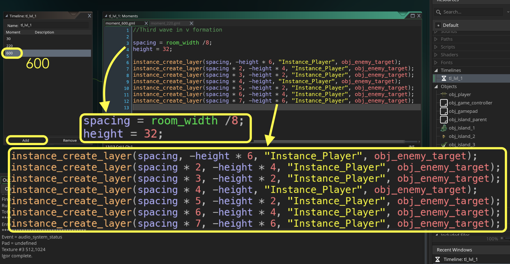

### Targeting Enemies

[previous](../shooting-enemies/README.md#user-content-shooting-enemies) • [home](../README.md#user-content-gms2-top-down-shooter) • [next](../player-health/README.md#user-content-player-health)  
<kbd></kbd> &nbsp;&nbsp; [Player Taking Damage)

Now our final enemy type will target by shooting at the player's future location. 

 

---

##### `Step 1.`\|`TDS`|:small_blue_diamond:

Open up **P4v**.  Select the top folder of the **GameMaker** project. Press the <kbd>Checkout</kbd> button.  Checkout out all files in P4V so that they are all writable (otherwise they will be read only and none of the changes will be saved). Select a **New** changelist and add a message describing the unit of work you will be performing. Press the <kbd>OK</kbd> button.

Open up the project you are working on in **GameMaker**. 

##### `Step 2.`\|`TDS`|:small_blue_diamond: :small_blue_diamond: 

Create a wave of the new planes. Open **tml_lvl_1** and press the <kbd>Add</kbd> button for another Moment at `600` (or 10 seconds in) with a V formation of seven enemy targeting shooters. 

##### `Step 3.`\|`TDS`|:small_blue_diamond: :small_blue_diamond: :small_blue_diamond:

Now *press* the <kbd>Play</kbd> button in the top menu bar to launch the game.  You should see a non-shooting third wave.

##### `Step 4.`\|`TDS`|:small_blue_diamond: :small_blue_diamond: :small_blue_diamond: :small_blue_diamond:

Lets add the behavior we want in the inheritted class.  Open **obj_enemy_target** and add a new **Create** event.

Please note: There are two events one for parent and one for current target object. Remember to run the parent script by using `event_inherited()`.

##### `Step 5.`\|`TDS`| :small_orange_diamond:

Add the same two variables we had in the shooter as well as inheriting the parents create event script.

##### `Step 6.`\|`TDS`| :small_orange_diamond: :small_blue_diamond:

How do we make the enemies target? We need to calculate an angle between the enemy shooting and the future position of the player. We don't need to use any trig as there is a GameMaker function that does the work for us called **[point_direction(x1, y1, x2, y2)](https://manual.yoyogames.com/GameMaker_Language/GML_Reference/Maths_And_Numbers/Angles_And_Distance/point_direction.htm)**.
	
This function returns an angle in degrees between the positions [x1, y1] and [x2, y2]. We will use this to figure out what direction the targeting plane aims the bullets.  I want the bullet to change angles to match the direction it is going in. This will cause some problems that we will have to address.

*Create* a new **Step | Step** event script on **obj_enemy_target**, inherit functionality from the parent and add targeting logic.

##### `Step 7.`\|`TDS`| :small_orange_diamond: :small_blue_diamond: :small_blue_diamond:

Lets walk through this.  First we inherit the previous functionality from the the Step event's parent.  Then we store one of three lookups that will offset to a future potential position of the plane.  Then we spawn the bullet and save a reference to that intance.  We then alter its direction based on the offset from the enemy to the player's future position (we use the same math as we used in the player).  Then we set the angle to be the same as the direction. The rest is the same as the shooter enemy.

##### `Step 8.`\|`TDS`| :small_orange_diamond: :small_blue_diamond: :small_blue_diamond: :small_blue_diamond:

Now *press* the <kbd>Play</kbd> button in the top menu bar to launch the game. Now it doesn't crash but the angle of the bullets are all wrong.

##### `Step 9.`\|`TDS`| :small_orange_diamond: :small_blue_diamond: :small_blue_diamond: :small_blue_diamond: :small_blue_diamond:

Why is that?  This is because **GameMaker** defaults to `0` degrees pointing right.  Our bullets point down initially so we are off by 90 degrees.  Lets fix this.  Open **spr_enemy_bullet** and press the **Edit Image** button.  *Select* the **Image | Rotate All Frames (anit-clockwise 90)** to rotate sprite counter-clockwise.

##### `Step 10.`\|`TDS`| :large_blue_diamond:

Now the bullet is facing the correct starting angle to represent 0°.

##### `Step 11.`\|`TDS`| :large_blue_diamond: :small_blue_diamond: 

Now *press* the <kbd>Play</kbd> button in the top menu bar to launch the game. Now we have messed up the angle of the bullets on the shooting enemy.

##### `Step 12.`\|`TDS`| :large_blue_diamond: :small_blue_diamond: :small_blue_diamond: 

Open **obj_enemy_shoot | Step** event and we need to adjust the angle of the bullet.  Get a variable from the instance creation and adjust it's image angle by 90 degrees clockwise (or -90 in GameMaker).

##### `Step 13.`\|`TDS`| :large_blue_diamond: :small_blue_diamond: :small_blue_diamond:  :small_blue_diamond: 

Now *press* the <kbd>Play</kbd> button in the top menu bar to launch the game. Notice that this one change I wanted to make with the targeting bullets caused a few bugs and required some code refactoring.  Be aware that all changes, no matter how small, can cause a lot of work and potential issues.

##### `Step 14.`\|`TDS`| :large_blue_diamond: :small_blue_diamond: :small_blue_diamond: :small_blue_diamond:  :small_blue_diamond: 

Select the **File | Save Project**, then press **File | Quit** (PC) **Game Maker | Quit** on Mac to make sure everything in the game is saved.

##### `Step 15.`\|`TDS`| :large_blue_diamond: :small_orange_diamond: 

Open up **P4V**.  Select the top folder and press the **Add** button.  We want to add all the new files we created during this last session.  Add these files to the last change list you used at the begining of the session (in my case it was `Spaceship I portion of walkthrough`). Press the <kbd>OK</kbd> button.

##### `Step 16.`\|`TDS`| :large_blue_diamond: :small_orange_diamond:   :small_blue_diamond: 
Now you can submit the changelist by pressing both <kbd>Submit</kbd> buttons.

<!--  -->

| [previous](../shooting-enemies/README.md#user-content-shooting-enemies)| [home](../README.md#user-content-gms2-top-down-shooter) | [next](../player-health/README.md#user-content-player-health) |
|---|---|---|
